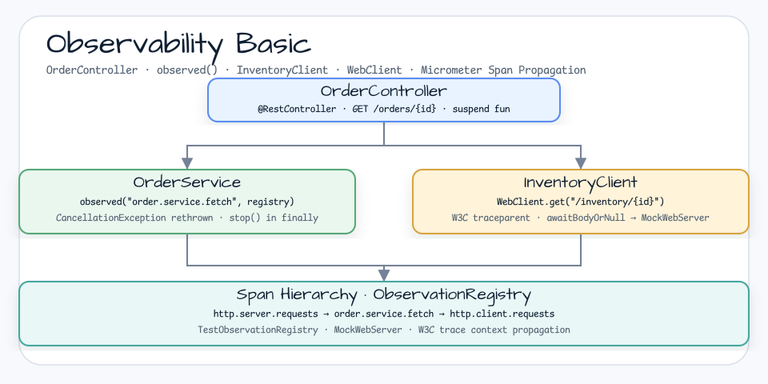

# observability-basic

[English](README.md) | 한국어

## 예제 시나리오

이 예제는 **observability-basic** 모듈을 실행 가능한 메트릭, 트레이싱, 관측 예제로 보여줍니다. 개발자가 먼저 확인할 경로인 모듈 설정, 샘플 또는 테스트 실행, 반복적인 인프라 코드를 줄이는 라이브러리 또는 프레임워크 API 사용 방식을 중심으로 설명합니다.

## 흐름 다이어그램

1. `observability-observability-basic` 예제에 필요한 로컬 런타임을 준비합니다.
2. 예제 시나리오를 담당하는 애플리케이션, 컨트롤러, 서비스 또는 테스트 픽스처를 실행합니다.
3. 반복적인 인프라 처리는 bluetape4k 유틸리티 또는 Spring/Kotlin 통합 기능에 위임합니다.
4. 샘플 출력, HTTP 응답, 저장소 상태, metric, trace 또는 테스트 기대값으로 결과를 검증합니다.

## 시퀀스 다이어그램

핵심 시퀀스는 호출자 또는 테스트 픽스처 -> 워크샵 어댑터 -> bluetape4k 헬퍼/API -> 외부 런타임 또는 인메모리 백엔드 -> 검증/응답 순서입니다. 전용 시퀀스 이미지가 있는 모듈은 아래 이미지가 상호작용 순서를 보여주며, 없는 경우 소스 테스트가 실행 가능한 시퀀스의 기준입니다.

WebFlux HTTP 엔드포인트, 코루틴 서비스, 아웃바운드 WebClient 호출에 걸쳐
Micrometer Observation + W3C 트레이스 전파를 보여주는 최소 Observability 워크샵 예제.

인프라(DB, Redis, Kafka) 불필요. 다운스트림 시뮬레이션에 MockWebServer 사용.

## 아키텍처




## 스팬 트리

```
http.server.requests            (자동 — Spring Boot)
  └─ order.service.fetch        (수동 — observed())
       └─ http.client.requests  (자동 — Micrometer WebClient)
            └─ 다운스트림 인벤토리 서비스
```

## 핵심 개념

| 개념 | 구현 |
|------|------|
| 수동 스팬 | `observed("order.service.fetch", registry) { }` |
| W3C traceparent 전파 | Spring Boot `WebClient.Builder` 빈을 통해 자동 전파 |
| 테스트 어설션 | `TestObservationRegistry` (Zipkin 불필요) |
| 4xx 처리 | `onStatus(4xx) { Mono.empty() }` → null 반환 |
| 5xx 처리 | `onStatus(5xx) { resp.createException() }` → 예외 전파 |

## 테스트 커버리지

- `OrderServiceTest`: 스팬 생명주기(시작/중지), 에러 기록, 취소 안전성
- `OrderControllerTest`: HTTP 200 통합 테스트, W3C traceparent 헤더 전파

## 의존성

- `bluetape4k-micrometer` — `observed()` 코루틴 헬퍼 (stop-safe wrapper; ObservationSupport.kt 참조)
- `micrometer-tracing-bridge-otel` — W3C 전파를 위한 OTel 브리지
- `micrometer-context-propagation` — reactor ↔ 코루틴 컨텍스트 브리징
- `spring-boot-starter-opentelemetry` — WebClient 계측 자동 구성
