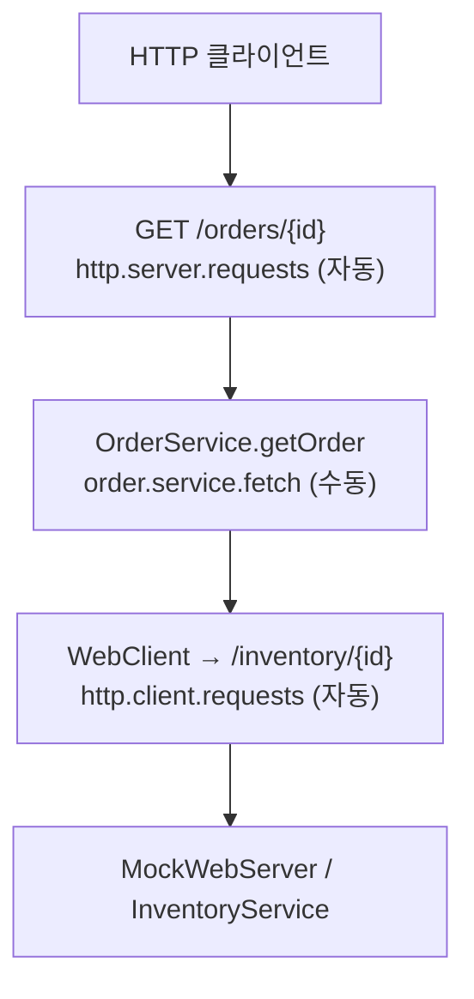

# observability-basic

WebFlux HTTP 엔드포인트, 코루틴 서비스, 아웃바운드 WebClient 호출에 걸쳐
Micrometer Observation + W3C 트레이스 전파를 보여주는 최소 Observability 워크샵 예제.

인프라(DB, Redis, Kafka) 불필요. 다운스트림 시뮬레이션에 MockWebServer 사용.

## 아키텍처



## 스팬 트리

```
http.server.requests            (자동 — Spring Boot)
  └─ order.service.fetch        (수동 — withObservationSuspending)
       └─ http.client.requests  (자동 — Micrometer WebClient)
            └─ 다운스트림 인벤토리 서비스
```

## 핵심 개념

| 개념 | 구현 |
|------|------|
| 수동 스팬 | `withObservationSuspending("order.service.fetch", registry) { }` |
| W3C traceparent 전파 | Spring Boot `WebClient.Builder` 빈을 통해 자동 전파 |
| 테스트 어설션 | `TestObservationRegistry` (Zipkin 불필요) |
| 4xx 처리 | `onStatus(4xx) { Mono.empty() }` → null 반환 |
| 5xx 처리 | `onStatus(5xx) { resp.createException() }` → 예외 전파 |

## 테스트 커버리지

- `OrderServiceTest`: 스팬 생명주기(시작/중지), 에러 기록, 취소 안전성
- `OrderControllerTest`: HTTP 200 통합 테스트, W3C traceparent 헤더 전파

## 의존성

- `bluetape4k-micrometer` — `withObservationSuspending` 코루틴 헬퍼
- `micrometer-tracing-bridge-otel` — W3C 전파를 위한 OTel 브리지
- `micrometer-context-propagation` — reactor ↔ 코루틴 컨텍스트 브리징
- `spring-boot-starter-opentelemetry` — WebClient 계측 자동 구성
