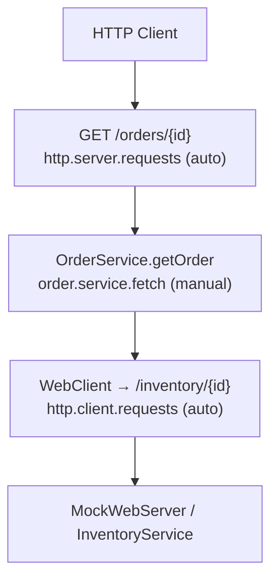

# observability-basic

Minimal observability workshop demonstrating Micrometer Observation + W3C trace propagation
across a WebFlux HTTP endpoint, a coroutine service, and an outbound WebClient call.

No infrastructure (DB, Redis, Kafka) required. MockWebServer is used for downstream simulation.

## Architecture



## Span Tree

```
http.server.requests            (auto — Spring Boot)
  └─ order.service.fetch        (manual — withObservationSuspending)
       └─ http.client.requests  (auto — Micrometer WebClient)
            └─ downstream inventory service
```

## Key Concepts

| Concept | Implementation |
|---------|---------------|
| Manual span | `withObservationSuspending("order.service.fetch", registry) { }` |
| W3C traceparent propagation | Auto via Spring Boot's `WebClient.Builder` bean |
| Test assertions | `TestObservationRegistry` (no Zipkin required) |
| 4xx handling | `onStatus(4xx) { Mono.empty() }` → returns null |
| 5xx handling | `onStatus(5xx) { resp.createException() }` → throws |

## Test Coverage

- `OrderServiceTest`: span lifecycle (started/stopped), error recording, cancellation safety
- `OrderControllerTest`: HTTP 200 integration, W3C traceparent header propagation

## Configuration

```yaml
workshop:
  observability:
    inventory:
      base-url: http://localhost:8080

management:
  tracing:
    sampling:
      probability: 1.0
  otlp:
    tracing:
      export:
        enabled: false  # set true to export to OTel collector
```

## Dependencies

- `bluetape4k-micrometer` — `withObservationSuspending` coroutine helper
- `micrometer-tracing-bridge-otel` — OTel bridge for W3C propagation
- `micrometer-context-propagation` — reactor ↔ coroutine context bridging
- `spring-boot-starter-opentelemetry` — auto-configures WebClient instrumentation
