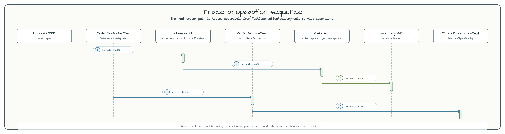

# observability-basic

[한국어](README.ko.md) | English

`observability-basic` is the smallest tracing example in the workshop. A WebFlux suspend endpoint
creates the automatic HTTP server span, `OrderService` adds one manual `order.service.fetch` span,
and a Spring Boot-managed `WebClient.Builder` propagates W3C `traceparent` to the downstream
inventory call. No database, Redis, Kafka, or external collector is required for the smoke path.

## Architecture


The sample keeps manual instrumentation in one place: `OrderService.getOrder()`. `InventoryClient`
does not create its own span; Micrometer WebClient instrumentation creates `http.client.requests`
and injects trace headers through the auto-configured `WebClient.Builder`.

## Trace Propagation Flow



`TracePropagationTest` uses real Micrometer + OpenTelemetry tracing so the outbound MockWebServer
request contains a `traceparent` header. Controller tests that replace the registry with
`TestObservationRegistry` are kept separate because that test registry has no real tracer attached.

## Span Tree

```text
http.server.requests
  └─ order.service.fetch
       └─ http.client.requests
            └─ downstream inventory service
```

## Key Concepts

| Concept | Implementation |
|---|---|
| Manual span | `observed("order.service.fetch", registry) { }` wraps order assembly. |
| W3C propagation | Spring Boot's `WebClient.Builder` injects `traceparent` automatically. |
| Test registry | `TestObservationRegistry` verifies service span lifecycle without Zipkin. |
| 4xx handling | `awaitExchangeOrNull { 4xx -> null }` returns no order. |
| 5xx handling | `createExceptionAndAwait()` propagates upstream failure. |

## Test Coverage

- `OrderServiceTest`: span lifecycle, error recording, and cancellation safety.
- `OrderControllerTest`: HTTP 200 and not-found integration behavior.
- `TracePropagationTest`: outbound `traceparent` header reaches MockWebServer.

## Configuration

```yaml
workshop:
  observability:
    inventory:
      base-url: http://localhost:8080

management:
  tracing:
    sampling:
      probability: 1.0
  otlp:
    tracing:
      export:
        enabled: false
```

## Smoke Checks

```bash
./gradlew :observability-basic:test
./gradlew :observability-basic:bootRun
```

## Dependencies

- `bluetape4k-micrometer` - local `observed()` coroutine helper.
- `micrometer-tracing-bridge-otel` - OpenTelemetry bridge for W3C propagation.
- `micrometer-context-propagation` - Reactor and coroutine context bridging.
- `spring-boot-starter-opentelemetry` - WebClient instrumentation auto-configuration.
