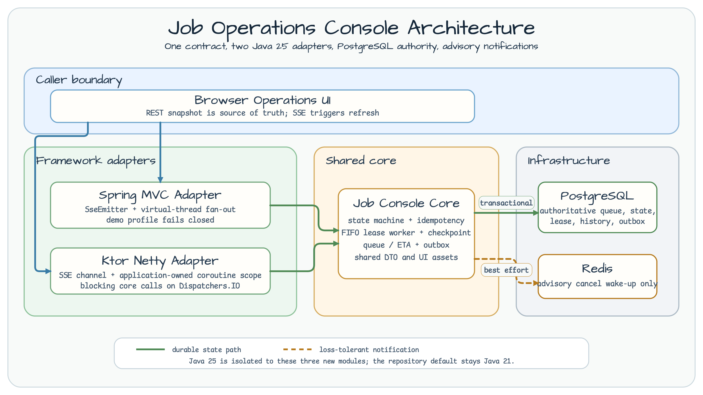
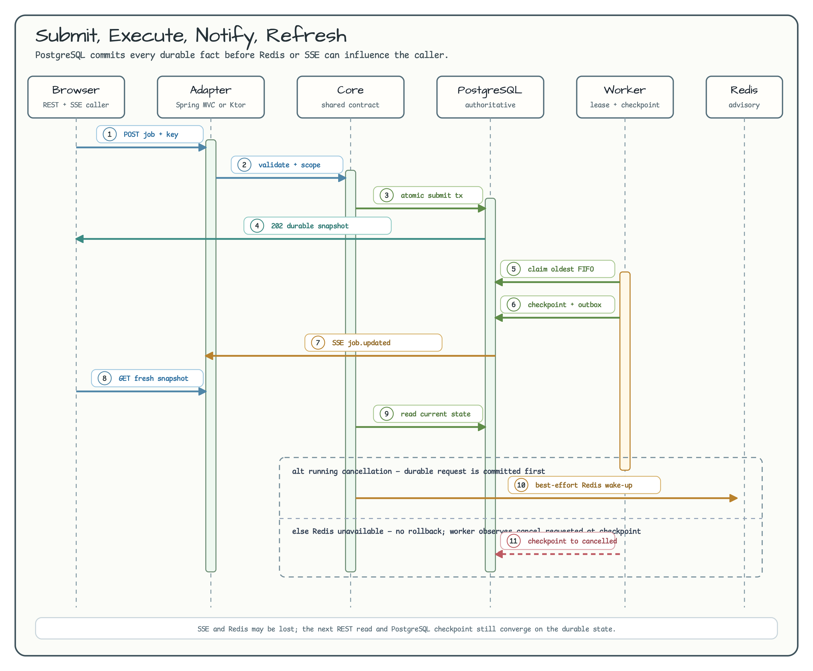

# 작업 운영 콘솔

[English](README.md) | 한국어

이 예제는 하나의 내구성 있는 백그라운드 작업 계약을 Spring MVC와 Ktor로
각각 노출합니다. 정확성의 유일한 권위는 PostgreSQL입니다. Redis와 SSE는
알림 지연을 줄일 수 있지만, 어느 쪽을 잃어도 작업 상태나 다음 REST
스냅샷의 유효성은 바뀌지 않습니다.

## 모듈

| 모듈 | 책임 | 런타임 |
|---|---|---|
| [`job-console-core`](job-console-core/) | 상태 머신, PostgreSQL 큐, lease, checkpoint, 재시도 예산, ETA, outbox, 공유 fixture | Java 25 |
| [`job-console-spring`](job-console-spring/) | Spring MVC REST/SSE 어댑터와 데모 UI | Java 25 |
| [`job-console-ktor`](job-console-ktor/) | Ktor Netty REST/SSE 어댑터와 데모 UI | Java 25 |

이 모듈들은 저장소 전체의 기본 Java 25 toolchain을 사용합니다.

## 아키텍처



두 어댑터는 같은 core 계약을 사용합니다. 제출, 멱등성, 큐 순서, lease,
상태 이력, outbox row의 권위는 PostgreSQL에 있습니다. Redis는 취소를 빨리
알리는 보조 wake-up 경로일 뿐입니다.

## 요청 시퀀스



API는 응답이나 알림보다 먼저 내구성 있는 사실을 commit합니다. SSE 이벤트는
안정적인 event id와 새로고침 힌트만 전달하며, 클라이언트는 이벤트를 받을
때마다 현재 REST 스냅샷을 다시 읽습니다.

## 상태 머신


재시도 가능한 실패는 동일한 작업과 큐 identity를 `queued`로 돌려보내고
attempt와 revision만 증가시킵니다. `succeeded`, `failed`,
`dead_lettered`, `cancelled`는 종료 상태이며 이후 전이를 거부합니다.

## API 계약

| 메서드 | 경로 | 목적 |
|---|---|---|
| `POST` | `/v1/jobs` | 멱등한 결정론적 작업 제출 |
| `GET` | `/v1/jobs/{jobId}` | 권위 있는 redacted 스냅샷 조회 |
| `POST` | `/v1/jobs/{jobId}/cancel` | 내구성 있는 취소 요청 commit |
| `GET` | `/v1/jobs/{jobId}/events` | 알림 전용 SSE 이벤트 수신 |
| `GET` | `/v1/queues/me` | 호출자 범위의 제한된 큐 페이지 조회 |
| `GET` | `/v1/tenants/{tenantId}/queue` | 운영자 범위의 제한된 큐 페이지 조회 |
| `GET` | `/healthz` | 프로세스 liveness |
| `GET` | `/readyz` | PostgreSQL 권위 readiness와 Redis 저하 상세 |

제출에는 `X-Demo-Tenant`, `X-Demo-Submitter`, `Idempotency-Key`가
필요합니다. 운영자 큐에는 `X-Demo-Operator: true`도 필요합니다. 이 신뢰
헤더는 워크숍을 단순하게 만드는 데모 fixture입니다. **운영 환경의 인증이나
인가가 아닙니다.**

큐 조회는 최대 100개 row로 제한되며 opaque cursor를 사용합니다. ETA는
confidence와 sample size가 붙은 표본 범위이지 SLA가 아닙니다. 표본이
부족하면 가짜 추정치를 만들지 않습니다.

## Spring MVC 실행

PostgreSQL을 시작한 뒤 데모 profile을 명시적으로 활성화합니다.

```bash
export SPRING_DATASOURCE_URL=jdbc:postgresql://localhost:5432/postgres
export SPRING_DATASOURCE_USERNAME=postgres
export SPRING_DATASOURCE_PASSWORD=postgres
export SPRING_PROFILES_ACTIVE=demo
./gradlew :operations-job-console-spring:bootRun
```

`http://localhost:8080`을 엽니다. `demo` profile이 없으면 데모 UI와 API
route를 등록하지 않습니다.

## Ktor 실행

PostgreSQL을 시작한 뒤 데모 route 사용을 명시합니다.

```bash
export POSTGRES_JDBC_URL=jdbc:postgresql://localhost:5432/postgres
export POSTGRES_USERNAME=postgres
export POSTGRES_PASSWORD=postgres
export JOB_CONSOLE_DEMO=true
./gradlew :operations-job-console-ktor:run
```

`http://localhost:8080`을 엽니다. `JOB_CONSOLE_DEMO=false`이면 애플리케이션은
데모 route를 노출하지 않습니다.

## 장애 fixture

`failureMode`는 `none`, `retry_once`, `non_retryable`,
`always_retryable`을 지원합니다. 결정론적 worker는 외부 provider 없이 성공
재시도, 즉시 종료 실패, 재시도 소진, lease 복구, 취소 race, Redis 손실,
outbox 재전송을 검증합니다.

## 운영 경계

- PostgreSQL 장애: readiness가 실패하며 Redis만으로 mutation을 수락하지 않습니다.
- Redis 장애: readiness에 저하를 표시하지만 PostgreSQL 기반 작업은 ready와 correct 상태를 유지합니다.
- SSE 연결 종료 또는 지연: 제한된 fan-out이 subscriber를 제거하며 REST가 계속 source of truth입니다.
- worker crash: 만료된 lease가 실행 가능한 작업을 내구성 큐로 되돌립니다.
- 롤백: 어댑터를 중지하고 PostgreSQL은 조사용으로 보존한 뒤 배포에서 `operations-job-console-*` 세 모듈을 제거합니다. 다른 워크숍 모듈은 이 모듈들에 의존하지 않습니다.

## 검증

```bash
./gradlew :operations-job-console-core:test
./gradlew :operations-job-console-core:integrationTest --max-workers=1
./gradlew :operations-job-console-spring:integrationTest --max-workers=1
./gradlew :operations-job-console-ktor:integrationTest --max-workers=1
./scripts/smoke-validate.sh operations
```
