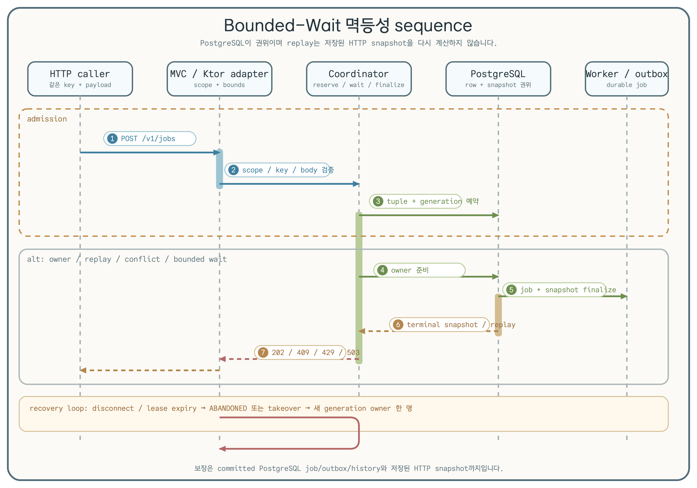

# 작업 콘솔 Core

[English](README.md) | 한국어

Java 25 core는 프레임워크에 독립적인 작업 계약, PostgreSQL migration, FIFO
큐, lease, checkpoint, 종료 전이, 제한된 ETA projection, outbox polling,
취소 signal, 어댑터 공용 test fixture를 담당합니다.

## 권위 경계

PostgreSQL이 권위를 갖습니다. Redis 취소 publish와 SSE fan-out은 best
effort입니다. 보조 publish 실패는 commit된 `cancel_requested`를 rollback하지
않으며, 느린 subscriber는 outbox 진행을 막지 않습니다.

## 상태 머신


닫힌 전이표는 stale revision과 종료 상태에서 들어오는 모든 signal을
거부합니다. 재시도 가능한 실패는 작업 및 큐 identity를 바꾸지 않고
`queued`로 돌아갑니다.

## 제한된 대기 HTTP 멱등성



`POST /v1/jobs`는 PostgreSQL이 소유하는 request row를 사용합니다. 기본
rollout은 비활성화(`job-console.bounded-wait.enabled=false`)되어 있으며 모든
인스턴스가 같은 policy fingerprint를 사용할 때만 활성화합니다. 기본값은
waiter deadline 2초, key별 waiter 2개, terminal retention 1시간, request/replay
body 64KiB, idempotency key 255바이트이며 timeout에는 `Retry-After: 1`,
waiter overflow에는 `Retry-After: 2`를 사용합니다.

처음 승인된 owner는 job, outbox, history와 HTTP snapshot을 하나의 transaction으로
commit합니다. replay는 저장된 snapshot을 반환하며 response를 다시 계산하지
않습니다. legacy(rollout 비활성) replay도 V001 호환 terminal 경로를 사용합니다.
이는 idempotent HTTP 계약을 갖는 at-least-once 처리이며 exactly-once 실행을
보장하지 않습니다.

| 결과 | 상태 | 호출자 동작 |
| --- | ---: | --- |
| 최초 owner 또는 replay | `202` | response를 저장하고 재시도 중단 |
| 같은 key, 다른 request | `409` | idempotency key와 payload 수정 |
| in-flight deadline | `409` + `Retry-After: 1` | 같은 key로 재시도 |
| waiter cap 초과 | `429` + `Retry-After: 2` | backoff 후 같은 key로 재시도 |
| owner abandoned / dependency unavailable | `503` | backoff를 두고 같은 key 재시도 |
| 잘못된 request / body 초과 | `400` / `413` | request 수정, 무조건 재시도하지 않음 |

Shutdown은 먼저 admission을 닫고 active submission을 최대 5초 drain한 뒤,
남은 owner를 abandon하여 lease recovery가 takeover하도록 합니다. Readiness는
PostgreSQL, Redis, policy fingerprint, bounded-wait 상태와 `postgres` 또는
`policy` reason을 표시합니다. Redis는 보조 경로이므로 ready를 해제하지 않습니다.
test-only conformance host는 운영 route가 아닙니다.

## 테스트 fixture

`testFixtures` source set은 PostgreSQL/Redis container fixture, barrier,
결정론적 clock, HTTP driver, event probe, 두 어댑터가 함께 사용하는 black-box
계약을 제공합니다.

## 검증

```bash
./gradlew :operations-job-console-core:test
./gradlew :operations-job-console-core:integrationTest --max-workers=1
```

## 고경합 증거


Docker daemon이 실행 중이고 JDK 25를 사용하며 Gradle과 container가 사용할
수 있는 메모리가 최소 4 GiB인 환경에서 저장소 전체 profile을 실행합니다.

```bash
CI_RUN_ID=developer-ci-001
REFERENCE_RUN_ID=developer-reference-001
./gradlew highContentionCi -PhighContentionRunId="$CI_RUN_ID" --max-workers=1
./gradlew highContentionLocalReference -PhighContentionRunId="$REFERENCE_RUN_ID" --max-workers=1
```

정확성 게이트는 `highContentionCi`입니다. `highContentionLocalReference`는
해당 환경의 실행 관찰값을 기록할 뿐이며, 프레임워크 순위를 매기지 않는다.
또한 운영 용량을 입증하지 않는다. Canonical report는
`build/reports/high-contention/<run-id>/` 아래에 기록됩니다. 명령마다 새 run
ID를 사용해야 하며 local-reference 실행에는 clean worktree도 필요합니다.

Lease, fencing, checkpoint, deduplication, 종료 상태의 권위는 PostgreSQL이
계속 가집니다. Toxiproxy는 기존 connection과 새 connection을 포함한 Redis
경로의 단절·복구에만 사용하며 PostgreSQL 권위나 database failover를
대체하지 않습니다.
