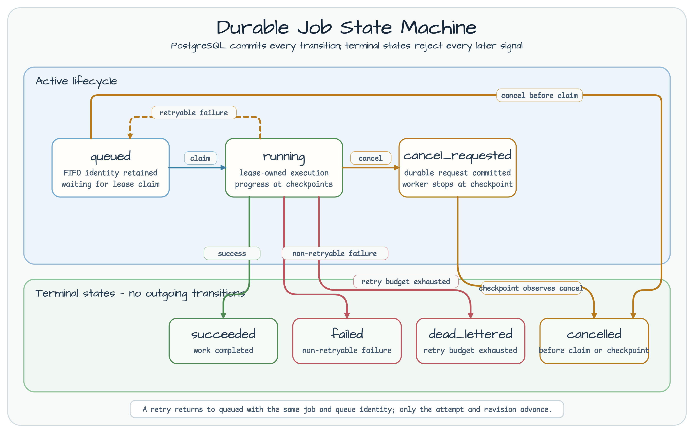

# 작업 콘솔 Core

[English](README.md) | 한국어

Java 25 core는 프레임워크에 독립적인 작업 계약, PostgreSQL migration, FIFO
큐, lease, checkpoint, 종료 전이, 제한된 ETA projection, outbox polling,
취소 signal, 어댑터 공용 test fixture를 담당합니다.

## 권위 경계

PostgreSQL이 권위를 갖습니다. Redis 취소 publish와 SSE fan-out은 best
effort입니다. 보조 publish 실패는 commit된 `cancel_requested`를 rollback하지
않으며, 느린 subscriber는 outbox 진행을 막지 않습니다.

## 상태 머신



닫힌 전이표는 stale revision과 종료 상태에서 들어오는 모든 signal을
거부합니다. 재시도 가능한 실패는 작업 및 큐 identity를 바꾸지 않고
`queued`로 돌아갑니다.

## 테스트 fixture

`testFixtures` source set은 PostgreSQL/Redis container fixture, barrier,
결정론적 clock, HTTP driver, event probe, 두 어댑터가 함께 사용하는 black-box
계약을 제공합니다.

## 검증

```bash
./gradlew :operations-job-console-core:test
./gradlew :operations-job-console-core:integrationTest --max-workers=1
```

## 고경합 증거

Docker daemon이 실행 중이고 JDK 25를 사용하며 Gradle과 container가 사용할
수 있는 메모리가 최소 4 GiB인 환경에서 저장소 전체 profile을 실행합니다.

```bash
CI_RUN_ID=developer-ci-001
REFERENCE_RUN_ID=developer-reference-001
./gradlew highContentionCi -PhighContentionRunId="$CI_RUN_ID" --max-workers=1
./gradlew highContentionLocalReference -PhighContentionRunId="$REFERENCE_RUN_ID" --max-workers=1
```

정확성 게이트는 `highContentionCi`입니다. `highContentionLocalReference`는
해당 환경의 실행 관찰값을 기록할 뿐이며, 프레임워크 순위를 매기지 않는다.
또한 운영 용량을 입증하지 않는다. Canonical report는
`build/reports/high-contention/<run-id>/` 아래에 기록됩니다. 명령마다 새 run
ID를 사용해야 하며 local-reference 실행에는 clean worktree도 필요합니다.

Lease, fencing, checkpoint, deduplication, 종료 상태의 권위는 PostgreSQL이
계속 가집니다. Toxiproxy는 기존 connection과 새 connection을 포함한 Redis
경로의 단절·복구에만 사용하며 PostgreSQL 권위나 database failover를
대체하지 않습니다.
