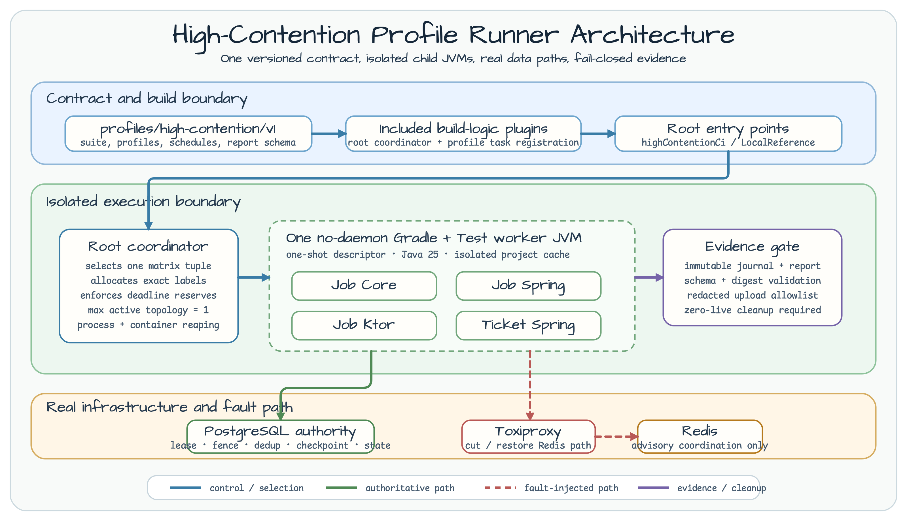

# Spring 작업 콘솔 어댑터

[English](README.md) | 한국어

이 Java 25 어댑터는 Spring Boot MVC, `SseEmitter`, scheduled outbox polling,
애플리케이션이 소유하는 virtual-thread worker executor, 공유 운영 UI를 통해
core 계약을 노출합니다.

## 안전 경계

route는 `demo` profile에서만 존재합니다. `X-Demo-Tenant`,
`X-Demo-Submitter`, `X-Demo-Operator`는 신뢰하는 데모 헤더이지 운영 인증이
아닙니다. 모든 SSE 알림 뒤에도 REST 스냅샷이 권위를 유지합니다.

## 실행

```bash
export SPRING_DATASOURCE_URL=jdbc:postgresql://localhost:5432/postgres
export SPRING_DATASOURCE_USERNAME=postgres
export SPRING_DATASOURCE_PASSWORD=postgres
export SPRING_PROFILES_ACTIVE=demo
# 선택 사항인 취소 알림 가속 경로:
# export JOB_CONSOLE_REDIS_URI=redis://localhost:6379
./gradlew :operations-job-console-spring:bootRun
```

## 검증

```bash
./gradlew :operations-job-console-spring:test
./gradlew :operations-job-console-spring:integrationTest --max-workers=1
```

## 고경합 증거



Docker daemon이 실행 중이고 JDK 25를 사용하며 Gradle과 container가 사용할
수 있는 메모리가 최소 4 GiB인 환경에서 core와 Spring adapter profile을
실행합니다.

```bash
CI_RUN_ID=developer-ci-001
REFERENCE_RUN_ID=developer-reference-001
./gradlew highContentionCi -PhighContentionRunId="$CI_RUN_ID" --max-workers=1
./gradlew highContentionLocalReference -PhighContentionRunId="$REFERENCE_RUN_ID" --max-workers=1
```

정확성 게이트는 `highContentionCi`입니다. `highContentionLocalReference`는
해당 환경의 실행 관찰값을 기록할 뿐이며, 프레임워크 순위를 매기지 않는다.
또한 운영 용량을 입증하지 않는다. Canonical report는
`build/reports/high-contention/<run-id>/` 아래에 기록됩니다. 명령마다 새 run
ID를 사용해야 하며 local-reference 실행에는 clean worktree도 필요합니다.

Spring `DataSource`는 HikariCP를 사용하지만 lease, fencing, checkpoint,
deduplication, 종료 상태의 권위는 PostgreSQL이 유지합니다. Toxiproxy는
기존 connection과 새 connection을 포함한 보조 Redis 경로의 단절·복구에만
사용하며 PostgreSQL 권위나 database failover를 대체하지 않습니다.
