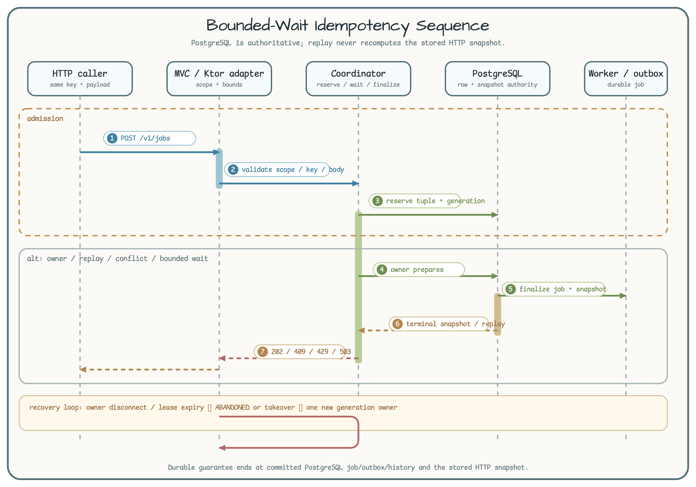

# Spring Job Console Adapter

[한국어](README.ko.md) | English

This Java 25 adapter exposes the shared contract through Spring Boot MVC,
`SseEmitter`, scheduled outbox polling, an application-owned virtual-thread
worker executor, and the shared operations UI.

## Safety boundary

Routes exist only under the `demo` profile. `X-Demo-Tenant`,
`X-Demo-Submitter`, and `X-Demo-Operator` are trusted demo headers, not
production authentication. REST snapshots remain authoritative after every SSE
notification.

## Bounded-wait HTTP idempotency



The adapter delegates `POST /v1/jobs` to the shared PostgreSQL-owned request
row. Rollout is disabled by default (`job-console.bounded-wait.enabled=false`);
enable it only with one policy fingerprint across every instance. The policy is
2s waiter deadline, two waiters per key, 1h terminal retention, 64KiB
request/replay bodies, and a 255-byte idempotency key.

| Outcome | Status | Caller action |
| --- | ---: | --- |
| first owner or replay | `202` | store the response; replay uses the saved snapshot |
| key reused with another request | `409` | correct the key or payload |
| in-flight timeout | `409` + `Retry-After: 1` | retry the same key |
| waiter overflow | `429` + `Retry-After: 2` | back off and retry |
| abandoned owner / dependency failure | `503` | retry with backoff |
| invalid input / body too large | `400` / `413` | fix the request |

The contract is at-least-once and idempotent, not exactly-once. Legacy replay
uses the V001-compatible terminal path. On shutdown, admission closes, active
submissions drain for at most five seconds, and remaining owners are abandoned
for lease recovery. Readiness exposes PostgreSQL, Redis, bounded-wait state,
and policy fingerprint; Redis remains advisory. No test-only conformance route
is published by this adapter.

## Run

```bash
export SPRING_DATASOURCE_URL=jdbc:postgresql://localhost:5432/postgres
export SPRING_DATASOURCE_USERNAME=postgres
export SPRING_DATASOURCE_PASSWORD=postgres
export SPRING_PROFILES_ACTIVE=demo
# Optional advisory cancellation acceleration:
# export JOB_CONSOLE_REDIS_URI=redis://localhost:6379
./gradlew :operations-job-console-spring:bootRun
```

## Verify

```bash
./gradlew :operations-job-console-spring:test
./gradlew :operations-job-console-spring:integrationTest --max-workers=1
```

## High-contention evidence


Run the shared core and Spring adapter profiles with a running Docker daemon,
JDK 25, and at least 4 GiB of memory available to Gradle and the containers:

```bash
CI_RUN_ID=developer-ci-001
REFERENCE_RUN_ID=developer-reference-001
./gradlew highContentionCi -PhighContentionRunId="$CI_RUN_ID" --max-workers=1
./gradlew highContentionLocalReference -PhighContentionRunId="$REFERENCE_RUN_ID" --max-workers=1
```

The correctness gate is `highContentionCi`. `highContentionLocalReference`
records environment-specific execution observations; it does not rank
frameworks and does not establish production capacity. Canonical reports are
written under `build/reports/high-contention/<run-id>/`. Use a new run ID for
every command; local-reference execution also requires a clean worktree.

The Spring `DataSource` uses HikariCP, while PostgreSQL remains authoritative
for leases, fencing, checkpoints, deduplication, and terminal state. Toxiproxy
cuts and restores only the advisory Redis path, including old and newly opened
connections; it does not replace PostgreSQL authority or database failover.
