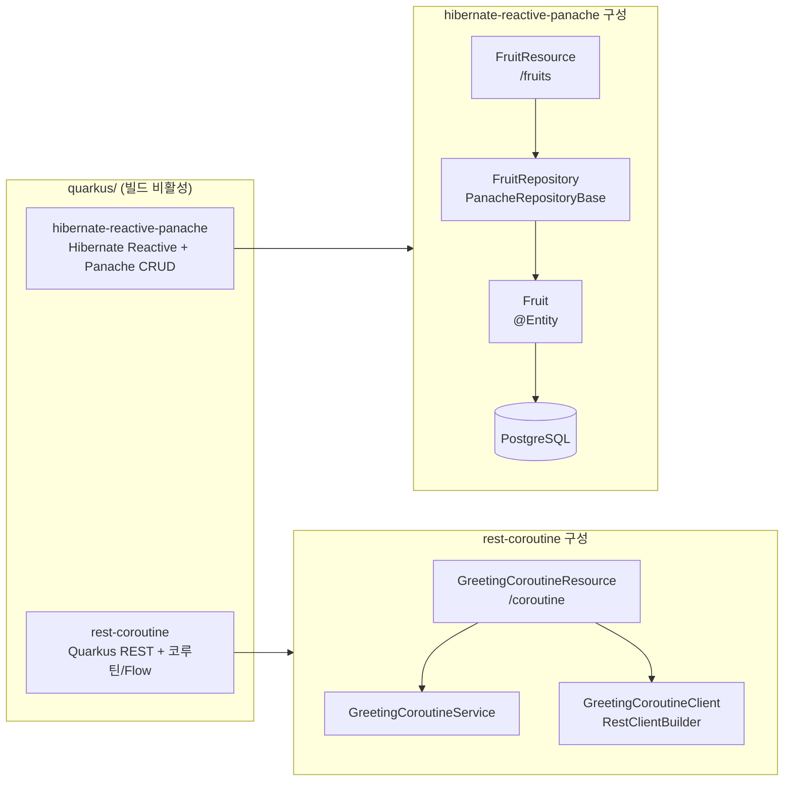

# quarkus-workshop

[Quarkus](http://quarkus.io) 학습을 위한 자료입니다.

> **참고**: 이 모듈은 현재 **빌드 비활성** 상태입니다 (Spring Boot 4 호환 대기).

## 모듈 구성



## 프로젝트 생성

Languge 를 kotlin 으로, build tool 을 Gradle Kotlin DSL 을 사용하도록, wrapper 없이 root project 것을 사용

```shell
$ quarkus create app something-demo --kotlin --gradle-kotlin-dsl --no-wrapper

```

## 사용법

각 예제를 cli 로 실행하기 위해서는 각각의 Application 폴더에서 다음과 같이 실행하면 됩니다. root folder는 quarkus 자료

`quarkus dev` 를 실행하면, `http://localhost:8080` 으로 REST API 를 실행합니다.

```shell
$ quarkus dev
```

JVM용 Build 를 위해서는 `quarkus build` 를 실행하고, native image 를 만들기 위해서는 `quarkus build --native` 를 실행하면 됩니다.

```shell
$ quarkus build

# build native image 
$ quarkus build --native 
```
