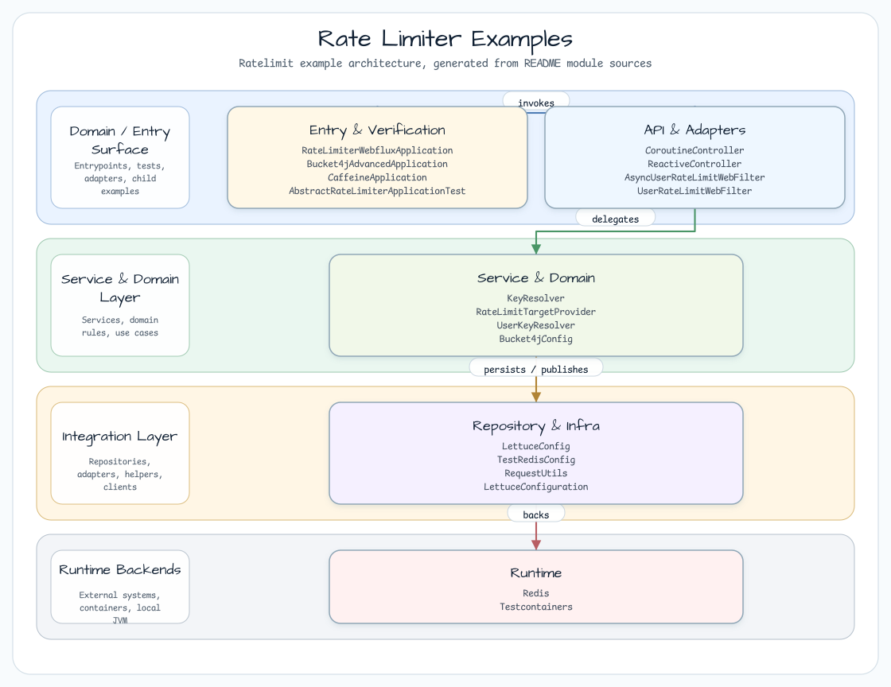
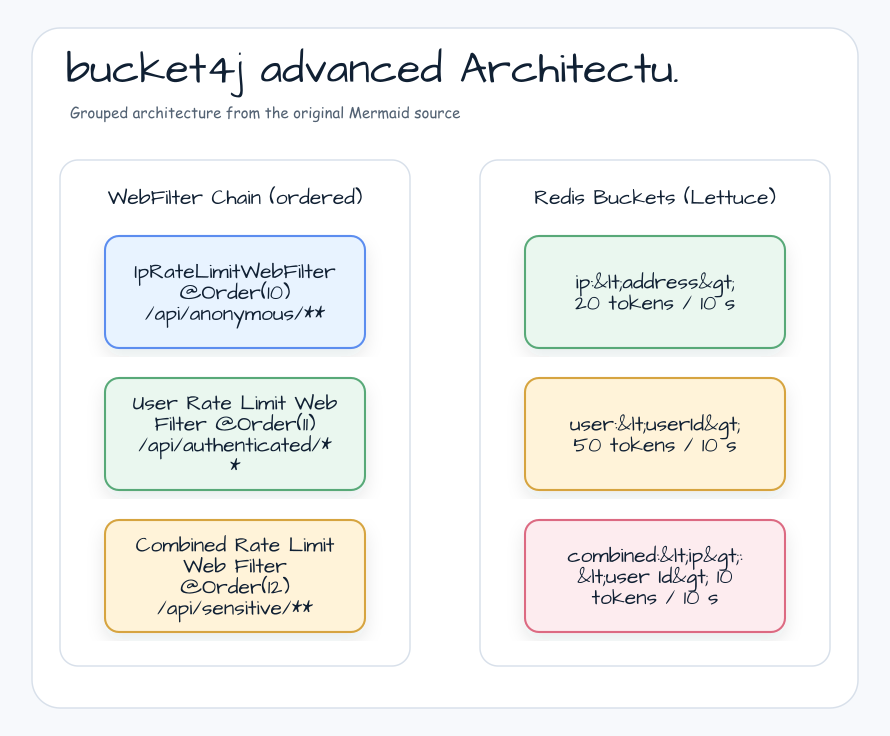
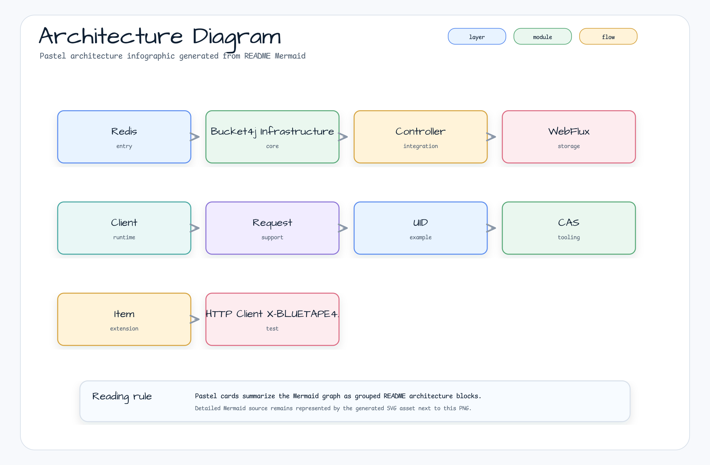
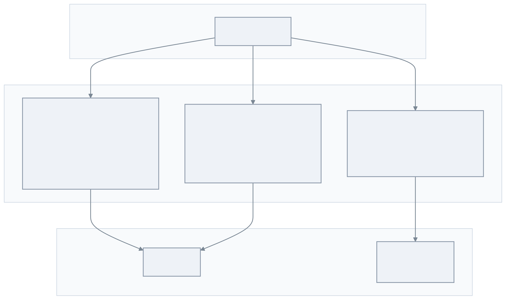
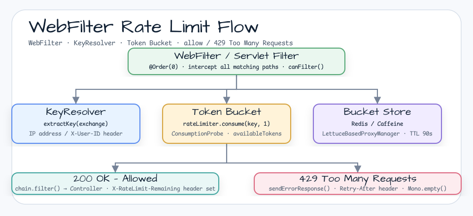

# Rate Limiter 예제

[한국어](README.ko.md) | English

## Example Scenario

This example exercises **Rate Limiter 예제** as a runnable rate limiting workshop slice. It focuses on the path a developer would inspect first: configure the module, run the sample or tests, and observe the library or framework APIs that remove repetitive infrastructure code.

## Architecture Diagram



The module is organized around the sample entry point or test fixture, the bluetape4k extension layer, and the runtime dependency used by the example. Keep the package under `io.bluetape4k.workshop.ratelimit` as the source of truth when comparing this README with the code.



## Flow Diagram

1. Prepare the local runtime required by `Rate Limiter 예제`.
2. Execute the application, controller, service, or test fixture that owns the example scenario.
3. Delegate repetitive infrastructure work to bluetape4k utilities or Spring/Kotlin integrations.
4. Assert the visible result through the sample output, HTTP response, repository state, metric, trace, or test expectation.



## Sequence Diagram

The core sequence is: caller or test fixture -> workshop adapter -> bluetape4k helper/API -> external runtime or in-memory backend -> assertion/response. When this module has a dedicated sequence asset, the image below shows that interaction order; otherwise the source tests are the authoritative executable sequence.


## 서브모듈 구조



## bucket4j-bluetape4k-webflux (추천)

`bluetape4k-bucket4j` 에서 제공하는 사용자 토큰 기반의 RateLimiter 를 사용한 예제입니다.

IP 기반, 사용자 토큰 기반 모두 제공하고, Redis 를 Bucket 저장소로 사용합니다.

## bucket4j-caffeine-web

`bucket4j-spring-boot-starter` 를 사용한 예제입니다. IP 기반 Rate Limiter를 제공하고, 로컬용입니다.

## bucket4j-redis

`bucket4j-spring-boot-starter` 를 사용한 예제입니다. IP 기반 Rate Limiter를 제공

## 모듈별 비교

| 항목 | `bucker4j-bluetape4k-webflux` | `bucket4j-redis` | `bucket4j-caffeine-web` |
|---|---|---|---|
| **추천 여부** | 추천 | 보통 | 로컬/개발용 |
| **식별 기준** | 사용자 토큰 / IP | IP | IP |
| **저장소** | Redis (Lettuce) | Redis (Lettuce) | Caffeine (인메모리) |
| **스택** | WebFlux + 코루틴 | WebFlux + 코루틴 | WebMVC (서블릿) |
| **분산 지원** | 가능 | 가능 | 불가 (단일 노드) |
| **라이브러리** | `bluetape4k-bucket4j` | `bucket4j-spring-boot-starter` | `bucket4j-spring-boot-starter` |

## Rate Limit 전략

### Token Bucket 알고리즘

Bucket4j는 Token Bucket 알고리즘을 사용합니다. 버킷에 토큰이 남아 있으면 요청을 허용하고, 소진되면 `429 Too Many Requests`를 반환합니다.

```
bucker4j-bluetape4k-webflux 버킷 설정 예시:
- 10초마다 10개 토큰 일괄 충전 (burst 방지)
- 1분마다 10개씩 점진적 충전 (최대 100개)
```

### 키 기반 분리

`bucker4j-bluetape4k-webflux`는 요청별로 고유한 키를 생성하여 버킷을 분리합니다.

| 키 전략 | 클래스 | 설명 |
|---|---|---|
| 사용자 토큰 | `UserKeyResolver` | Authorization 헤더 또는 토큰 기반 |
| IP 주소 | IP 기반 KeyResolver | 클라이언트 IP로 버킷 구분 |

### WebFilter 동작 흐름



응답 헤더 `X-Bluetape4k-Remaining-Token`으로 남은 토큰 수를 클라이언트에 전달합니다.

## 실행 방법

```bash
# Redis 필요 (Docker)
docker run -d -p 6379:6379 redis

./gradlew :bucker4j-bluetape4k-webflux:bootRun
./gradlew :bucket4j-redis:bootRun
./gradlew :bucket4j-caffeine-web:bootRun
```
