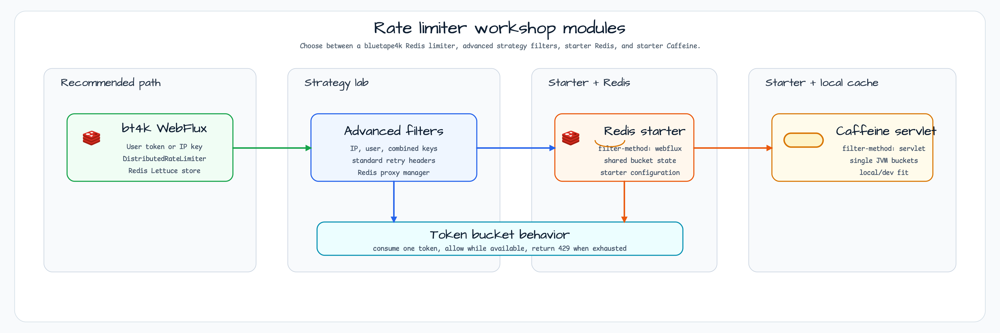
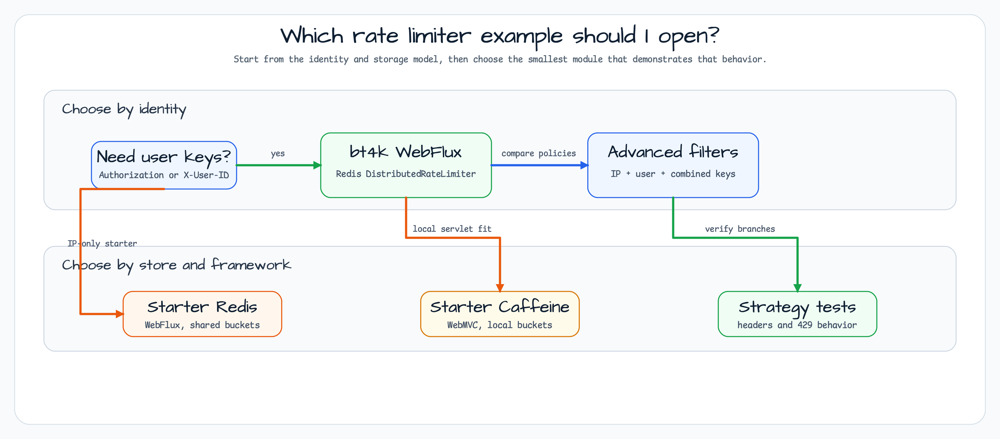

# Rate Limiter Examples

[한국어](README.ko.md) | English

This directory groups the Bucket4j rate-limit workshop modules. Use it as a map: pick the module by identity model, storage model, and Spring stack before opening the detailed README in each submodule.

## Module Map



The recommended path is `bucker4j-bluetape4k-webflux` when you want a bluetape4k `DistributedRateLimiter` and user-token-based buckets. `bucket4j-advanced` is the policy lab for IP, user, and combined-key filters. `bucket4j-redis` keeps the Bucket4j starter model but stores tokens in Redis. `bucket4j-caffeine-web` is the local WebMVC starter example for a single JVM.

## Selection Flow



Start with the key you need. User-token or mixed identity work belongs in the bluetape4k modules. IP-only starter behavior belongs in the Redis or Caffeine starter modules. Redis examples demonstrate shared bucket state; the Caffeine example demonstrates local servlet filtering.

## Modules

| Module | Use it for | Stack | Store | Identity |
|---|---|---|---|---|
| `bucker4j-bluetape4k-webflux` | Recommended bluetape4k WebFlux limiter | WebFlux + coroutines | Redis (Lettuce) | User token or IP |
| `bucket4j-advanced` | Comparing IP, user, and combined-key policies | WebFlux + coroutines | Redis (Lettuce) | IP, user, combined |
| `bucket4j-redis` | Bucket4j starter with distributed token state | WebFlux + Reactor/coroutines | Redis (Lettuce) | URL/IP-oriented starter rules |
| `bucket4j-caffeine-web` | Local starter behavior without Redis | Spring WebMVC | Caffeine JCache | URL/IP-oriented starter rules |

## Shared Concepts

All modules demonstrate token bucket decisions:

| Concept | Meaning |
|---|---|
| Bucket capacity | Maximum tokens available in a window |
| Refill | How and when tokens return to the bucket |
| Key resolver | The value used to isolate one caller's bucket from another |
| Store | Where bucket state is held: local Caffeine or shared Redis |
| Exhausted bucket | Request is rejected with `429 Too Many Requests` |

The bluetape4k WebFlux examples also expose response headers such as `X-Bluetape4k-Remaining-Token` or standard `X-RateLimit-Remaining` / `Retry-After`, depending on the module.

## Run

```bash
./gradlew :bucker4j-bluetape4k-webflux:bootRun
./gradlew :bucket4j-advanced:bootRun
./gradlew :bucket4j-redis:bootRun
./gradlew :bucket4j-caffeine-web:bootRun
```

Redis-backed modules use the repository's Testcontainers-based tests. For manual runs, provide a reachable Redis instance and match the module's `application.yml` properties.
