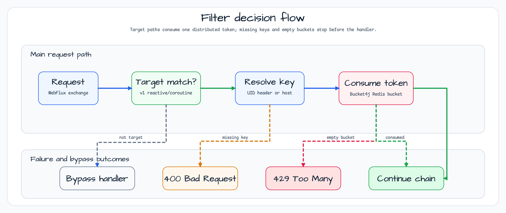

# Bucket4j를 이용한 WebFlux 사용자별 Rate Limit

[English](README.md) | 한국어

이 모듈은 Spring WebFlux endpoint에 Bucket4j 기반 사용자별 rate limit을 적용하는 예제입니다.
Bucket 상태는 Redis 기반 분산 저장소에 둡니다. Reactive endpoint와 coroutine endpoint가 모두
있으며, `/api/v1/reactive/**`, `/api/v1/coroutines/**` 경로만 제한합니다. `/api/v2/**` 경로는
그대로 통과하므로 제한 대상과 비대상 동작을 쉽게 비교할 수 있습니다.

## 아키텍처


필터는 먼저 `X-Bluetape4k-UID`에서 사용자 key를 읽고, 없으면 remote host를 사용합니다.
`UserRateLimitWebFilter`는 `DistributedRateLimiter`를 사용하고, `AsyncUserRateLimitWebFilter`는
coroutine bridge를 통해 `DistributedSuspendRateLimiter`를 사용합니다. 두 limiter bean은 같은
Bucket4j 설정과 Redis/Lettuce proxy manager를 공유합니다.

## Filter Decision Flow



대상 경로이고 key가 있으며 token 소비에 성공하면 요청을 계속 진행하고
`X-Bluetape4k-Remaining-Token` header를 기록합니다. key가 없으면 `400 Bad Request`, bucket이
비었으면 `429 Too Many Requests`를 반환합니다. Rate-limit 처리 중 예외가 나면 warn 로그를 남기고
요청을 통과시킵니다. 이 예제에서는 limiter가 endpoint 가용성의 단일 장애점이 되지 않게 합니다.

## Rate-Limited Paths

| 경로 | Handler | Rate limit |
|---|---|---|
| `/api/v1/reactive/hello` | `ReactiveController.helloV1()` | yes |
| `/api/v1/coroutines/hello` | `CoroutineController.helloV1()` | yes |
| `/api/v2/reactive/hello` | `ReactiveController.helloV2()` | no |
| `/api/v2/coroutines/hello` | `CoroutineController.helloV2()` | no |

## Bucket Policy

| Limit | Refill |
|---|---|
| 10 tokens | 10초마다 interval refill |
| 100 tokens | 1분마다 10개 greedy refill |

Bucket 상태는 `LettuceBasedProxyManager`를 통해 저장하며, 최대 용량까지 refill될 만큼 시간이 지난
뒤 만료됩니다.

## Smoke 확인

```bash
./gradlew :ratelimit-bucker4j-bluetape4k-webflux:test
./gradlew :ratelimit-bucker4j-bluetape4k-webflux:bootRun
```

`UserLateLimit.http`로 v1/v2 endpoint를 반복 호출하면 허용, 제한, 필터 비대상 응답을 비교할 수
있습니다.
