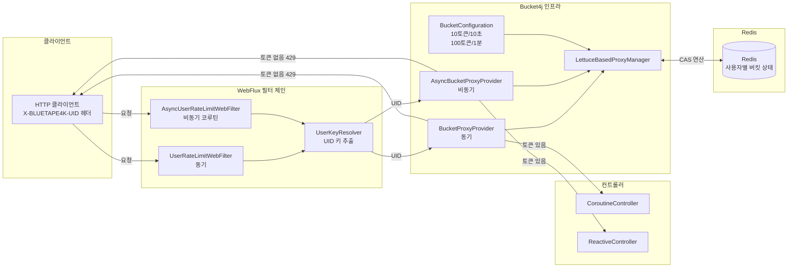

# Rate Limit per user with Bucket4j in Spring Webflux

## 아키텍처 다이어그램

Spring Webflux 환경에서 IpAddress 가 아닌 User Token으로 Rate Limit을 적용하는 예제입니다.

참고: `UserRateLimitWebFilter` 는 Spring Webflux 환경에서 요청 정보 (`ServerHttpRequest`) 의 Header에서 `X-BLUETAPE4K-UID` 값을 추출해서
이 값을 기준의 Bucket4j의 Rate Limit을 적용합니다.

기존 `bucket4j-spring-boot-starter` 는 User 기반으로 사용하려면 Spring SpEL을 동기 방식으로 사용해야 하는데,
헤더에서 User Token 값을 추출하는데, 동기 방식만 지원해서 성능이 느려질 수 있습니다.
