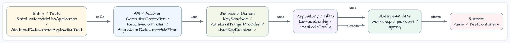
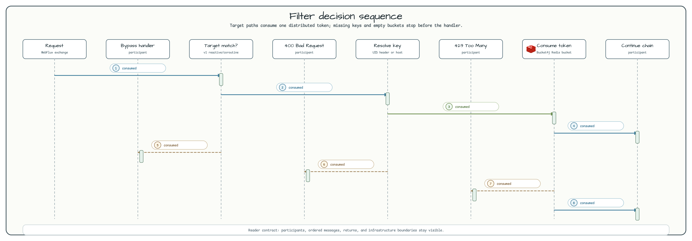

# WebFlux user rate limit with Bucket4j

[한국어](README.ko.md) | English

This module demonstrates per-user rate limiting for Spring WebFlux endpoints with Bucket4j and a
Redis-backed distributed bucket store. Both reactive and coroutine endpoints are present. Only the
`/api/v1/reactive/**` and `/api/v1/coroutines/**` paths are rate limited; `/api/v2/**` paths pass
through unchanged so the behavior is easy to compare.

## Architecture



The filters resolve a user key from `X-Bluetape4k-UID` first and fall back to the remote host.
`UserRateLimitWebFilter` uses `DistributedRateLimiter`, while `AsyncUserRateLimitWebFilter` uses
`DistributedSuspendRateLimiter` through a coroutine bridge. Both limiter beans share the same
Bucket4j configuration and Redis/Lettuce proxy manager.

## Filter Decision Flow



When a target path has a key and a token is consumed, the request continues and
`X-Bluetape4k-Remaining-Token` is written. Missing keys return `400 Bad Request`. Empty buckets return
`429 Too Many Requests`. Exceptions in the rate-limit path are logged and the request is allowed to
continue so the limiter does not become an availability dependency for the demo endpoint.

## Rate-Limited Paths

| Path | Handler | Rate limit |
|---|---|---|
| `/api/v1/reactive/hello` | `ReactiveController.helloV1()` | yes |
| `/api/v1/coroutines/hello` | `CoroutineController.helloV1()` | yes |
| `/api/v2/reactive/hello` | `ReactiveController.helloV2()` | no |
| `/api/v2/coroutines/hello` | `CoroutineController.helloV2()` | no |

## Bucket Policy

| Limit | Refill |
|---|---|
| 10 tokens | interval refill every 10 seconds |
| 100 tokens | greedy refill, 10 tokens per minute |

Bucket state is stored through `LettuceBasedProxyManager` and expires after enough time to refill to
the maximum capacity.

## Smoke Checks

```bash
./gradlew :ratelimit-bucker4j-bluetape4k-webflux:test
./gradlew :ratelimit-bucker4j-bluetape4k-webflux:bootRun
```

Use `UserLateLimit.http` to call the v1/v2 endpoints repeatedly and compare accepted, throttled, and
unfiltered responses.
