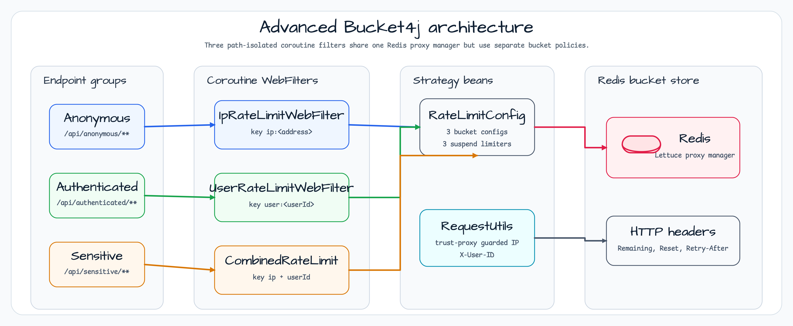
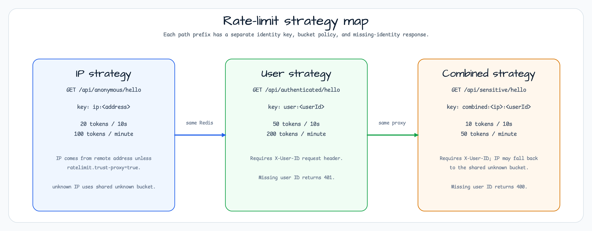

# bucket4j-advanced - Advanced Rate Limit Strategies

[English](README.md) | 한국어

`bucket4j-advanced`는 Spring WebFlux coroutine filter에서 세 가지 독립 Bucket4j rate-limit
전략을 보여줍니다. 각 filter는 하나의 path prefix, 하나의 identity key 형태, 하나의 bucket
설정을 소유합니다. Bucket 상태는 모두 같은 Redis/Lettuce proxy manager를 통해 저장합니다.

## 아키텍처



필터는 path prefix로 분리됩니다. Anonymous traffic은 IP bucket을 사용하고, authenticated
traffic은 `X-User-ID`를 사용하며, sensitive traffic은 IP와 user ID를 조합합니다. Rate-limit
실패는 표준 header를 반환하고, limiter 내부 오류는 fail-open으로 처리해 예제 endpoint 가용성을
유지합니다.

## Strategy Map



## 요청 제한 전략

| 전략 | 엔드포인트 | 키 | 버킷 | 필요한 헤더 |
|---|---|---|---|---|
| IP 기반 | `GET /api/anonymous/hello` | `ip:<address>` | 20 tokens / 10 s | 없음 |
| userId 기반 | `GET /api/authenticated/hello` | `user:<userId>` | 50 tokens / 10 s | `X-User-ID` |
| 조합(IP + userId) | `GET /api/sensitive/hello` | `combined:<ip>:<userId>` | 10 tokens / 10 s | `X-User-ID` |

## 적용 전 / 후 비교

| 관심사 | 적용 전(기본 `bucker4j-bluetape4k-webflux`) | 적용 후(이 모듈) |
|---|---|---|
| 식별 전략 | 단일 전략(userId 또는 IP) | 세 개의 독립 전략 |
| 필터 격리 | 겹치는 필터 두 개가 이중 카운팅을 유발 | 각 필터가 자신의 경로 prefix만 처리 |
| 응답 헤더 | `X-BLUETAPE4K-REMAINING-TOKEN`(커스텀) | `X-RateLimit-Remaining` + `Retry-After`(HTTP 표준) |
| 사용자 ID 헤더 | `X-BLUETAPE4K-UID` | `X-User-ID` |
| 누락된 식별자 | 조용히 remoteAddress로 대체 | 명시적 오류 코드(400 / 401) |
| 조합 quota | 지원하지 않음 | IP+userId 복합 키 |

## 응답 헤더

| 헤더 | 의미 |
|---|---|
| `X-RateLimit-Remaining` | 이 요청 이후 현재 윈도우에 남은 토큰 수 |
| `X-RateLimit-Reset` | _(예약됨. 아직 채우지 않음)_ |
| `Retry-After` | 재시도 전 기다릴 초. HTTP 429 응답에만 포함됩니다. |

## 프록시 신뢰 설정

기본값은 `ratelimit.trust-proxy=false`이며 `X-Forwarded-For` / `X-Real-IP` 헤더는 **무시**됩니다. IP 추출에는 항상 원시 TCP remote address를 사용합니다.

**보안 경고**: `ratelimit.trust-proxy=true`를 설정하면 `X-Forwarded-For`를 신뢰하고 해당 헤더의 **가장 왼쪽** IP를 클라이언트 주소로 사용합니다. 애플리케이션이 알려진 통제된 리버스 프록시(예: 내부 로드 밸런서) 뒤에 있을 때만 활성화하세요. 신뢰할 수 있는 프록시가 없으면 클라이언트가 `X-Forwarded-For` 헤더에 임의의 IP 주소를 위조해 IP별 요청 제한을 완전히 우회할 수 있습니다.

```yaml
# application.yml — enable only behind a trusted proxy
ratelimit:
  trust-proxy: true
```

## 실행

```bash
# Start a Redis instance (or let Testcontainers manage it in dev/test profile)
./gradlew :bucket4j-advanced:bootRun

# Run tests
./gradlew :bucket4j-advanced:test
```

## 예제 요청

```bash
# IP-based (anonymous)
curl http://localhost:8080/api/anonymous/hello

# userId-based (authenticated)
curl -H "X-User-ID: alice" http://localhost:8080/api/authenticated/hello

# Combined IP + userId (sensitive)
curl -H "X-User-ID: alice" http://localhost:8080/api/sensitive/hello
```

## 의존성

| 의존성 | 목적 |
|---|---|
| `bluetape4k-bucket4j` | `DistributedSuspendRateLimiter`, `AsyncBucketProxyProvider`, `bucketConfiguration {}` DSL |
| `bucket4j-lettuce` | Redis-backed distributed `ProxyManager` |
| `bluetape4k-redis` / `lettuce-core` | Lettuce Redis client |
| `bluetape4k-coroutines` | `mono {}`, `awaitSingleOrNull()` bridges |
| `bluetape4k-testcontainers` | `RedisServer.Launcher.redis` singleton for tests |
