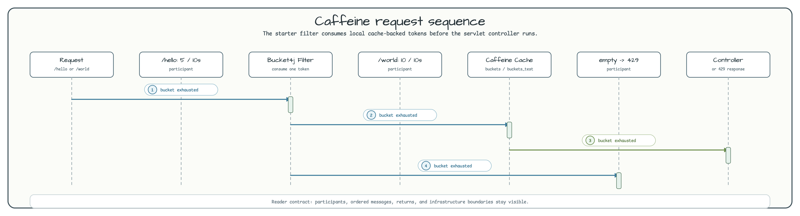

# Caffeine을 사용하는 Spring WebMVC Bucket4j

[English](README.md) | 한국어

이 모듈은 Bucket4j Spring Boot starter와 Caffeine JCache 저장소로 servlet 기반 rate limit을
적용하는 예제입니다. 의도적으로 로컬/동기 방식입니다. Redis도, 분산 proxy manager도, WebFlux
filter 코드도 없습니다. 단일 WebMVC 인스턴스에서 작은 in-memory bucket store가 필요할 때의
구성을 보여줍니다.

## 아키텍처


`CaffeineApplication`은 Spring caching을 활성화하고, `IndexController`는 `/hello`, `/world`를
노출합니다. Bucket4j starter는 `application.yml` 설정으로 servlet filter를 설치합니다. Bucket
상태는 `buckets`라는 Caffeine JCache cache에 저장됩니다.

## Request Flow



기본 application profile은 하나의 catch-all `url: .*` 제한을 적용합니다. Servlet 테스트 profile은
서로 다른 quota를 검증할 수 있도록 두 URL 규칙을 분리합니다.

| Profile | URL rule | Capacity |
|---|---|---|
| `application.yml` | `.*` | capacity 10, 초당 1 token refill, initial capacity 20 |
| `application-servlet.yml` | `^(/hello).*` | 10초당 5 요청 |
| `application-servlet.yml` | `^(/world).*` | 10초당 10 요청 |

## 핵심 구성 요소

| 클래스 / 파일 | 역할 |
|---|---|
| `CaffeineApplication.kt` | `@EnableCaching`이 있는 Spring Boot entry point. |
| `IndexController.kt` | `GET /hello`, `GET /world` 제공. |
| `application.yml` | Caffeine JCache와 Bucket4j starter 설정. |
| `ServletRateLimitTest.kt` | remaining-token header와 429 응답 검증. |

## 제약과 대안

| 항목 | 세부 사항 |
|---|---|
| 저장소 | 단일 JVM 안의 Caffeine JCache. |
| 서버 모델 | Spring Boot WebMVC servlet stack. |
| Blocking 동작 | 단순 로컬 데모에는 적합하지만 분산 quota 저장소는 아니다. |
| 분산 대안 | Redis/Lettuce 또는 Hazelcast 기반 Bucket4j proxy manager. |

## 빌드와 테스트

```bash
./gradlew :bucket4j-caffeine-web:test
```
