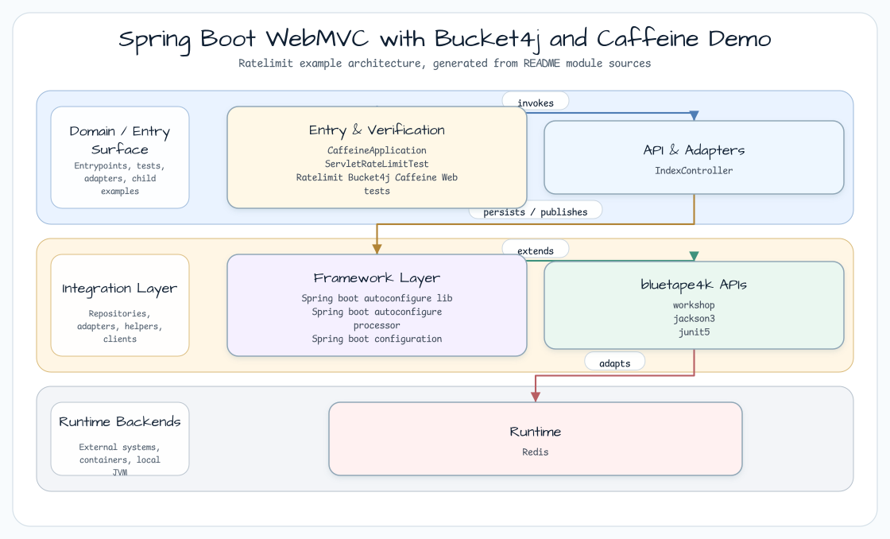
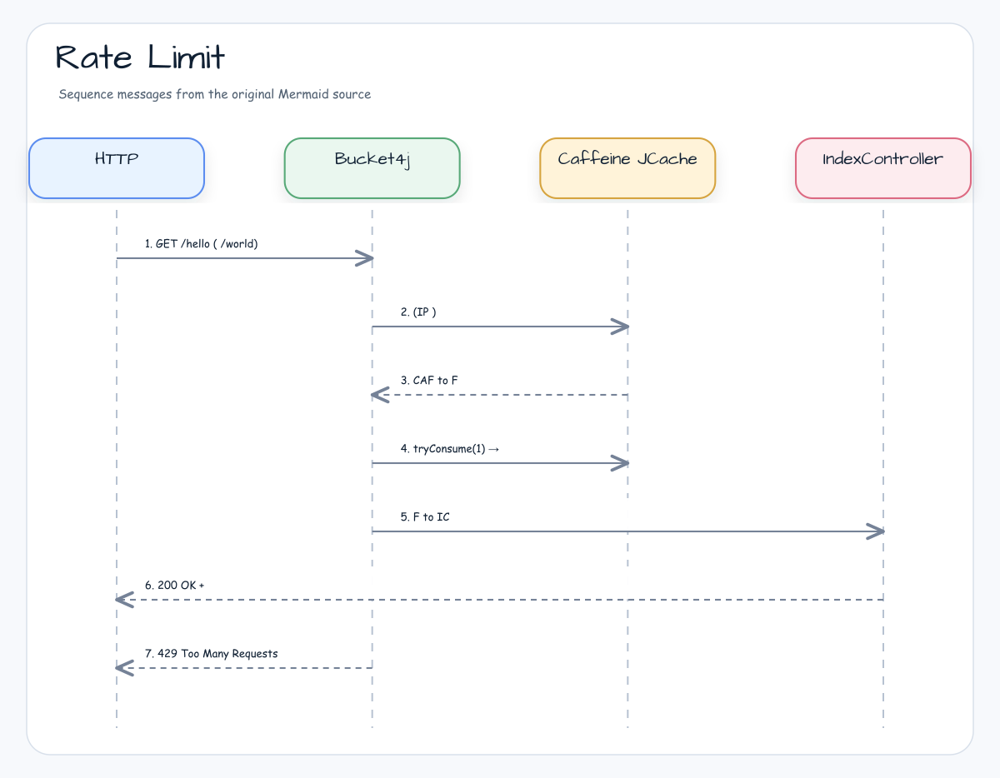

# Bucket4j와 Caffeine을 사용하는 Spring Boot WebMVC 데모

[English](README.md) | 한국어

## 예제 시나리오

이 예제는 **Bucket4j와 Caffeine을 사용하는 Spring Boot WebMVC 데모**를 실행 가능한 rate limiting 워크숍 조각으로 다룹니다. 개발자가 가장 먼저 확인할 경로인 모듈 설정, 샘플 또는 테스트 실행, 반복적인 인프라 코드를 줄여 주는 라이브러리와 프레임워크 API를 중심으로 설명합니다.

## 아키텍처 다이어그램



이 모듈은 샘플 진입점 또는 테스트 픽스처, bluetape4k 확장 계층, 예제가 사용하는 런타임 의존성을 중심으로 구성됩니다. README와 코드를 비교할 때는 `io.bluetape4k.workshop.ratelimit` 패키지를 기준으로 삼습니다.

## 시퀀스 다이어그램



## application.yml 설정 예제

```yaml
spring:
  cache:
    jcache:
      provider: com.github.benmanes.caffeine.jcache.spi.CaffeineCachingProvider
    cache-names:
      - buckets
    caffeine:
      spec: maximumSize=1000000,expireAfterAccess=3600s

bucket4j:
  enabled: true
  filters:
    - cache-name: buckets
      url: .*                      # Apply to all URLs
      rate-limits:
        - bandwidths:
            - capacity: 10         # Maximum number of bucket tokens
              refill-capacity: 1   # Tokens refilled each interval
              time: 1
              unit: seconds
              initial-capacity: 20 # Initial token count (allows burst)
              refill-speed: interval
```

## 핵심 구성 요소

| 클래스 / 파일 | 역할 |
|---------------|------|
| `CaffeineApplication.kt` | Spring Boot 진입점, `@SpringBootApplication` |
| `IndexController.kt` | `GET /hello`와 `GET /world` 엔드포인트를 제공합니다 |
| `application.yml` | Caffeine JCache + Bucket4j filter 설정입니다 |
| `ServletRateLimitTest.kt` | `@SpringBootTest` 기반 Rate Limit 통합 테스트입니다 |

## 제약과 대안

| 항목 | 세부 사항 |
|------|------|
| 저장소 | Caffeine JCache — **동기(blocking)** 전용 |
| 적용 가능한 서버 | Spring Boot WebMVC(Servlet 기반) |
| 비동기 대안 | Redis(`LettuceBasedProxyManager`), Hazelcast |
| Virtual Threads 대안 | `spring.threads.virtual.enabled=true` + WebMVC |

## 빌드와 테스트

```bash
./gradlew :bucket4j-caffeine-web:test
```
