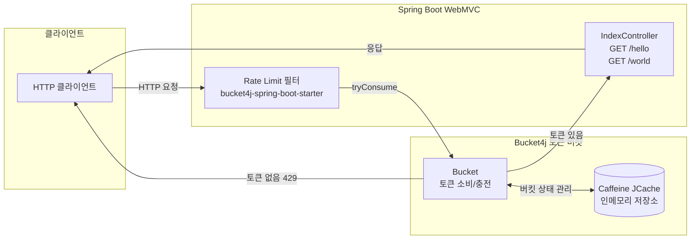
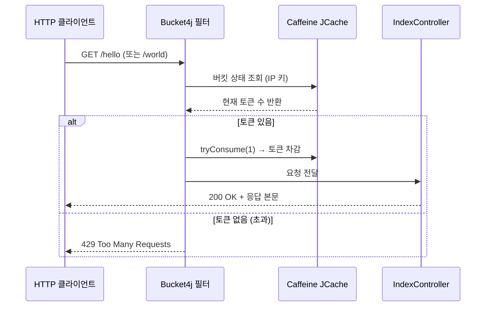

# Spring Boot WebMVC with Bucket4j and Caffeine Demo

## 아키텍처 다이어그램



Bucket4j 저장소로 Caffeine 을 사용하는 Spring Boot WebMVC 데모 프로젝트입니다.
Caffeine JCache 가 동기 방식밖에 지원하지 않기 때문에 Spring Boot WebMVC 에서만 가능합니다.

만약, Spring Webflux 등 비동기 방식의 API 에 대해서는 Redis, Hazelcast 등을 사용해야 합니다.
아니면 Virtual Threads 를 사용하는 방식을 고려해야 합니다.

## Rate Limit 요청 처리 흐름



## application.yml 설정 예제

```yaml
spring:
  cache:
    jcache:
      provider: com.github.benmanes.caffeine.jcache.spi.CaffeineCachingProvider
    cache-names:
      - buckets
    caffeine:
      spec: maximumSize=1000000,expireAfterAccess=3600s

bucket4j:
  enabled: true
  filters:
    - cache-name: buckets
      url: .*                      # 모든 URL 에 적용
      rate-limits:
        - bandwidths:
            - capacity: 10         # 버킷 최대 토큰 수
              refill-capacity: 1   # 매 interval 마다 충전 토큰 수
              time: 1
              unit: seconds
              initial-capacity: 20 # 초기 토큰 수 (burst 허용)
              refill-speed: interval
```

## 주요 구성 요소

| 클래스 / 파일 | 역할 |
|---------------|------|
| `CaffeineApplication.kt` | Spring Boot 진입점, `@SpringBootApplication` |
| `IndexController.kt` | `GET /hello`, `GET /world` 엔드포인트 제공 |
| `application.yml` | Caffeine JCache + Bucket4j 필터 설정 |
| `ServletRateLimitTest.kt` | `@SpringBootTest` 기반 Rate Limit 통합 테스트 |

## 제약 사항 및 대안

| 항목 | 내용 |
|------|------|
| 저장소 | Caffeine JCache — **동기(Blocking)** 전용 |
| 적용 가능 서버 | Spring Boot WebMVC (Servlet 기반) |
| 비동기 대안 | Redis (`LettuceBasedProxyManager`), Hazelcast |
| Virtual Threads 대안 | `spring.threads.virtual.enabled=true` + WebMVC |

## 빌드 및 테스트

```bash
./gradlew :bucket4j-caffeine-web:test
```
