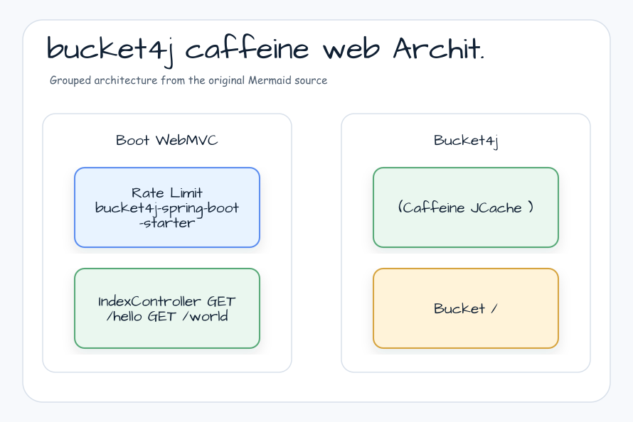

# Spring Boot WebMVC with Bucket4j and Caffeine Demo

[한국어](README.ko.md) | English

## Example Scenario

This example exercises **Spring Boot WebMVC with Bucket4j and Caffeine Demo** as a runnable rate limiting workshop slice. It focuses on the path a developer would inspect first: configure the module, run the sample or tests, and observe the library or framework APIs that remove repetitive infrastructure code.

## Architecture Diagram

The module is organized around the sample entry point or test fixture, the bluetape4k extension layer, and the runtime dependency used by the example. Keep the package under `io.bluetape4k.workshop.ratelimit` as the source of truth when comparing this README with the code.



## Flow Diagram

1. Prepare the local runtime required by `ratelimit-bucket4j-caffeine-web`.
2. Execute the application, controller, service, or test fixture that owns the example scenario.
3. Delegate repetitive infrastructure work to bluetape4k utilities or Spring/Kotlin integrations.
4. Assert the visible result through the sample output, HTTP response, repository state, metric, trace, or test expectation.

## Sequence Diagram

The core sequence is: caller or test fixture -> workshop adapter -> bluetape4k helper/API -> external runtime or in-memory backend -> assertion/response. When this module has a dedicated sequence asset, the image below shows that interaction order; otherwise the source tests are the authoritative executable sequence.


## 아키텍처 다이어그램


Bucket4j 저장소로 Caffeine 을 사용하는 Spring Boot WebMVC 데모 프로젝트입니다.
Caffeine JCache 가 동기 방식밖에 지원하지 않기 때문에 Spring Boot WebMVC 에서만 가능합니다.

만약, Spring Webflux 등 비동기 방식의 API 에 대해서는 Redis, Hazelcast 등을 사용해야 합니다.
아니면 Virtual Threads 를 사용하는 방식을 고려해야 합니다.

## Rate Limit 요청 처리 흐름


## application.yml 설정 예제

```yaml
spring:
  cache:
    jcache:
      provider: com.github.benmanes.caffeine.jcache.spi.CaffeineCachingProvider
    cache-names:
      - buckets
    caffeine:
      spec: maximumSize=1000000,expireAfterAccess=3600s

bucket4j:
  enabled: true
  filters:
    - cache-name: buckets
      url: .*                      # 모든 URL 에 적용
      rate-limits:
        - bandwidths:
            - capacity: 10         # 버킷 최대 토큰 수
              refill-capacity: 1   # 매 interval 마다 충전 토큰 수
              time: 1
              unit: seconds
              initial-capacity: 20 # 초기 토큰 수 (burst 허용)
              refill-speed: interval
```

## 주요 구성 요소

| 클래스 / 파일 | 역할 |
|---------------|------|
| `CaffeineApplication.kt` | Spring Boot 진입점, `@SpringBootApplication` |
| `IndexController.kt` | `GET /hello`, `GET /world` 엔드포인트 제공 |
| `application.yml` | Caffeine JCache + Bucket4j 필터 설정 |
| `ServletRateLimitTest.kt` | `@SpringBootTest` 기반 Rate Limit 통합 테스트 |

## 제약 사항 및 대안

| 항목 | 내용 |
|------|------|
| 저장소 | Caffeine JCache — **동기(Blocking)** 전용 |
| 적용 가능 서버 | Spring Boot WebMVC (Servlet 기반) |
| 비동기 대안 | Redis (`LettuceBasedProxyManager`), Hazelcast |
| Virtual Threads 대안 | `spring.threads.virtual.enabled=true` + WebMVC |

## 빌드 및 테스트

```bash
./gradlew :bucket4j-caffeine-web:test
```
