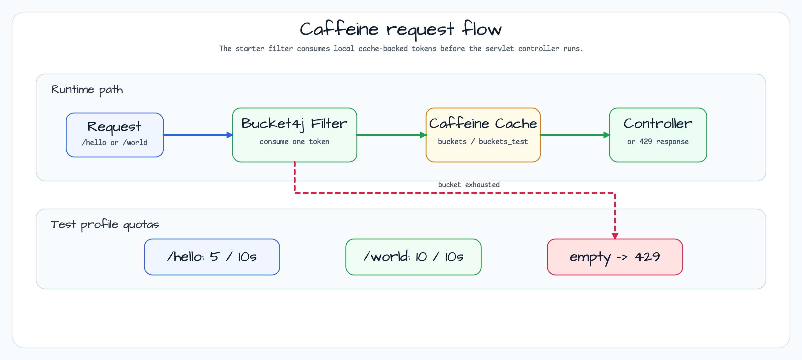

# Spring WebMVC Bucket4j with Caffeine

[한국어](README.ko.md) | English

This module demonstrates servlet-based rate limiting with the Bucket4j Spring Boot starter and a
Caffeine JCache store. It is intentionally local and blocking: no Redis, no distributed proxy
manager, and no WebFlux filter code. The sample is useful when a single WebMVC instance needs a
small in-memory bucket store.

## Architecture


`CaffeineApplication` enables Spring caching, `IndexController` exposes `/hello` and `/world`, and
the Bucket4j starter installs the servlet filter from `application.yml`. Bucket state is stored in
the Caffeine JCache cache named `buckets`.

## Request Flow



The default application profile applies one catch-all `url: .*` limit. The servlet test profile uses
two explicit URL rules so the test can prove different quotas:

| Profile | URL rule | Capacity |
|---|---|---|
| `application.yml` | `.*` | 10 capacity, 1 token per second, initial capacity 20 |
| `application-servlet.yml` | `^(/hello).*` | 5 requests per 10 seconds |
| `application-servlet.yml` | `^(/world).*` | 10 requests per 10 seconds |

## Key Components

| Class / File | Role |
|---|---|
| `CaffeineApplication.kt` | Spring Boot entry point with `@EnableCaching`. |
| `IndexController.kt` | Provides `GET /hello` and `GET /world`. |
| `application.yml` | Caffeine JCache and Bucket4j starter configuration. |
| `ServletRateLimitTest.kt` | Verifies remaining-token headers and 429 responses. |

## Constraints and Alternatives

| Item | Details |
|---|---|
| Store | Caffeine JCache, local to one JVM. |
| Server model | Spring Boot WebMVC servlet stack. |
| Blocking behavior | Suitable for simple local demos; not a distributed quota store. |
| Distributed alternative | Redis/Lettuce or Hazelcast-backed Bucket4j proxy manager. |

## Build and Test

```bash
./gradlew :bucket4j-caffeine-web:test
```
