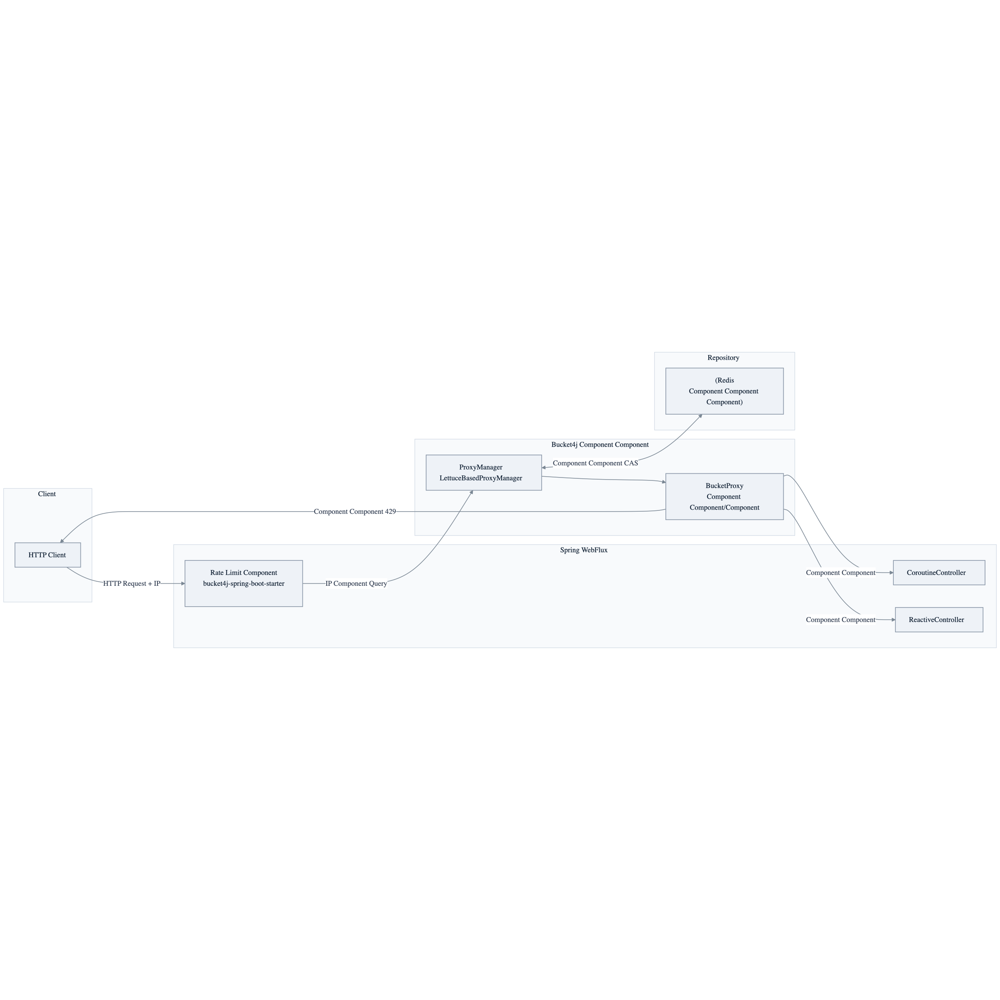
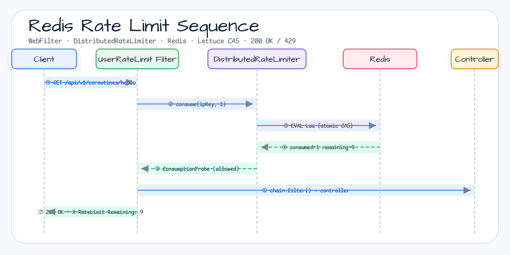

# Bucket4j와 Redis를 사용하는 Spring Webflux

[English](README.md) | 한국어

## 예제 시나리오

이 예제는 **Bucket4j와 Redis를 사용하는 Spring Webflux**를 실행 가능한 rate limiting 워크숍 조각으로 다룹니다. 개발자가 가장 먼저 확인할 경로인 모듈 설정, 샘플 또는 테스트 실행, 반복적인 인프라 코드를 줄여 주는 라이브러리와 프레임워크 API를 중심으로 설명합니다.

## 아키텍처 다이어그램


이 모듈은 샘플 진입점 또는 테스트 픽스처, bluetape4k 확장 계층, 예제가 사용하는 런타임 의존성을 중심으로 구성됩니다. README와 코드를 비교할 때는 `io.bluetape4k.workshop.ratelimit` 패키지를 기준으로 삼습니다.



## 흐름 다이어그램

1. `ratelimit-bucket4j-redis`에 필요한 로컬 런타임을 준비합니다.
2. 예제 시나리오를 담당하는 애플리케이션, 컨트롤러, 서비스 또는 테스트 픽스처를 실행합니다.
3. 반복적인 인프라 작업을 bluetape4k 유틸리티 또는 Spring/Kotlin 통합에 위임합니다.
4. 샘플 출력, HTTP 응답, 저장소 상태, 메트릭, trace 또는 테스트 기대값으로 보이는 결과를 검증합니다.

## 시퀀스 다이어그램

핵심 시퀀스는 호출자 또는 테스트 픽스처 -> 워크숍 어댑터 -> bluetape4k 헬퍼/API -> 외부 런타임 또는 인메모리 백엔드 -> 검증/응답 순서입니다. 이 모듈에 전용 시퀀스 이미지가 있으면 아래 이미지가 상호작용 순서를 보여주며, 그렇지 않으면 소스 테스트가 실행 가능한 시퀀스의 기준입니다.



## 아키텍처 다이어그램


이 예제는 Redis를 bucket store로 사용하는 Spring WebFlux 애플리케이션에서 Bucket4j rate limiting을 구현합니다.

`bucket4j-spring-boot-starter`를 사용해 간단한 Bucket4j 설정을 보여줍니다.
다만 IP 기반 rate limiting만 제공합니다.

## Redis 기반 Rate Limit 요청 흐름


## application.yml 설정 예제

```yaml
spring:
  data:
    redis:
      host: ${testcontainers.redis.host}
      port: ${testcontainers.redis.port}
      lettuce:
        pool:
          enabled: true

bucket4j:
  enabled: true
  cache-to-use: redis-lettuce          # Use the Lettuce-based Redis store
  filters:
    - cache-name: buckets
      filter-method: webflux           # WebFlux (asynchronous) filter mode
      url: .*
      rate-limits:
        - bandwidths:
            - capacity: 5              # Maximum number of bucket tokens
              time: 10
              unit: seconds            # Allow 5 requests per 10 seconds
```

## 핵심 구성 요소

| 클래스 / 파일 | 역할 |
|---------------|------|
| `Bucket4jRedisApplication.kt` | Spring Boot 진입점입니다 |
| `LettuceConfiguration.kt` | `RedisClient` 빈을 등록합니다(Testcontainers URL 주입) |
| `CoroutineController.kt` | `suspend` 기반 `GET /coroutines/hello`와 `GET /coroutines/world` 엔드포인트입니다 |
| `ReactiveController.kt` | `Mono` 기반 `GET /reactive/hello`와 `GET /reactive/world` 엔드포인트입니다 |
| `DebugMetricHandler.kt` | Bucket4j metric debug handler입니다 |
| `application.yml` | Redis 연결 + Bucket4j WebFlux filter 설정입니다 |
| `CoroutineRateLimitTest.kt` | Coroutine 엔드포인트용 Rate Limit 통합 테스트입니다 |
| `ReactiveRateLimitTest.kt` | Reactive 엔드포인트용 Rate Limit 통합 테스트입니다 |

## Caffeine 방식과 비교

| 항목 | Caffeine(WebMVC) | Redis(WebFlux) |
|------|-------------------|-----------------|
| 저장소 | 인메모리(단일 인스턴스) | Redis(분산 가능) |
| 동기/비동기 | 동기(blocking) | 비동기(non-blocking) |
| Scale-out | 아니요 | 예(shared bucket state) |
| `cache-to-use` 설정 | `jcache` | `redis-lettuce` |
| `filter-method` | `servlet` | `webflux` |

## 빌드와 테스트

```bash
./gradlew :bucket4j-redis:test
./gradlew :bucket4j-redis:test --tests "io.bluetape4k.workshop.bucket4j.controller.CoroutineRateLimitTest"
```
