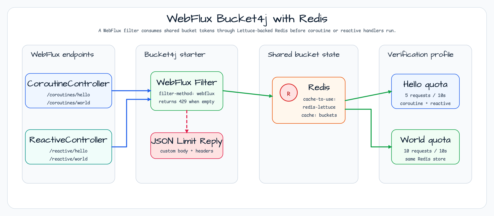
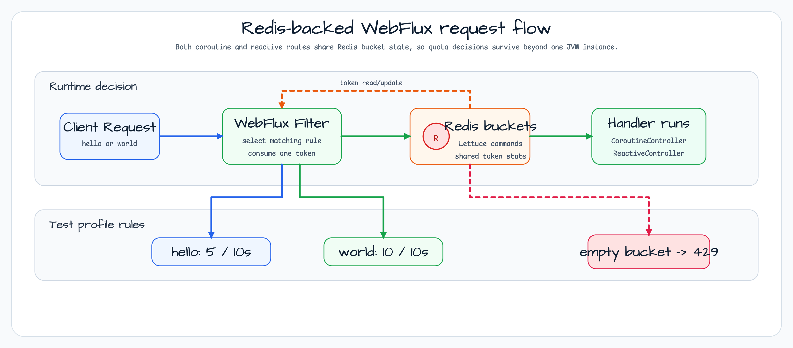

# Redis를 사용하는 Spring WebFlux Bucket4j

[English](README.md) | 한국어

이 모듈은 Redis-backed token store를 사용하는 Bucket4j WebFlux filter 예제입니다. Caffeine servlet 예제가 단일 JVM 로컬 bucket을 보여준다면, 이 예제는 coroutine/reactive controller가 실행되기 전에 Redis에 저장된 공유 token 상태로 quota를 판단하는 흐름을 보여줍니다.

## 아키텍처



애플리케이션은 Testcontainers Redis URL로 Lettuce `RedisClient`를 등록하고, Bucket4j starter가 WebFlux filter를 설치하게 둡니다. 기본 runtime 설정은 전체 URL에 10초당 5회 rule을 적용합니다. 테스트 profile은 URL별 quota를 분리해 정상 요청 횟수와 마지막 차단 응답을 명확히 검증합니다.

## 요청 흐름



모든 요청은 먼저 Bucket4j WebFlux filter를 통과합니다. Filter는 URL rule을 선택하고 Redis bucket에서 token 하나를 소비한 뒤에야 `CoroutineController` 또는 `ReactiveController`로 요청을 넘깁니다. Redis bucket이 비면 handler를 호출하지 않고 starter가 설정된 body/header와 함께 `429 Too Many Requests`를 반환합니다.

## 설정

```yaml
spring:
  data:
    redis:
      host: ${testcontainers.redis.host}
      port: ${testcontainers.redis.port}
      lettuce:
        pool:
          enabled: true

bucket4j:
  enabled: true
  cache-to-use: redis-lettuce
  filters:
    - cache-name: buckets
      filter-method: webflux
      url: .*
      http-content-type: application/json;charset=UTF-8
      http-response-body: '{ "name": "hello"}'
      http-response-headers:
        HELLO: WORLD
      rate-limits:
        - bandwidths:
            - capacity: 5
              time: 10
              unit: seconds
```

통합 테스트 profile은 `buckets_test`를 사용하고 URL을 다음처럼 나눕니다.

| URL pattern | Quota |
|---|---:|
| `^(/coroutines/hello).*` | 10초당 5회 |
| `^(/coroutines/world).*` | 10초당 10회 |
| `^(/reactive/hello).*` | 10초당 5회 |
| `^(/reactive/world).*` | 10초당 10회 |

## 핵심 구성 요소

| Class / file | 역할 |
|---|---|
| `Bucket4jRedisApplication.kt` | Spring Boot 진입점 |
| `LettuceConfiguration.kt` | Testcontainers Redis URL로 `RedisClient` 생성 |
| `CoroutineController.kt` | `/coroutines/hello`, `/coroutines/world` suspend handler |
| `ReactiveController.kt` | `/reactive/hello`, `/reactive/world` `Mono` handler |
| `application.yml` | Redis 연결과 Bucket4j WebFlux filter 설정 |
| `application-webflux.yml` | Endpoint별 test quota rule |
| `CoroutineRateLimitTest.kt` | Coroutine endpoint의 정상 요청 수와 마지막 429 응답 검증 |
| `ReactiveRateLimitTest.kt` | Reactive endpoint의 정상 요청 수와 마지막 429 응답 검증 |

## Caffeine vs Redis

| 항목 | Caffeine WebMVC | Redis WebFlux |
|---|---|---|
| Store | 로컬 JVM cache | 공유 Redis bucket |
| Filter method | `servlet` | `webflux` |
| Cache adapter | `jcache` | `redis-lettuce` |
| Scale-out behavior | Instance별로 분리 | Instance 간 공유 |
| Endpoint style | Servlet controller | Coroutine/Reactor controller |

## 빌드와 테스트

```bash
./gradlew :bucket4j-redis:test
./gradlew :bucket4j-redis:test --tests "io.bluetape4k.workshop.bucket4j.controller.CoroutineRateLimitTest"
./gradlew :bucket4j-redis:test --tests "io.bluetape4k.workshop.bucket4j.controller.ReactiveRateLimitTest"
```
