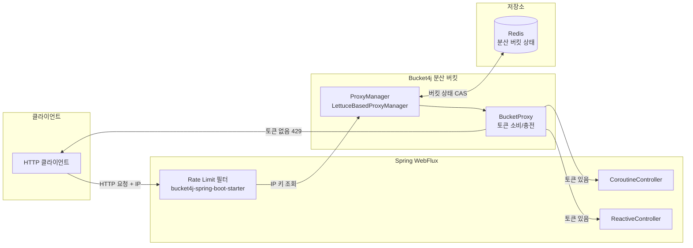
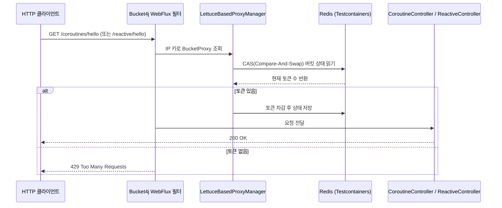

# Spring Webflux with Bucket4j and Redis

## 아키텍처 다이어그램



Spring Webflux Application 에서 Redis를 Bucket 저장소로 사용하는 Rate Limit 을 Bucket4j 로 구현한 예제입니다.

`bucket4j-spring-boot-starter` 를 사용하여 Bucket4j 를 쉽게 사용한 예입니다.
단, IP 기반 Rate Limit 만 제공합니다.

## Redis 기반 Rate Limit 요청 처리 흐름



## application.yml 설정 예제

```yaml
spring:
  data:
    redis:
      host: ${testcontainers.redis.host}
      port: ${testcontainers.redis.port}
      lettuce:
        pool:
          enabled: true

bucket4j:
  enabled: true
  cache-to-use: redis-lettuce          # Lettuce 기반 Redis 저장소 사용
  filters:
    - cache-name: buckets
      filter-method: webflux           # WebFlux(비동기) 필터 모드
      url: .*
      rate-limits:
        - bandwidths:
            - capacity: 5              # 버킷 최대 토큰 수
              time: 10
              unit: seconds            # 10초에 5회 허용
```

## 주요 구성 요소

| 클래스 / 파일 | 역할 |
|---------------|------|
| `Bucket4jRedisApplication.kt` | Spring Boot 진입점 |
| `LettuceConfiguration.kt` | `RedisClient` 빈 등록 (Testcontainers URL 주입) |
| `CoroutineController.kt` | `suspend` 기반 `GET /coroutines/hello`, `GET /coroutines/world` |
| `ReactiveController.kt` | `Mono` 기반 `GET /reactive/hello`, `GET /reactive/world` |
| `DebugMetricHandler.kt` | Bucket4j 메트릭 디버그 핸들러 |
| `application.yml` | Redis 연결 + Bucket4j WebFlux 필터 설정 |
| `CoroutineRateLimitTest.kt` | 코루틴 엔드포인트 Rate Limit 통합 테스트 |
| `ReactiveRateLimitTest.kt` | Reactive 엔드포인트 Rate Limit 통합 테스트 |

## Caffeine 방식과의 비교

| 항목 | Caffeine (WebMVC) | Redis (WebFlux) |
|------|-------------------|-----------------|
| 저장소 | 인메모리 (단일 인스턴스) | Redis (분산 가능) |
| 동기/비동기 | 동기 (Blocking) | 비동기 (Non-blocking) |
| 스케일 아웃 | 불가 | 가능 (공유 버킷 상태) |
| 설정 `cache-to-use` | `jcache` | `redis-lettuce` |
| `filter-method` | `servlet` | `webflux` |

## 빌드 및 테스트

```bash
./gradlew :bucket4j-redis:test
./gradlew :bucket4j-redis:test --tests "io.bluetape4k.workshop.bucket4j.controller.CoroutineRateLimitTest"
```
