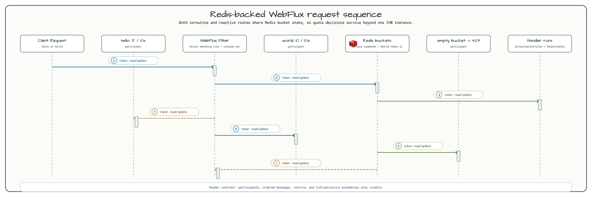

# Spring WebFlux Bucket4j with Redis

[한국어](README.ko.md) | English

This module demonstrates Bucket4j's WebFlux filter with a Redis-backed token store. It is the distributed counterpart to the Caffeine servlet example: quota decisions are made before the coroutine or reactive controller runs, and token state is shared through Redis by the `redis-lettuce` cache adapter.

## Architecture


The application registers a Lettuce `RedisClient` from the Testcontainers Redis URL and lets the Bucket4j starter install a WebFlux filter. Runtime configuration uses one catch-all rule with 5 requests per 10 seconds. The test profile narrows that into endpoint-specific rules so the integration tests can assert both allowed and blocked requests.

## Request Flow



Every request first reaches the Bucket4j WebFlux filter. The filter chooses the matching URL rule, consumes a token from Redis, and only then dispatches to either `CoroutineController` or `ReactiveController`. Once the Redis bucket is empty, the starter returns `429 Too Many Requests` with the configured response body and headers instead of invoking the handler.

## Configuration

```yaml
spring:
  data:
    redis:
      host: ${testcontainers.redis.host}
      port: ${testcontainers.redis.port}
      lettuce:
        pool:
          enabled: true

bucket4j:
  enabled: true
  cache-to-use: redis-lettuce
  filters:
    - cache-name: buckets
      filter-method: webflux
      url: .*
      http-content-type: application/json;charset=UTF-8
      http-response-body: '{ "name": "hello"}'
      http-response-headers:
        HELLO: WORLD
      rate-limits:
        - bandwidths:
            - capacity: 5
              time: 10
              unit: seconds
```

The integration profile uses `buckets_test` and splits the URLs:

| URL pattern | Quota |
|---|---:|
| `^(/coroutines/hello).*` | 5 requests / 10 seconds |
| `^(/coroutines/world).*` | 10 requests / 10 seconds |
| `^(/reactive/hello).*` | 5 requests / 10 seconds |
| `^(/reactive/world).*` | 10 requests / 10 seconds |

## Key Components

| Class / file | Role |
|---|---|
| `Bucket4jRedisApplication.kt` | Spring Boot entry point |
| `LettuceConfiguration.kt` | Creates the `RedisClient` from the Testcontainers Redis URL |
| `CoroutineController.kt` | Suspend handlers for `/coroutines/hello` and `/coroutines/world` |
| `ReactiveController.kt` | `Mono` handlers for `/reactive/hello` and `/reactive/world` |
| `application.yml` | Redis connection plus Bucket4j WebFlux filter configuration |
| `application-webflux.yml` | Endpoint-specific test quota rules |
| `CoroutineRateLimitTest.kt` | Verifies coroutine endpoint success counts and final 429 response |
| `ReactiveRateLimitTest.kt` | Verifies reactive endpoint success counts and final 429 response |

## Caffeine vs Redis

| Item | Caffeine WebMVC | Redis WebFlux |
|---|---|---|
| Store | Local JVM cache | Shared Redis buckets |
| Filter method | `servlet` | `webflux` |
| Cache adapter | `jcache` | `redis-lettuce` |
| Scale-out behavior | Per instance | Shared across instances |
| Endpoint style | Servlet controller | Coroutine and Reactor controllers |

## Build and Test

```bash
./gradlew :bucket4j-redis:test
./gradlew :bucket4j-redis:test --tests "io.bluetape4k.workshop.bucket4j.controller.CoroutineRateLimitTest"
./gradlew :bucket4j-redis:test --tests "io.bluetape4k.workshop.bucket4j.controller.ReactiveRateLimitTest"
```
