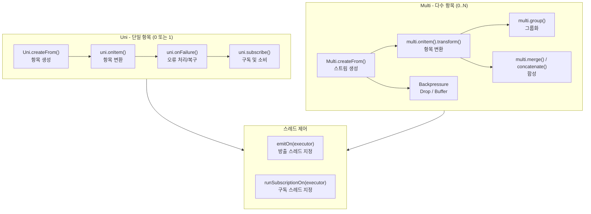

# Mutiny Examples

[Mutiny](https://smallrye.io/smallrye-mutiny/) 는 Reactive Programming 을 위한 SmallRye 라이브러리 입니다. 이 프로젝트는 Mutiny 를 사용하는
예제들을 제공합니다.

## 리액티브 스트림 구성



## 예제 파일 목록

| 파일 | 주제 | 핵심 내용 |
|------|------|-----------|
| `01_Basic_Uni.kt` | Uni 기초 | `uniOf`, `deferred`, `emitter`, `CompletionStage` 변환, `awaitSuspending` |
| `02_Basic_Multi.kt` | Multi 기초 | `multiOf`, `multiRangeOf`, `emitter`, `ticks`, `resource` |
| `03_Groups.kt` | 그룹화 | `group().by()`, `group().intoLists()` |
| `04_Composition_Transformation.kt` | 합성/변환 | `flatMap`, `concatenate`, `merge`, `zip` |
| `05_Failures.kt` | 오류 처리 | `recoverWithItem`, `recoverWithUni`, `retry().atMost()`, `withBackOff` |
| `06_Backpressure.kt` | 배압 제어 | `onOverflow().drop()`, `onOverflow().buffer()` |
| `07_Threading.kt` | 스레드 제어 | `emitOn(executor)`, `runSubscriptionOn(executor)` |
| `08_Multi_CustomOperator.kt` | 커스텀 연산자 | `plug()` 를 이용한 재사용 가능한 파이프라인 조각 |
| `backpressure/01_Drop.kt` | 드롭 전략 | 소비 불가 항목 즉시 버림 |
| `backpressure/02_Buffer.kt` | 버퍼 전략 | 일정 크기 버퍼에 항목 보관 |

## Uni / Multi 핵심 개념

### Uni — 0 또는 1개 항목

```kotlin
// 값으로 생성
val uni = uniOf("Hello")

// Supplier 로 생성 (구독 시마다 새 값)
val uni2 = uniOf { Random.nextInt() }

// 코루틴 환경에서 await
val result = uni.awaitSuspending()

// 오류 복구
uni.onFailure(IOException::class.java)
   .recoverWithItem { e -> "fallback: ${e.message}" }
```

### Multi — 0개 이상의 항목 스트림

```kotlin
// 범위 스트림
val list = multiRangeOf(0, 10)
    .onItem().transform { it * 2 }
    .collect().asList()
    .await().indefinitely()

// 재시도 (지수 백오프)
multi.onFailure()
     .retry()
     .withBackOff(Duration.ofMillis(10), Duration.ofMillis(50))
     .expireIn(1000)
```

### 코루틴 연동

Mutiny는 `smallrye-mutiny-kotlin` 을 통해 Kotlin 코루틴과 통합됩니다.

```kotlin
// Uni → suspend
val value: String = uni.awaitSuspending()

// Multi → Flow
val flow: Flow<Int> = multi.asFlow()
val items = flow.toList()
```

## 빌드 및 테스트

```bash
./gradlew :reactive-mutiny:test
./gradlew :reactive-mutiny:test --tests "io.bluetape4k.examples.mutiny.UniBasicExamples"
./gradlew :reactive-mutiny:test --tests "io.bluetape4k.examples.mutiny.FailuresExample"
```
