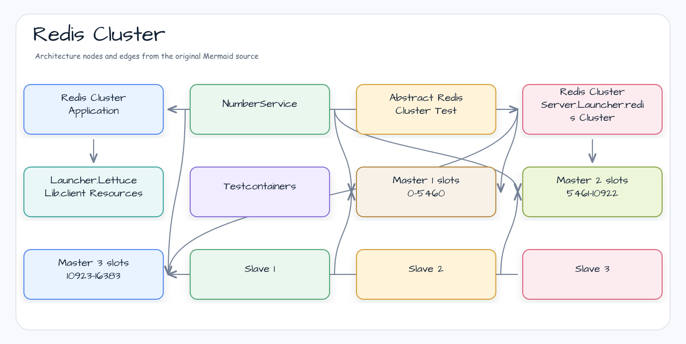
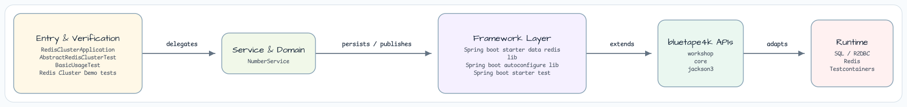
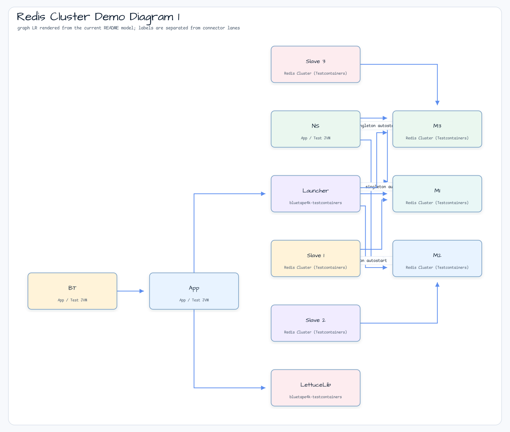

# Redis Cluster 데모

[English](README.md) | 한국어

## 예제 시나리오

이 예제는 **Redis Cluster 데모**를 실행 가능한 Redis 기반 coordination 워크숍 조각으로 다룹니다. 개발자가 가장 먼저 확인할 경로인 모듈 설정, 샘플 또는 테스트 실행, 반복적인 인프라 코드를 줄여 주는 라이브러리와 프레임워크 API를 중심으로 설명합니다.

## 아키텍처 다이어그램



이 모듈은 샘플 진입점 또는 테스트 픽스처, bluetape4k 확장 계층, 예제가 사용하는 런타임 의존성을 중심으로 구성됩니다. README와 코드를 비교할 때는 `io.bluetape4k.workshop.redis` 패키지를 기준으로 삼습니다.



## 흐름 다이어그램

1. `redis-cluster-demo`에 필요한 로컬 런타임을 준비합니다.
2. 예제 시나리오를 담당하는 애플리케이션, 컨트롤러, 서비스 또는 테스트 픽스처를 실행합니다.
3. 반복적인 인프라 작업을 bluetape4k 유틸리티 또는 Spring/Kotlin 통합에 위임합니다.
4. 샘플 출력, HTTP 응답, 저장소 상태, 메트릭, trace 또는 테스트 기대값으로 보이는 결과를 검증합니다.

## 시퀀스 다이어그램

핵심 시퀀스는 호출자 또는 테스트 픽스처 -> 워크숍 어댑터 -> bluetape4k 헬퍼/API -> 외부 런타임 또는 인메모리 백엔드 -> 검증/응답 순서입니다. 이 모듈에 전용 시퀀스 이미지가 있으면 아래 이미지가 상호작용 순서를 보여주며, 그렇지 않으면 소스 테스트가 실행 가능한 시퀀스의 기준입니다.

이 예제는 `bluetape4k-testcontainers`의 `RedisClusterServer.Launcher`로 Redis Cluster를 자동 시작한 뒤,
Spring Data Redis Cluster Operations를 검증합니다.

## Redis Cluster Topology




## 핵심 구성 요소

| 클래스 / 파일 | 역할 |
|---------------|------|
| `RedisClusterApplication.kt` | Spring Boot 진입점입니다. `RedisClusterServer.Launcher.redisCluster` singleton을 시작합니다 |
| `NumberService.kt` | `clusterConnection`을 통해 byte 직렬화된 숫자를 저장하고 조회합니다 |
| `AbstractRedisClusterTest.kt` | `@SpringBootTest` + `KLoggingChannel` + `Fakers`를 포함하는 공통 기반입니다 |
| `BasicUsageTest.kt` | 기본 key-value CRUD cluster 테스트입니다 |
| `NumberServiceTest.kt` | `multiplyAndSave` / `get` 서비스 레이어 테스트입니다 |
| `application.yml` | Cluster node list + Lettuce adaptive refresh 설정입니다 |

## application.yml 설정 예제

```yaml
spring:
  data:
    redis:
      cluster:
        nodes: ${testcontainers.redis.cluster.nodes}  # Injected by Testcontainers
      lettuce:
        cluster:
          refresh:
            adaptive: true              # Automatically refresh topology on node failure
            dynamic-refresh-sources: true
        pool:
          enabled: true
          max-active: 16
          max-idle: 8
```

## 사용한 bluetape4k 기능

| 기능 | 아티팩트 | 코드 위치 | 이점 |
|---|---|---|---|
| `RedisClusterServer.Launcher.redisCluster` | `bluetape4k-testcontainers` | `RedisClusterApplication` companion | 6개 노드(3 masters + 3 replicas)를 자동으로 시작하고 중지하는 Testcontainers Redis Cluster singleton입니다 |
| `Launcher.LettuceLib.clientResources(redisCluster)` | `bluetape4k-testcontainers` | `RedisClusterApplication.lettuceClientResource()` | 컨테이너 포트에 맞는 Lettuce `ClientResources`를 한 번에 생성합니다 |
| `LettuceClients` / `LettuceLongCodec` / `awaitSuspending()` | `bluetape4k-lettuce` | `Bluetape4kLettuceUsageTest` | typed codec과 low-level Redis 경로의 coroutine-friendly async wait를 검증합니다 |
| `KLoggingChannel` | `bluetape4k-logging` | `RedisClusterApplication` companion, `NumberService` companion, `AbstractRedisClusterTest` companion | coroutine MDC context를 포함한 구조화 로깅을 제공합니다 |
| `Fakers.faker` / `Fakers.fixedString` | `bluetape4k-junit5` | `AbstractRedisClusterTest` | 재현 가능한 random key와 value를 생성합니다 |
| `bluetape4k-core` — `toByteArray()` / `toInt()` | `bluetape4k-core` | `NumberService` | binary cluster command에서 사용하는 Int-to-ByteArray 변환 유틸리티입니다 |

## bluetape4k Before / After

### `RedisClusterServer.Launcher`와 수동 Testcontainers Cluster 설정 비교

```kotlin
// Before — manual Redis Cluster setup based on GenericContainer (6 containers, DynamicPropertySource)
@SpringBootTest
class RedisClusterTest {
    companion object {
        // 3 masters + 3 replicas = 6 containers managed manually
        val node1 = GenericContainer("redis:7").withExposedPorts(6379)
        val node2 = GenericContainer("redis:7").withExposedPorts(6379)
        // ... node3 through node6 omitted

        @JvmStatic
        @DynamicPropertySource
        fun props(registry: DynamicPropertyRegistry) {
            // Manually compose each node port
            registry.add("spring.data.redis.cluster.nodes") {
                "${node1.host}:${node1.getMappedPort(6379)},..."
            }
        }
    }
}

// After — RedisClusterServer.Launcher.redisCluster singleton (one line)
@SpringBootApplication(proxyBeanMethods = false)
class RedisClusterApplication {
    companion object: KLoggingChannel() {
        @JvmStatic
        val redisCluster = RedisClusterServer.Launcher.redisCluster  // automatically starts the 6-node cluster
    }

    @Bean(destroyMethod = "shutdown")
    fun lettuceClientResource(): ClientResources =
        RedisClusterServer.Launcher.LettuceLib.clientResources(redisCluster)
}
```

### `Fakers.fixedString` — 재현 가능한 Random Test Data

```kotlin
// Before — UUID-based (not reproducible)
val key = UUID.randomUUID().toString()
val value = RandomStringUtils.randomAlphanumeric(256)

// After — bluetape4k Fakers.fixedString (fixed seed, reproducible)
companion object: KLoggingChannel() {
    @JvmStatic
    fun randomKey(): String = Fakers.fixedString(32)

    @JvmStatic
    fun randomValue(): String = Fakers.fixedString(256)
}
```

## NumberService 동작 방식

`NumberService`는 `StringRedisTemplate`에서 `clusterConnection`을 직접 열어 숫자를 binary serialization으로 저장합니다.
hash slot은 key(숫자의 byte array)에 따라 자동으로 결정되며, 값은 cluster의 master node 중 하나로 분산됩니다.

```kotlin
fun multiplyAndSave(number: Int) {
    operations.requiredConnectionFactory.clusterConnection.use { conn ->
        conn.stringCommands()[number.toByteArray()] = (number * 2).toByteArray()
    }
}
```

## Lettuce 경계

Spring Data Redis `clusterConnection`은 Redis Cluster 동작을 입증하는 책임을 가집니다.
`bluetape4k-lettuce`는 `LettuceClients`, `LettuceLongCodec`, `awaitSuspending()`을 사용하는 별도의 low-level 테스트에서 typed codec과 coroutine-friendly async bridge를 검증합니다.

## Cluster Slot 분산

| Master Node | Slot Range | Replica |
|-------------|-----------|---------|
| Master 1 | 0-5460 | Replica 1 |
| Master 2 | 5461-10922 | Replica 2 |
| Master 3 | 10923-16383 | Replica 3 |

## 운영 참고 사항

- **Mac AirPlay 포트 충돌**: Redis Cluster는 기본적으로 7000-7005 포트를 사용합니다.
  macOS에서 AirPlay Receiver 모드가 켜져 있으면 7000 포트가 충돌할 수 있습니다.
  시스템 설정에서 AirPlay Receiver를 끈 뒤 다시 시도하세요.
- **Lettuce adaptive refresh**: `adaptive: true`가 없으면 노드 장애 시 cluster topology가 자동 갱신되지 않으므로 연결이 끊길 수 있습니다.
- **Testcontainers 사전 요구 사항**: Docker가 실행 중이어야 합니다. `RedisClusterServer.Launcher.redisCluster`는 처음 접근할 때 컨테이너를 시작하고 JVM 종료 시 자동으로 정리합니다.

## 빌드와 테스트

```bash
./gradlew :redis-cluster-demo:test
```

## 참고 자료

* [Spring Data Redis-Cluster Examples](https://github.com/spring-projects/spring-data-examples/tree/main/redis/cluster)
* [bluetape4k-testcontainers](https://github.com/bluetape4k/bluetape4k-projects)
* [Lettuce Cluster Topology Refresh](https://lettuce.io/core/release/reference/index.html#redis-cluster.topology-refresh)
