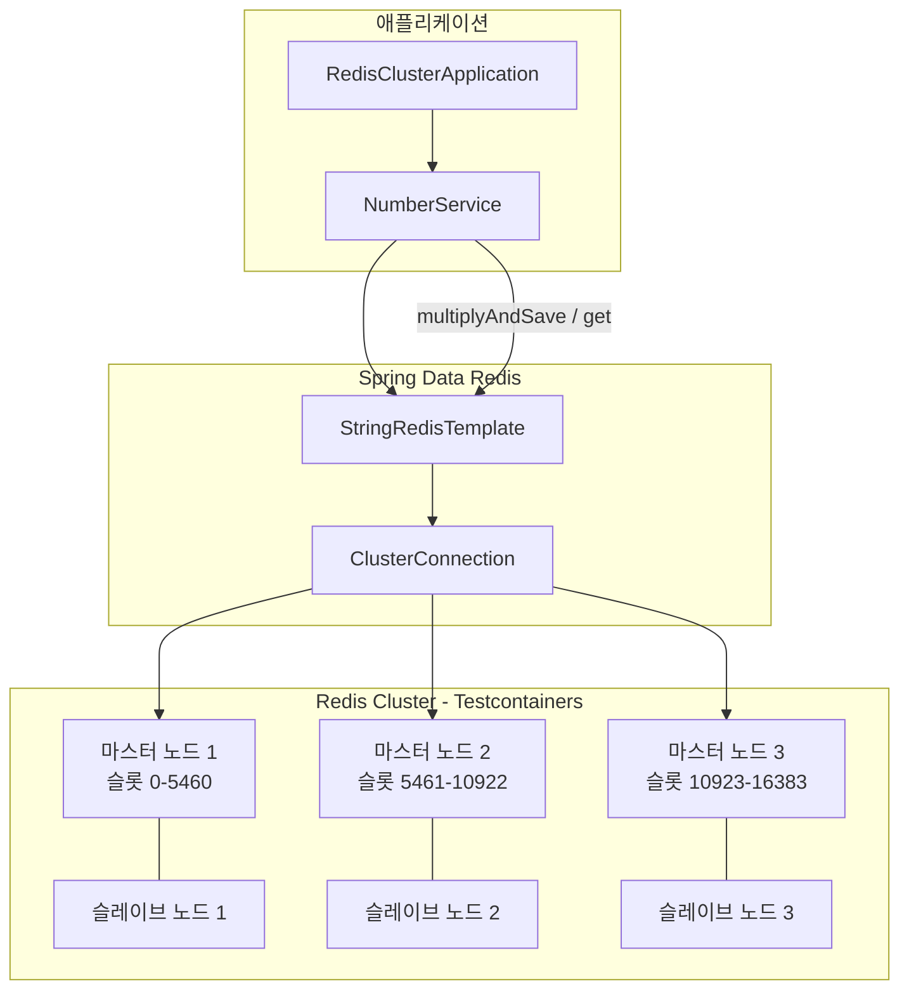

# Redis Cluster Demo

`bluetape4k-testcontainers` 의 `RedisClusterServer` 를 사용하여 Redis Cluster를 구성하고, 이를 Spring Data Redis의 Cluster Operations
에 대한 예제입니다.

## Redis Cluster 토폴로지



## 주요 구성 요소

| 클래스 / 파일 | 역할 |
|---------------|------|
| `RedisClusterApplication.kt` | Spring Boot 진입점 |
| `NumberService.kt` | `clusterConnection` 으로 바이트 직렬화 기반 숫자 저장/조회 |
| `AbstractRedisClusterTest.kt` | `@SpringBootTest` + Testcontainers RedisCluster 공통 베이스 |
| `BasicUsageTest.kt` | 키-값 기본 CRUD 클러스터 테스트 |
| `NumberServiceTest.kt` | `multiplyAndSave` / `get` 서비스 레이어 테스트 |
| `application.yml` | 클러스터 노드 목록 + Lettuce adaptive refresh 설정 |

## application.yml 설정 예제

```yaml
spring:
  data:
    redis:
      cluster:
        nodes: ${testcontainers.redis.cluster.nodes}  # Testcontainers 가 주입
      lettuce:
        cluster:
          refresh:
            adaptive: true              # 노드 장애 시 자동 토폴로지 갱신
            dynamic-refresh-sources: true
        pool:
          enabled: true
          max-active: 16
          max-idle: 8
```

## NumberService 동작 방식

`StringRedisTemplate` 의 `clusterConnection` 을 직접 열어 바이너리 직렬화로 숫자를 저장합니다.
해시 슬롯은 키(숫자의 바이트 배열)에 의해 자동으로 결정되며, 클러스터 내 마스터 노드 중 하나에 분산됩니다.

```kotlin
fun multiplyAndSave(number: Int) {
    operations.requiredConnectionFactory.clusterConnection.use { conn ->
        conn.stringCommands()[number.toByteArray()] = (number * 2).toByteArray()
    }
}
```

## 클러스터 슬롯 분배

| 마스터 노드 | 슬롯 범위 | 슬레이브 |
|-------------|-----------|---------|
| 마스터 1 | 0 – 5460 | 슬레이브 1 |
| 마스터 2 | 5461 – 10922 | 슬레이브 2 |
| 마스터 3 | 10923 – 16383 | 슬레이브 3 |

## 빌드 및 테스트

```bash
./gradlew :redis-cluster-demo:test
```

## 참고

* [Spring Data Redis-Cluster Examples](https://github.com/spring-projects/spring-data-examples/tree/main/redis/cluster)
