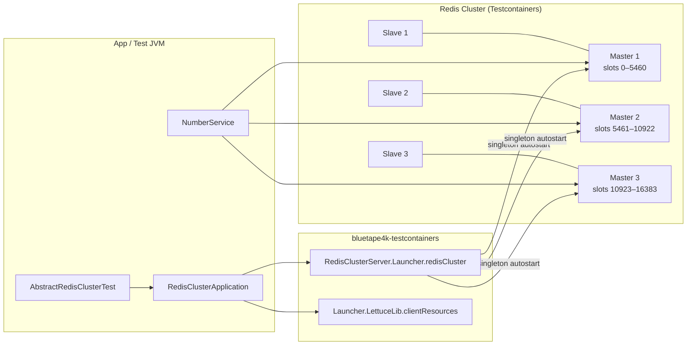

# Redis Cluster Demo

`bluetape4k-testcontainers` 의 `RedisClusterServer.Launcher` 를 사용하여 Redis Cluster를 자동 구동하고,
Spring Data Redis의 Cluster Operations를 검증하는 예제입니다.

## Redis Cluster 토폴로지



```mermaid
graph LR
    subgraph "App / Test JVM"
        App[RedisClusterApplication]
        NS[NumberService]
        BT[AbstractRedisClusterTest]
    end

    subgraph "bluetape4k-testcontainers"
        Launcher[RedisClusterServer.Launcher.redisCluster]
        LettuceLib[Launcher.LettuceLib.clientResources]
    end

    subgraph "Redis Cluster (Testcontainers)"
        M1[Master 1\nslots 0–5460]
        M2[Master 2\nslots 5461–10922]
        M3[Master 3\nslots 10923–16383]
        S1[Slave 1] --- M1
        S2[Slave 2] --- M2
        S3[Slave 3] --- M3
    end

    App --> Launcher
    App --> LettuceLib
    BT  --> App
    NS  --> M1
    NS  --> M2
    NS  --> M3
    Launcher -->|singleton autostart| M1
    Launcher -->|singleton autostart| M2
    Launcher -->|singleton autostart| M3
```

## 주요 구성 요소

| 클래스 / 파일 | 역할 |
|---------------|------|
| `RedisClusterApplication.kt` | Spring Boot 진입점 — `RedisClusterServer.Launcher.redisCluster` 싱글톤 구동 |
| `NumberService.kt` | `clusterConnection` 으로 바이트 직렬화 기반 숫자 저장/조회 |
| `AbstractRedisClusterTest.kt` | `@SpringBootTest` + `KLoggingChannel` + `Fakers` 공통 베이스 |
| `BasicUsageTest.kt` | 키-값 기본 CRUD 클러스터 테스트 |
| `NumberServiceTest.kt` | `multiplyAndSave` / `get` 서비스 레이어 테스트 |
| `application.yml` | 클러스터 노드 목록 + Lettuce adaptive refresh 설정 |

## application.yml 설정 예제

```yaml
spring:
  data:
    redis:
      cluster:
        nodes: ${testcontainers.redis.cluster.nodes}  # Testcontainers 가 주입
      lettuce:
        cluster:
          refresh:
            adaptive: true              # 노드 장애 시 자동 토폴로지 갱신
            dynamic-refresh-sources: true
        pool:
          enabled: true
          max-active: 16
          max-idle: 8
```

## bluetape4k 활용 기능

| 기능 | 아티팩트 | 코드 위치 | 이점 |
|---|---|---|---|
| `RedisClusterServer.Launcher.redisCluster` | `bluetape4k-testcontainers` | `RedisClusterApplication` companion | Testcontainers Redis Cluster 싱글톤 — 6노드(3마스터+3슬레이브) 자동 구동·종료 |
| `Launcher.LettuceLib.clientResources(redisCluster)` | `bluetape4k-testcontainers` | `RedisClusterApplication.lettuceClientResource()` | 컨테이너 포트에 맞춘 Lettuce `ClientResources` 원스텝 생성 |
| `LettuceClients` / `LettuceLongCodec` / `awaitSuspending()` | `bluetape4k-lettuce` | `Bluetape4kLettuceUsageTest` | 저수준 Redis 경로에서 타입 codec과 coroutine-friendly async 대기를 검증 |
| `KLoggingChannel` | `bluetape4k-logging` | `RedisClusterApplication` companion, `NumberService` companion, `AbstractRedisClusterTest` companion | 코루틴 MDC 컨텍스트 포함 구조적 로깅 |
| `Fakers.faker` / `Fakers.fixedString` | `bluetape4k-junit5` | `AbstractRedisClusterTest` | 재현 가능한 랜덤 키·값 생성 |
| `bluetape4k-core` — `toByteArray()` / `toInt()` | `bluetape4k-core` | `NumberService` | Int ↔ ByteArray 변환 유틸리티 — 바이너리 클러스터 커맨드에서 활용 |

## bluetape4k Before / After

### `RedisClusterServer.Launcher` vs 수동 Testcontainers 클러스터 설정

```kotlin
// Before — GenericContainer 기반 수동 Redis Cluster 구성 (6컨테이너, DynamicPropertySource)
@SpringBootTest
class RedisClusterTest {
    companion object {
        // 마스터 3 + 슬레이브 3 = 6개 컨테이너 수동 관리
        val node1 = GenericContainer("redis:7").withExposedPorts(6379)
        val node2 = GenericContainer("redis:7").withExposedPorts(6379)
        // ... node3~6 생략

        @JvmStatic
        @DynamicPropertySource
        fun props(registry: DynamicPropertyRegistry) {
            // 각 노드 포트를 수동으로 조합
            registry.add("spring.data.redis.cluster.nodes") {
                "${node1.host}:${node1.getMappedPort(6379)},..."
            }
        }
    }
}

// After — RedisClusterServer.Launcher.redisCluster 싱글톤 (한 줄)
@SpringBootApplication(proxyBeanMethods = false)
class RedisClusterApplication {
    companion object: KLoggingChannel() {
        @JvmStatic
        val redisCluster = RedisClusterServer.Launcher.redisCluster  // 6노드 클러스터 자동 구동
    }

    @Bean(destroyMethod = "shutdown")
    fun lettuceClientResource(): ClientResources =
        RedisClusterServer.Launcher.LettuceLib.clientResources(redisCluster)
}
```

### `Fakers.fixedString` — 재현 가능한 랜덤 테스트 데이터

```kotlin
// Before — UUID 기반 (재현 불가)
val key = UUID.randomUUID().toString()
val value = RandomStringUtils.randomAlphanumeric(256)

// After — bluetape4k Fakers.fixedString (고정 시드, 재현 가능)
companion object: KLoggingChannel() {
    @JvmStatic
    fun randomKey(): String = Fakers.fixedString(32)

    @JvmStatic
    fun randomValue(): String = Fakers.fixedString(256)
}
```

## NumberService 동작 방식

`StringRedisTemplate` 의 `clusterConnection` 을 직접 열어 바이너리 직렬화로 숫자를 저장합니다.
해시 슬롯은 키(숫자의 바이트 배열)에 의해 자동으로 결정되며, 클러스터 내 마스터 노드 중 하나에 분산됩니다.

```kotlin
fun multiplyAndSave(number: Int) {
    operations.requiredConnectionFactory.clusterConnection.use { conn ->
        conn.stringCommands()[number.toByteArray()] = (number * 2).toByteArray()
    }
}
```

## Lettuce boundary

Redis Cluster 동작 증명은 Spring Data Redis `clusterConnection` 경로가 담당합니다.
`bluetape4k-lettuce`는 별도 저수준 테스트에서 `LettuceClients`, `LettuceLongCodec`, `awaitSuspending()`을 사용해 typed codec과 coroutine-friendly async bridge를 검증합니다.

## 클러스터 슬롯 분배

| 마스터 노드 | 슬롯 범위 | 슬레이브 |
|-------------|-----------|---------|
| 마스터 1 | 0 – 5460 | 슬레이브 1 |
| 마스터 2 | 5461 – 10922 | 슬레이브 2 |
| 마스터 3 | 10923 – 16383 | 슬레이브 3 |

## 운영 주의사항

- **Mac AirPlay 포트 충돌**: Redis Cluster는 기본적으로 7000–7005 포트를 사용합니다.  
  Mac에서 AirPlay 수신 모드가 활성화된 경우 7000 포트 충돌이 발생할 수 있습니다.  
  시스템 환경설정 → AirPlay 수신기 비활성화 후 재시도하세요.
- **Lettuce adaptive refresh**: `adaptive: true` 설정이 없으면 노드 장애 시 클러스터 토폴로지가 자동 갱신되지 않아 연결이 끊길 수 있습니다.
- **Testcontainers 사전 조건**: Docker가 실행 중이어야 합니다. `RedisClusterServer.Launcher.redisCluster`는 최초 접근 시 컨테이너를 구동하며, JVM 종료 시 자동 정리됩니다.

## 빌드 및 테스트

```bash
./gradlew :redis-cluster-demo:test
```

## 참고

* [Spring Data Redis-Cluster Examples](https://github.com/spring-projects/spring-data-examples/tree/main/redis/cluster)
* [bluetape4k-testcontainers](https://github.com/bluetape4k/bluetape4k-projects)
* [Lettuce Cluster Topology Refresh](https://lettuce.io/core/release/reference/index.html#redis-cluster.topology-refresh)
