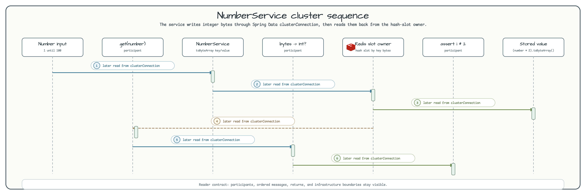

# Redis Cluster Demo

[한국어](README.ko.md) | English

This module shows how a Spring Boot application can test Redis Cluster behavior without manually wiring six Redis containers. `RedisClusterServer.Launcher.redisCluster` starts the 3-master / 3-replica cluster, Spring Data Redis uses the injected cluster node list, and `NumberService` proves binary reads and writes through `clusterConnection`.

## Architecture


The example keeps two boundaries separate. Spring Data Redis proves cluster routing and slot behavior. The low-level `bluetape4k-lettuce` smoke test separately proves typed codec and coroutine-friendly async waiting against a standalone Redis server.

## NumberService Flow



`NumberService` opens `StringRedisTemplate.requiredConnectionFactory.clusterConnection`, writes `number.toByteArray()` as the key, writes `(number * 2).toByteArray()` as the value, then reads the bytes back as `Int`.

## Key Components

| Class / File | Role |
|---------------|------|
| `RedisClusterApplication.kt` | Spring Boot entry point — starts the `RedisClusterServer.Launcher.redisCluster` singleton |
| `NumberService.kt` | Stores and retrieves byte-serialized numbers through `clusterConnection` |
| `AbstractRedisClusterTest.kt` | Common base with `@SpringBootTest` + `KLoggingChannel` + `Fakers` |
| `BasicUsageTest.kt` | Basic key-value CRUD cluster test |
| `NumberServiceTest.kt` | Service-layer tests for `multiplyAndSave` / `get` |
| `application.yml` | Cluster node list + Lettuce adaptive refresh configuration |

## application.yml Configuration Example

```yaml
spring:
  data:
    redis:
      cluster:
        nodes: ${testcontainers.redis-cluster.nodes}  # Injected by Testcontainers
      lettuce:
        cluster:
          refresh:
            adaptive: true              # Automatically refresh topology on node failure
            dynamic-refresh-sources: true
        pool:
          enabled: true
          max-active: 16
          max-idle: 8
```

## Used bluetape4k Features

| Feature | Artifact | Code Location | Benefit |
|---|---|---|---|
| `RedisClusterServer.Launcher.redisCluster` | `bluetape4k-testcontainers` | `RedisClusterApplication` companion | Testcontainers Redis Cluster singleton that automatically starts and stops 6 nodes (3 masters + 3 replicas) |
| `Launcher.LettuceLib.clientResources(redisCluster)` | `bluetape4k-testcontainers` | `RedisClusterApplication.lettuceClientResource()` | One-step creation of Lettuce `ClientResources` matched to container ports |
| `LettuceClients` / `LettuceIntCodec` / `LettuceLongCodec` / `awaitSuspending()` | `bluetape4k-lettuce` | `Bluetape4kLettuceUsageTest` | Verifies 32-bit/64-bit typed codecs and coroutine-friendly async waiting on low-level Redis paths |
| `KLoggingChannel` | `bluetape4k-logging` | `RedisClusterApplication` companion, `NumberService` companion, `AbstractRedisClusterTest` companion | Structured logging with coroutine MDC context |
| `Fakers.faker` / `Fakers.fixedString` | `bluetape4k-junit5` | `AbstractRedisClusterTest` | Generates reproducible random keys and values |
| `bluetape4k-core` — `toByteArray()` / `toInt()` | `bluetape4k-core` | `NumberService` | Int-to-ByteArray conversion utilities used in binary cluster commands |

## bluetape4k Before / After

### `RedisClusterServer.Launcher` vs Manual Testcontainers Cluster Setup

```kotlin
// Before — manual Redis Cluster setup based on GenericContainer (6 containers, DynamicPropertySource)
@SpringBootTest
class RedisClusterTest {
    companion object {
        // 3 masters + 3 replicas = 6 containers managed manually
        val node1 = GenericContainer("redis:7").withExposedPorts(6379)
        val node2 = GenericContainer("redis:7").withExposedPorts(6379)
        // ... node3 through node6 omitted

        @JvmStatic
        @DynamicPropertySource
        fun props(registry: DynamicPropertyRegistry) {
            // Manually compose each node port
            registry.add("spring.data.redis.cluster.nodes") {
                "${node1.host}:${node1.getMappedPort(6379)},..."
            }
        }
    }
}

// After — RedisClusterServer.Launcher.redisCluster singleton (one line)
@SpringBootApplication(proxyBeanMethods = false)
class RedisClusterApplication {
    companion object: KLoggingChannel() {
        @JvmStatic
        val redisCluster = RedisClusterServer.Launcher.redisCluster  // automatically starts the 6-node cluster
    }

    @Bean(destroyMethod = "shutdown")
    fun lettuceClientResource(): ClientResources =
        RedisClusterServer.Launcher.LettuceLib.clientResources(redisCluster)
}
```

### `Fakers.fixedString` — Reproducible Random Test Data

```kotlin
// Before — UUID-based (not reproducible)
val key = UUID.randomUUID().toString()
val value = RandomStringUtils.randomAlphanumeric(256)

// After — bluetape4k Fakers.fixedString (fixed seed, reproducible)
companion object: KLoggingChannel() {
    @JvmStatic
    fun randomKey(): String = Fakers.fixedString(32)

    @JvmStatic
    fun randomValue(): String = Fakers.fixedString(256)
}
```

## How NumberService Works

`NumberService` opens `clusterConnection` from `StringRedisTemplate` directly and stores numbers with binary serialization.
The hash slot is determined automatically by the key (the number's byte array), and the value is distributed to one of the master nodes in the cluster.

```kotlin
fun multiplyAndSave(number: Int) {
    operations.requiredConnectionFactory.clusterConnection.use { conn ->
        conn.stringCommands()[number.toByteArray()] = (number * 2).toByteArray()
    }
}
```

## Lettuce boundary

Spring Data Redis `clusterConnection` is responsible for proving Redis Cluster behavior.
`bluetape4k-lettuce` verifies the coroutine-friendly async bridge with separate low-level round trips: `LettuceLongCodec` preserves 64-bit values and `LettuceIntCodec` preserves 32-bit values through the matching typed commands.

## Cluster Slot Distribution

| Master Node | Slot Range | Replica |
|-------------|-----------|---------|
| Master 1 | 0-5460 | Replica 1 |
| Master 2 | 5461-10922 | Replica 2 |
| Master 3 | 10923-16383 | Replica 3 |

## Operational Notes

- **Mac AirPlay port conflict**: Redis Cluster uses ports 7000-7005 by default.
  If AirPlay Receiver mode is enabled on macOS, port 7000 may conflict.
  Disable AirPlay Receiver in System Settings, then try again.
- **Lettuce adaptive refresh**: Without `adaptive: true`, cluster topology is not refreshed automatically when a node fails, so connections may be dropped.
- **Testcontainers prerequisite**: Docker must be running. `RedisClusterServer.Launcher.redisCluster` starts containers on first access and cleans them up automatically when the JVM exits.

## Build and Test

```bash
./gradlew :redis-cluster-demo:test
```

## References

* [Spring Data Redis-Cluster Examples](https://github.com/spring-projects/spring-data-examples/tree/main/redis/cluster)
* [bluetape4k-testcontainers](https://github.com/bluetape4k/bluetape4k-projects)
* [Lettuce Cluster Topology Refresh](https://lettuce.io/core/release/reference/index.html#redis-cluster.topology-refresh)
