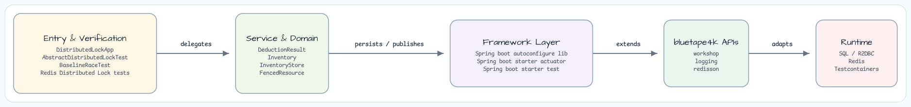

# redis-distributed-lock

[English](README.md) | 한국어

## 예제 시나리오

이 예제는 **redis-distributed-lock** 모듈을 실행 가능한 Redis 기반 조정 워크샵 조각으로 보여줍니다. 개발자가 먼저 확인할 경로인 모듈 설정, 샘플 또는 테스트 실행, 반복적인 인프라 코드를 줄이는 라이브러리 또는 프레임워크 API 사용 방식을 중심으로 설명합니다.

## 흐름 다이어그램

1. `redis-distributed-lock`에 필요한 로컬 런타임을 준비합니다.
2. 예제 시나리오를 담당하는 애플리케이션, 컨트롤러, 서비스 또는 테스트 픽스처를 실행합니다.
3. 반복적인 인프라 작업을 bluetape4k 유틸리티 또는 Spring/Kotlin 통합 기능에 위임합니다.
4. 샘플 출력, HTTP 응답, 저장소 상태, metric, trace 또는 테스트 기대값으로 결과를 검증합니다.

## 시퀀스 다이어그램

핵심 시퀀스는 호출자 또는 테스트 픽스처 -> 워크샵 어댑터 -> bluetape4k 헬퍼/API -> 외부 런타임 또는 인메모리 백엔드 -> 검증/응답 순서입니다. 전용 시퀀스 이미지가 있는 모듈은 아래 이미지가 상호작용 순서를 보여주며, 없는 경우 소스 테스트가 실행 가능한 시퀀스의 기준입니다.

Redisson을 사용한 분산 락 전략을 시연합니다. 안전하지 않은 공유 가변 상태부터
스레드 안전 락, 펜싱(토큰 기반) 락, 코루틴 네이티브 구현까지 다룹니다.

---

## 아키텍처




---

## 핵심 기능

| 기능 | 클래스 | 핵심 API |
|---|---|---|
| 비안전(race 데모) | `UnsafeInventoryService` | 락 없음; oversell 시연 |
| 분산 락 | `LockedInventoryService` | `RLock.tryLock(wait, lease, unit)` |
| 펜싱 락(블로킹) | `FencedInventoryService` | `RFencedLock.tryLockAndGetToken(wait, lease, unit)` |
| 펜싱 락(코루틴) | `SuspendingFencedInventoryService` | `tryLockAsync` + `tokenAsync` + `NonCancellable` unlock |
| 토큰 가드 | `FencedResource` | CAS `lastSeenToken`; 오래된 holder 쓰기 거부 |

---

## 모듈 구조

```
redis/distributed-lock/
├── src/main/kotlin/io/bluetape4k/workshop/lock/
│   ├── DistributedLockApp.kt          # Spring Boot entry point
│   ├── domain/
│   │   ├── DeductionResult.kt         # sealed interface: Success / InsufficientStock / LockTimeout / Error
│   │   ├── Inventory.kt               # data class: id, name, stock
│   │   └── InventoryStore.kt          # in-memory concurrent store
│   ├── fenced/
│   │   ├── FencedResource.kt          # CAS token gate for one resource
│   │   └── FencedResources.kt         # ConcurrentHashMap registry
│   └── service/
│       ├── UnsafeInventoryService.kt
│       ├── LockedInventoryService.kt
│       ├── FencedInventoryService.kt
│       └── SuspendingFencedInventoryService.kt
└── src/test/kotlin/io/bluetape4k/workshop/lock/
    ├── AbstractDistributedLockTest.kt  # shared fixtures (Testcontainers Redis)
    ├── BaselineRaceTest.kt             # proves oversell without lock
    ├── DistributedLockTest.kt          # RLock prevents oversell
    ├── FencedLockTest.kt               # fenced guard; stale-holder rejection
    ├── SuspendFencedLockTest.kt        # coroutine safety + cancel-safety
    ├── FencedStaleHolderTest.kt        # [smoke] lease expiry re-lock scenario
    └── LockFailureTest.kt              # [smoke] tryLock timeout behaviour
```

---

## 사용 예시

### 1. Unsafe — race condition 증명

```kotlin
// Stock = 100, qty = 10, 20 concurrent goroutines
// → oversell: successCount > 10
val result = unsafeService.deduct(inventoryId, 10)
```

### 2. 분산 락(블로킹)

```kotlin
// RLock ensures exactly one deduction at a time
val result = lockedService.deduct(inventoryId, qty = 10, waitMs = 3000L, leaseMs = 3000L)
when (result) {
    is DeductionResult.Success          -> println("deducted token=${result.token}")
    is DeductionResult.InsufficientStock -> println("out of stock")
    is DeductionResult.LockTimeout      -> println("lock timed out")
    is DeductionResult.Error            -> println("error: ${result.message}")
}
```

### 3. 펜싱 락 — 오래된 holder 방지

`FencedResource` CAS 게이트는 현재 `lastSeenToken`보다 오래된 fencing token을 가진 쓰기를 거부합니다.
느리거나 재시작된 이전 lock-holder가 더 최신 holder가 쓴 데이터를 덮어쓰지 못하게 합니다.

```kotlin
// FencedInventoryService internally:
val token: Long = fLock.tryLockAndGetToken(waitMs, leaseMs, MILLISECONDS)
val result: DeductionResult? = resource.apply(token) {
    store.deduct(inventoryId, qty)
}
// null result → stale holder rejected
```

### 4. 코루틴 네이티브 펜싱 락

```kotlin
// Coroutine-safe: NonCancellable unlock prevents lock leak on Job.cancel()
val result = suspendingService.deduct(inventoryId, qty = 10, waitMs = 3000L, leaseMs = 3000L)
```

#### 취소 안전성

`SuspendingFencedInventoryService`는 `finally` 절에서 `withContext(NonCancellable)` 블록을 사용합니다.
그래서 호출 코루틴이 중간에 취소되더라도 `unlockAsync(lockId).await()`가 항상 완료됩니다.

```kotlin
// Simplified internal pattern
val acquired = fLock.tryLockAsync(waitMs, leaseMs, MILLISECONDS, lockId).await()
if (!acquired) return LockTimeout
val token = fLock.tokenAsync.await()
try {
    /* work */
} finally {
    withContext(NonCancellable) {
        fLock.unlockAsync(lockId).await()
    }
}
```

---

## 테스트 실행

```bash
# All non-smoke tests (default)
./gradlew :redis-distributed-lock:test

# Force fresh run
./gradlew :redis-distributed-lock:test --rerun-tasks

# Include smoke tests (timing-sensitive: lease expiry scenarios)
./gradlew :redis-distributed-lock:test -Djunit.jupiter.execution.exclude.tags=

# Specific test class
./gradlew :redis-distributed-lock:test --tests "io.bluetape4k.workshop.lock.SuspendFencedLockTest"
```

> **Smoke 테스트**(`@Tag("smoke")`)는 lease expiry와 timeout 시나리오를 실제 wall-clock delay로 검증합니다.
> 기본 CI 실행에서는 flakiness를 피하기 위해 제외됩니다.

---

## 핵심 개념

### 펜싱 토큰 프로토콜

펜싱 토큰은 lock server가 각 성공적인 lock 획득 시 발급하는 단조 증가 숫자입니다.
모든 리소스 업데이트는 토큰을 전달해야 하며, 리소스 가드(`lastSeenToken` CAS)는 오래된 토큰의 쓰기를 거부합니다.

이 방식은 고전적인 "lock을 획득한 프로세스가 쓰기 전에 멈췄다가 재개되는" race를 방지합니다.

```
Client A acquires lock → token=1
Client A pauses (GC, network delay, lease expires)
Client B acquires lock → token=2, writes with token=2
Client A resumes → FencedResource rejects write (1 < 2) ✅
```

### SuspendedJobTester 의미론

`SuspendedJobTester.workers(N).rounds(R)`는 `N`개 동시 worker를 만들고
각 `add { }` 블록의 `R`라운드를 협력적으로 실행합니다. `totalUnits = R × blockCount`입니다.

stock-100/qty-10 테스트의 경우:
- `workers(20).rounds(20)` -> 총 20회 시도 -> 정확히 10회 성공

### Smoke vs 기본 테스트

| 태그 | 목적 | 타이밍 포함? | 기본 CI |
|---|---|---|---|
| _(none)_ | 빠른 정확성 검사 | 아니오(로직만) | ✅ 포함 |
| `smoke` | Lease expiry, timeout | 예(실제 wall-clock) | ❌ 제외 |

---

## 사용된 bluetape4k 기능

| 기능 | 아티팩트 | 코드 위치 | 이점 |
|---|---|---|---|
| `RedisServer.Launcher.redis` | `bluetape4k-testcontainers` | `AbstractDistributedLockTest` companion | Testcontainers Redis singleton — 한 줄 설정, `@DynamicPropertySource` 불필요 |
| `redissonClient {}` DSL | `bluetape4k-redisson` | `AbstractDistributedLockTest.redisson` | `RedissonClient`용 Kotlin DSL — `Config()` boilerplate 제거 |
| `getLockId(lockName)` | `bluetape4k-redis` (`coroutines` package) | `SuspendingFencedInventoryService.deduct()` | `RFencedLock` identity용 coroutine-safe Snowflake ID — 2단계 async acquire에 필요 |
| `KLoggingChannel` | `bluetape4k-logging` | All companion objects | Coroutine-context-aware structured logging |
| `requirePositiveNumber` | `bluetape4k-core` | `SuspendingFencedInventoryService.deduct()` | 명확한 메시지의 `IllegalArgumentException`을 던지는 inline argument validation |
| `SuspendedJobTester` | `bluetape4k-junit5` | `SuspendFencedLockTest` | 재현 가능한 coroutine concurrency harness — 결정적 race 검증 |
| `MultithreadingTester` | `bluetape4k-junit5` | `DistributedLockTest` | OS-thread lock 시나리오용 fixed-thread-pool concurrency verification |

---

## bluetape4k Before / After

### `RedisServer.Launcher` vs Manual Testcontainers Redis

```kotlin
// Before — manual container + @DynamicPropertySource
@SpringBootTest
class LockTest {
    companion object {
        @Container
        val redis = GenericContainer("redis:7").withExposedPorts(6379)

        @JvmStatic
        @DynamicPropertySource
        fun props(registry: DynamicPropertyRegistry) {
            registry.add("spring.redis.url") { "redis://${redis.host}:${redis.getMappedPort(6379)}" }
        }
    }
}

// After — bluetape4k singleton (one line in AbstractDistributedLockTest)
abstract class AbstractDistributedLockTest {
    companion object : KLoggingChannel() {
        val redis = RedisServer.Launcher.redis          // auto-started, auto-cleaned up
        val redisUrl: String get() = redis.url
    }

    protected val redisson: RedissonClient by lazy {
        redissonClient {                                // bluetape4k DSL
            useSingleServer().setAddress(redisUrl)
        }
    }
}
```

### Coroutine-Native Fenced Lock — Two-Step Acquire + `NonCancellable` Unlock

```kotlin
// Before — blocking tryLockAndGetToken (blocks the calling thread)
val token: Long = fLock.tryLockAndGetToken(waitMs, leaseMs, MILLISECONDS)
try {
    // work
} finally {
    fLock.unlock()  // may throw if coroutine was cancelled before this line
}

// After — suspend-friendly two-step acquire with NonCancellable unlock guard
val lockId = redisson.getLockId(lockName)           // bluetape4k: Snowflake ID for coroutine identity
val acquired = fLock.tryLockAsync(waitMs, leaseMs, MILLISECONDS, lockId).await()
if (!acquired) return LockNotAcquired(lockName)
val token: Long = fLock.tokenAsync.await()          // separate token step (no combined overload in Redisson 4.x)
try {
    /* work */
} finally {
    // CRITICAL: without NonCancellable, a cancelled coroutine never completes unlockAsync
    // and the lock leaks until lease expiry
    withContext(NonCancellable) {
        fLock.unlockAsync(lockId).await()
    }
}
```

### `SuspendedJobTester` — Reproducible Coroutine Race Verification

```kotlin
// Before — manual coroutine launch (non-deterministic, hard to tune worker count)
val results = (1..20).map {
    async { suspendingService.deduct(inventoryId, qty = 10) }
}.awaitAll()

// After — bluetape4k SuspendedJobTester (fixed rounds × blockCount = total attempts)
SuspendedJobTester()
    .workers(20)    // 20 coroutine workers
    .rounds(20)     // 20 total attempts, exactly 10 succeed (stock=100, qty=10)
    .add {
        suspendingService.deduct(inventoryId, qty = 10, waitMs = 3000L, leaseMs = 5000L)
    }
    .run()
```

---

## 의존성

- **Redisson** — `RLock`, `RFencedLock`, async API
- **bluetape4k-redisson** — `redissonClient {}` DSL
- **bluetape4k-redis** — `getLockId()` coroutines extension (`io.bluetape4k.redis.redisson.coroutines`)
- **bluetape4k-coroutines** — `awaitSuspending()`, `io.bluetape4k.logging.coroutines`
- **bluetape4k-testcontainers** — `RedisServer.Launcher.redis` Testcontainers singleton
- **bluetape4k-junit5** — `SuspendedJobTester`, `MultithreadingTester`
- **kotlinx.atomicfu** — `atomic(0L)` for `FencedResource.lastSeenToken`
