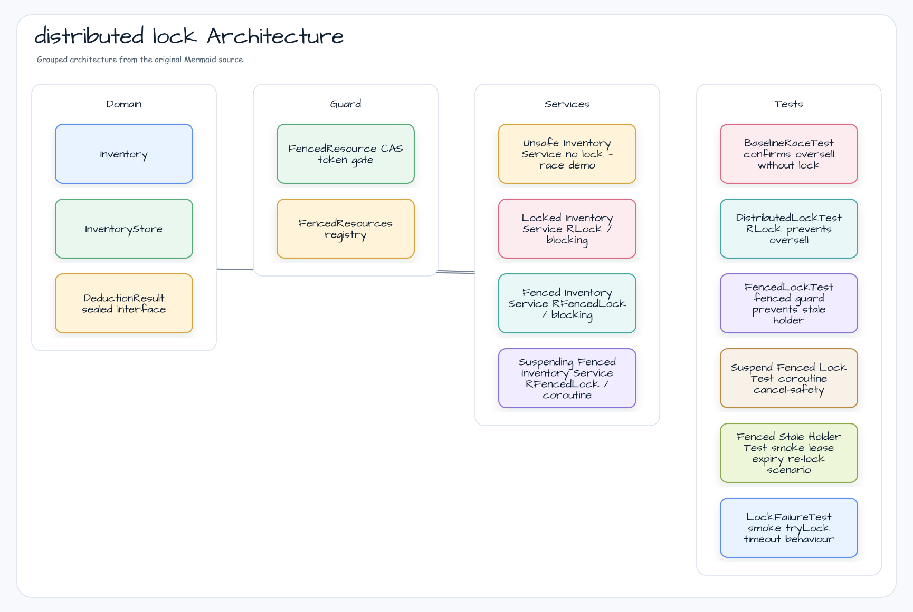

# redis-distributed-lock

Demonstrates distributed locking strategies using Redisson, from unsafe shared mutable state through
thread-safe locks to fenced (token-based) locks and their coroutine-native counterpart.

---

## Architecture



---

## Core Features

| Feature | Class | Key API |
|---|---|---|
| Unsafe (race demo) | `UnsafeInventoryService` | No lock; shows oversell |
| Distributed lock | `LockedInventoryService` | `RLock.tryLock(wait, lease, unit)` |
| Fenced lock (blocking) | `FencedInventoryService` | `RFencedLock.tryLockAndGetToken(wait, lease, unit)` |
| Fenced lock (coroutine) | `SuspendingFencedInventoryService` | `tryLockAsync` + `tokenAsync` + `NonCancellable` unlock |
| Token guard | `FencedResource` | CAS `lastSeenToken`; rejects stale-holder writes |

---

## Module Structure

```
redis/distributed-lock/
├── src/main/kotlin/io/bluetape4k/workshop/lock/
│   ├── DistributedLockApp.kt          # Spring Boot entry point
│   ├── domain/
│   │   ├── DeductionResult.kt         # sealed interface: Success / InsufficientStock / LockTimeout / Error
│   │   ├── Inventory.kt               # data class: id, name, stock
│   │   └── InventoryStore.kt          # in-memory concurrent store
│   ├── fenced/
│   │   ├── FencedResource.kt          # CAS token gate for one resource
│   │   └── FencedResources.kt         # ConcurrentHashMap registry
│   └── service/
│       ├── UnsafeInventoryService.kt
│       ├── LockedInventoryService.kt
│       ├── FencedInventoryService.kt
│       └── SuspendingFencedInventoryService.kt
└── src/test/kotlin/io/bluetape4k/workshop/lock/
    ├── AbstractDistributedLockTest.kt  # shared fixtures (Testcontainers Redis)
    ├── BaselineRaceTest.kt             # proves oversell without lock
    ├── DistributedLockTest.kt          # RLock prevents oversell
    ├── FencedLockTest.kt               # fenced guard; stale-holder rejection
    ├── SuspendFencedLockTest.kt        # coroutine safety + cancel-safety
    ├── FencedStaleHolderTest.kt        # [smoke] lease expiry re-lock scenario
    └── LockFailureTest.kt              # [smoke] tryLock timeout behaviour
```

---

## Usage Examples

### 1. Unsafe — proves race condition

```kotlin
// Stock = 100, qty = 10, 20 concurrent goroutines
// → oversell: successCount > 10
val result = unsafeService.deduct(inventoryId, 10)
```

### 2. Distributed Lock (blocking)

```kotlin
// RLock ensures exactly one deduction at a time
val result = lockedService.deduct(inventoryId, qty = 10, waitMs = 3000L, leaseMs = 3000L)
when (result) {
    is DeductionResult.Success          -> println("deducted token=${result.token}")
    is DeductionResult.InsufficientStock -> println("out of stock")
    is DeductionResult.LockTimeout      -> println("lock timed out")
    is DeductionResult.Error            -> println("error: ${result.message}")
}
```

### 3. Fenced Lock — guards against stale holders

The `FencedResource` CAS gate rejects any write whose fencing token is older than
the current `lastSeenToken`, preventing a slow/restarted lock-holder from
overwriting data written by a newer holder.

```kotlin
// FencedInventoryService internally:
val token: Long = fLock.tryLockAndGetToken(waitMs, leaseMs, MILLISECONDS)
val result: DeductionResult? = resource.apply(token) {
    store.deduct(inventoryId, qty)
}
// null result → stale holder rejected
```

### 4. Coroutine-Native Fenced Lock

```kotlin
// Coroutine-safe: NonCancellable unlock prevents lock leak on Job.cancel()
val result = suspendingService.deduct(inventoryId, qty = 10, waitMs = 3000L, leaseMs = 3000L)
```

#### Cancellation Safety

The `SuspendingFencedInventoryService` uses a `withContext(NonCancellable)` block in its
`finally` clause so that `unlockAsync(lockId).await()` always completes even when the
calling coroutine is cancelled mid-flight.

```kotlin
// Simplified internal pattern
val acquired = fLock.tryLockAsync(waitMs, leaseMs, MILLISECONDS, lockId).await()
if (!acquired) return LockTimeout
val token = fLock.tokenAsync.await()
try {
    /* work */
} finally {
    withContext(NonCancellable) {
        fLock.unlockAsync(lockId).await()
    }
}
```

---

## Running Tests

```bash
# All non-smoke tests (default)
./gradlew :redis-distributed-lock:test

# Force fresh run
./gradlew :redis-distributed-lock:test --rerun-tasks

# Include smoke tests (timing-sensitive: lease expiry scenarios)
./gradlew :redis-distributed-lock:test -Djunit.jupiter.execution.exclude.tags=

# Specific test class
./gradlew :redis-distributed-lock:test --tests "io.bluetape4k.workshop.lock.SuspendFencedLockTest"
```

> **Smoke tests** (`@Tag("smoke")`) test lease-expiry and timeout scenarios with real
> wall-clock delays. They are excluded from the default CI run to avoid flakiness.

---

## Key Concepts

### Fencing Token Protocol

A fencing token is a monotonically increasing number issued by the lock server on
each successful lock acquisition. Any resource update must carry the token; the resource
guard (CAS on `lastSeenToken`) rejects writes from older tokens.

This prevents the classic "process paused after lock acquired but before write" race:

```
Client A acquires lock → token=1
Client A pauses (GC, network delay, lease expires)
Client B acquires lock → token=2, writes with token=2
Client A resumes → FencedResource rejects write (1 < 2) ✅
```

### SuspendedJobTester Semantics

`SuspendedJobTester.workers(N).rounds(R)` launches `N` workers each running `R` rounds
of the `add { }` block. `totalUnits = R × blockCount`.

For a stock-100/qty-10 test:
- `workers(20).rounds(20)` → 20 total attempts → exactly 10 succeed

### Smoke vs Default Tests

| Tag | Purpose | Includes timing? | Default CI |
|---|---|---|---|
| _(none)_ | Fast correctness checks | No (logic only) | ✅ included |
| `smoke` | Lease expiry, timeout | Yes (real wall-clock) | ❌ excluded |

---

## Dependencies

- **Redisson** — `RLock`, `RFencedLock`, async API
- **bluetape4k-redisson** — `getLockId()` (Snowflake ID), `redissonClient {}` DSL
- **bluetape4k-coroutines** — `awaitSuspending()`, `io.bluetape4k.logging.coroutines`
- **bluetape4k-testcontainers** — `RedisServer.Launcher.redis` Testcontainers singleton
- **kotlinx.atomicfu** — `atomic(0L)` for `FencedResource.lastSeenToken`
