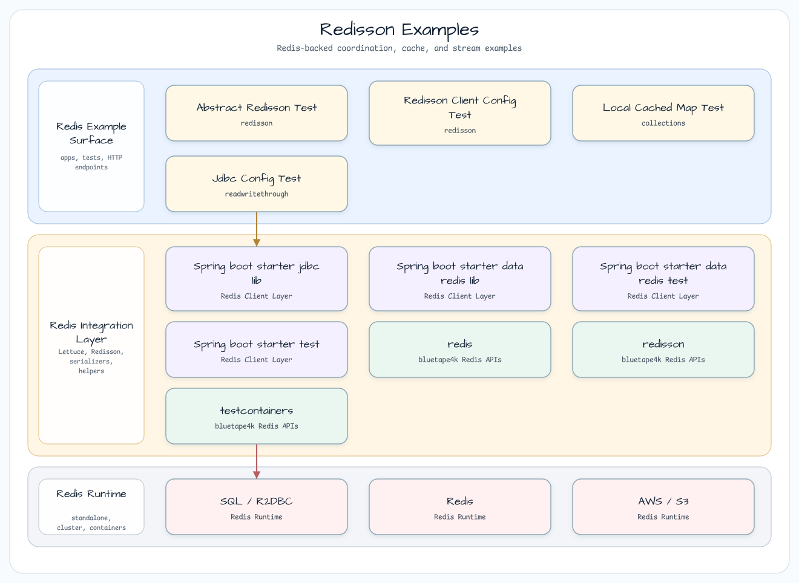

# Redisson 예제

[English](README.md) | 한국어

## 예제 시나리오

이 예제는 **Redisson 예제**를 실행 가능한 Redis 기반 coordination 워크숍 조각으로 다룹니다. 개발자가 가장 먼저 확인할 경로인 모듈 설정, 샘플 또는 테스트 실행, 반복적인 인프라 코드를 줄여 주는 라이브러리와 프레임워크 API를 중심으로 설명합니다.

## 아키텍처 다이어그램



이 모듈은 샘플 진입점 또는 테스트 픽스처, bluetape4k 확장 계층, 예제가 사용하는 런타임 의존성을 중심으로 구성됩니다. README와 코드를 비교할 때는 `io.bluetape4k.workshop.redis` 패키지를 기준으로 삼습니다.


## 흐름 다이어그램

1. `redis-redisson-examples`에 필요한 로컬 런타임을 준비합니다.
2. 예제 시나리오를 담당하는 애플리케이션, 컨트롤러, 서비스 또는 테스트 픽스처를 실행합니다.
3. 반복적인 인프라 작업을 bluetape4k 유틸리티 또는 Spring/Kotlin 통합에 위임합니다.
4. 샘플 출력, HTTP 응답, 저장소 상태, 메트릭, trace 또는 테스트 기대값으로 보이는 결과를 검증합니다.


## 시퀀스 다이어그램

핵심 시퀀스는 호출자 또는 테스트 픽스처 -> 워크숍 어댑터 -> bluetape4k 헬퍼/API -> 외부 런타임 또는 인메모리 백엔드 -> 검증/응답 순서입니다. 이 모듈에 전용 시퀀스 이미지가 있으면 아래 이미지가 상호작용 순서를 보여주며, 그렇지 않으면 소스 테스트가 실행 가능한 시퀀스의 기준입니다.

이 예제 모음은 Redis client library인 [Redisson](https://redisson.org/)의 distributed synchronization object를 사용합니다.
bluetape4k의 `RedissonCodecs.LZ4ForyComposite`, `localCachedMap()`, `streamAddArgsOf()`, `VirtualThreadExecutor`, `RedisServer.Launcher`, 테스트 concurrency helper를 사용합니다.
Testcontainers로 Redis 컨테이너를 자동 시작하고 그 컨테이너를 대상으로 통합 테스트를 실행합니다.

## 아키텍처


## 예제 범주

### Distributed Locks (`locks/`)

| 클래스 | 설명 |
|---|---|
| `LockExamples` | 기본 distributed lock(`RLock`) |
| `FairLockExamples` | 요청 순서를 보존하는 fair lock |
| `ReadWriteLockExamples` | read/write를 분리한 lock(`RReadWriteLock`) |
| `FencedLockExamples` | fencing token 기반 lock(split brain 방지) |
| `SpinLockExamples` | 짧은 critical section용 spin lock |
| `MultiLockExamples` | 여러 Redis node에 걸친 distributed lock |

### Distributed Semaphores (`locks/`)

| 클래스 | 설명 |
|---|---|
| `SemaphoreExamples` | distributed semaphore(`RSemaphore`) |
| `PermitExpirableSemaphoreExamples` | TTL 기반 자동 만료 semaphore |
| `CountDownLatchExamples` | Distributed `CountDownLatch` |

### Distributed Objects (`objects/`)

| 클래스 | 설명 |
|---|---|
| `BucketExamples` | `RBucket` — `AtomicReference`와 유사한 object holder |
| `AtomicLongExamples` | `RAtomicLong` — distributed atomic integer |
| `BloomFilterExamples` | `RBloomFilter` — probabilistic membership filter |
| `HyperLogLogExamples` | `RHyperLogLog` — 대규모 cardinality estimation |
| `GeoExamples` | `RGeo` — geospatial data |
| `RateLimiterExamples` | `RRateLimiter` — distributed rate limiting |
| `IdGeneratorExamples` | `RIdGenerator` — distributed ID generation |
| `BatchExamples` | 명령을 batch로 실행합니다 |

### Pub/Sub (`objects/`)

| 클래스 | 설명 |
|---|---|
| `TopicExamples` | `RTopic` channel을 통해 메시지를 발행하고 구독합니다 |
| `ReliableTopicExamples` | `RReliableTopic` — 메시지 손실 없는 reliable Pub/Sub |

### Distributed Collections (`collections/`)

| 클래스 | 설명 |
|---|---|
| `LocalCachedMapExamples` | `RLocalCachedMap` — local cache + Redis synchronization |
| `StreamExamples` | `RStream` — Redis Streams |
| `ScoredSortedSetExamples` | `RScoredSortedSet` — score 기반 sorted set |

### Read/Write Through

| 클래스 | 설명 |
|---|---|
| `ReadWriteThroughExamples` | Cache-as-SOR — cache가 DB 읽기와 쓰기를 proxy합니다 |

## 사용한 bluetape4k 기능

| 기능 | 아티팩트 | 코드 위치 | 이점 |
|---|---|---|---|
| `RedissonCodecs.LZ4ForyComposite` | `bluetape4k-redisson` | `AbstractRedissonTest` | JSON보다 공간과 속도 특성이 좋은 LZ4 압축 + Fory serialization을 사용합니다 |
| `localCachedMap()` | `bluetape4k-redisson` | `LocalCachedMapExamples` | `LocalCachedMapOptions` DSL과 map 생성 호출을 결합해 Near Cache 설정 중복을 줄입니다 |
| `streamAddArgsOf()` | `bluetape4k-redisson` | `StreamExamples` | Kotlin 친화적인 helper로 Redis Stream append arguments를 만듭니다 |
| `VirtualThreadExecutor` | `bluetape4k-coroutines` | `AbstractRedissonTest` | Virtual Threads로 Redisson I/O를 처리합니다 |
| `RedisServer.Launcher.redis` | `bluetape4k-testcontainers` | `AbstractRedissonTest` | 자동으로 시작하고 중지하는 Testcontainers Redis singleton입니다 |
| `ShutdownQueue.register` | `bluetape4k-core` | `AbstractRedissonTest` | JVM shutdown 시 `RedissonClient`를 자동으로 닫습니다 |
| `Base58.randomString` | `bluetape4k-io` | `AbstractRedissonTest` | URL-safe random key를 생성합니다 |
| `MultithreadingTester` | `bluetape4k-junit5` | `FencedLockExamples` | 고정 thread pool로 concurrency를 검증합니다 |
| `StructuredTaskScopeTester` | `bluetape4k-junit5` | `FencedLockExamples` | Virtual Thread concurrency를 검증합니다 |
| `SuspendedJobTester` | `bluetape4k-junit5` | `FencedLockExamples` | coroutine race condition을 검증합니다 |
| `getLockId()` | `bluetape4k-redis` | `FencedLockExamples` | coroutine-safe `RFencedLock` ID를 가져옵니다 |

## bluetape4k Before / After

### `RedissonCodecs.LZ4ForyComposite`와 기본 Codec 비교

```kotlin
// Before — default JSON serialization (text-based, larger payloads)
val config = Config().apply {
    useSingleServer().setAddress(redisUrl)
    codec = JsonJacksonCodec()  // text-based serialization
}

// After — bluetape4k LZ4ForyComposite (binary compressed serialization)
val config = Config().apply {
    useSingleServer()
        .setAddress(redis.url)
        .setConnectionPoolSize(128)
        .setConnectionMinimumIdleSize(32)
    executor = VirtualThreadExecutor          // Virtual Thread I/O
    threads = 256
    nettyThreads = 128
    codec = RedissonCodecs.LZ4ForyComposite   // LZ4 + Fory binary compression
}
```

### Concurrency Testing — BT Test Helpers

```kotlin
// Before — manual Thread creation (non-deterministic, hard to verify race conditions)
val threads = (1..8).map { Thread { lock.tryLock() } }
threads.forEach { it.start() }
threads.forEach { it.join() }

// After — bluetape4k MultithreadingTester (reproducible concurrency verification)
MultithreadingTester()
    .workers(8)
    .rounds(2)
    .add {
        val token = lock.tryLockAndGetTokenAsync(5, 10, TimeUnit.SECONDS).get()
        if (token != null) {
            // Critical section work
            lock.unlock()
        }
    }
    .run()
```

### `SuspendedJobTester` — Coroutine FencedLock

```kotlin
// After — verifies FencedLock concurrency in a coroutine environment
SuspendedJobTester()
    .workers(8)
    .rounds(16)
    .add {
        val mlockId = redisson.getLockId("fencedLock")  // BT coroutine-safe getLockId
        val locked = lock.tryLockAsync(5, 10, TimeUnit.SECONDS, mlockId).await()
        if (locked) {
            // Critical section
            lock.unlockAsync(mlockId).await()
        }
    }
    .run()
```

## 실행

```bash
# Automatically starts the Redis container, then runs tests
./gradlew :redis-redisson-examples:test

# Run only a specific example
./gradlew :redis-redisson-examples:test --tests "*.FencedLockExamples"
```

## 참고 자료

- [Redisson official docs](https://redisson.org/docs/)
- [Redisson GitHub](https://github.com/redisson/redisson)
- [bluetape4k-redis](https://github.com/bluetape4k/bluetape4k-projects)
- [bluetape4k-redisson](https://github.com/bluetape4k/bluetape4k-projects)
- Spring Data Redis 기반 예제는 [`spring-data/redis-examples`](../../spring-data/redis-examples)를 참고하세요
