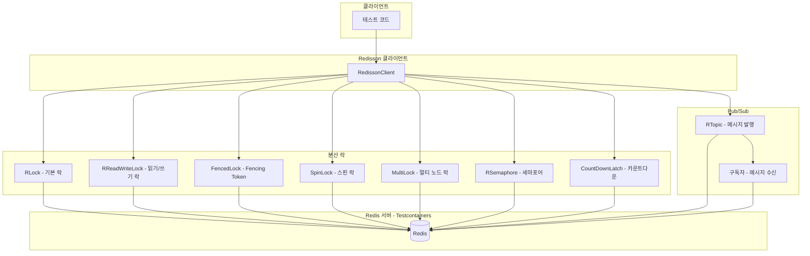

# Redisson Examples

Redis 클라이언트 라이브러리 [Redisson](https://redisson.org/)의 분산 동기화 객체를 활용하는 예제 모음입니다.
Testcontainers로 Redis 컨테이너를 자동으로 구동하여 통합 테스트를 수행합니다.

## Redisson 분산 패턴 구조

## 예제 범주

### 분산 락 (`locks/`)

| 클래스 | 설명 |
|---|---|
| `LockExamples` | 기본 분산 락 (`RLock`) |
| `FairLockExamples` | 공정 락 — 요청 순서 보장 |
| `ReadWriteLockExamples` | 읽기/쓰기 분리 락 (`RReadWriteLock`) |
| `FencedLockExamples` | Fencing Token 기반 락 (Split-Brain 방지) |
| `SpinLockExamples` | 스핀 락 (짧은 임계구역용) |
| `MultiLockExamples` | 여러 Redis 노드에 걸친 분산 락 |

### 분산 세마포어 (`locks/`)

| 클래스 | 설명 |
|---|---|
| `SemaphoreExamples` | 분산 세마포어 (`RSemaphore`) |
| `PermitExpirableSemaphoreExamples` | TTL 기반 자동 만료 세마포어 |
| `CountDownLatchExamples` | 분산 `CountDownLatch` |

### Pub/Sub (`objects/`)

| 클래스 | 설명 |
|---|---|
| `TopicExamples` | `RTopic` 채널 기반 메시지 발행·구독 |

## 참고

- [Redisson 공식 문서](https://redisson.org/docs/)
- [Redisson GitHub](https://github.com/redisson/redisson)
- Spring Data Redis 기반 예제는 [`spring-data/redis-examples`](../../spring-data/redis-examples) 참고
