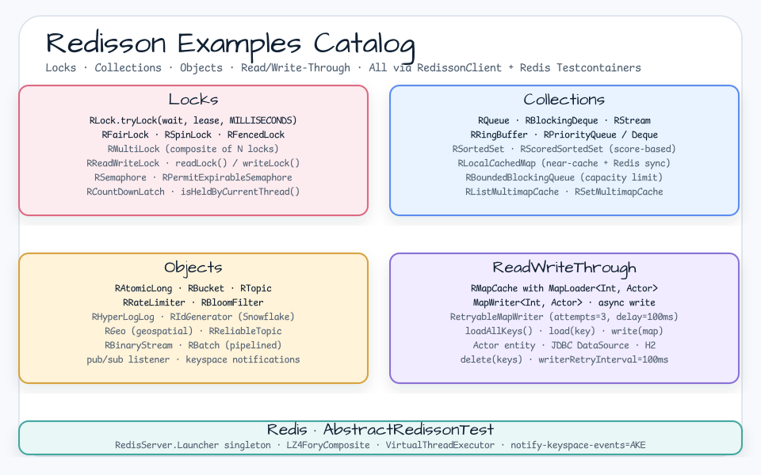

# Redisson Examples

[한국어](README.ko.md) | English

## Example Scenario

This example exercises **Redisson Examples** as a runnable Redis-backed coordination workshop slice. It focuses on the path a developer would inspect first: configure the module, run the sample or tests, and observe the library or framework APIs that remove repetitive infrastructure code.

## Architecture Diagram

The module is organized around the sample entry point or test fixture, the bluetape4k extension layer, and the runtime dependency used by the example. Keep the package under `io.bluetape4k.workshop.redis` as the source of truth when comparing this README with the code.


## Flow Diagram

1. Prepare the local runtime required by `redis-redisson-examples`.
2. Execute the application, controller, service, or test fixture that owns the example scenario.
3. Delegate repetitive infrastructure work to bluetape4k utilities or Spring/Kotlin integrations.
4. Assert the visible result through the sample output, HTTP response, repository state, metric, trace, or test expectation.



## Sequence Diagram

The core sequence is: caller or test fixture -> workshop adapter -> bluetape4k helper/API -> external runtime or in-memory backend -> assertion/response. When this module has a dedicated sequence asset, the image below shows that interaction order; otherwise the source tests are the authoritative executable sequence.

Redis 클라이언트 라이브러리 [Redisson](https://redisson.org/)의 분산 동기화 객체를 활용하는 예제 모음입니다.
bluetape4k의 `RedissonCodecs.LZ4ForyComposite`, `localCachedMap()`, `streamAddArgsOf()`, `VirtualThreadExecutor`, `RedisServer.Launcher`, 테스트 동시성 헬퍼를 활용합니다.
Testcontainers로 Redis 컨테이너를 자동으로 구동하여 통합 테스트를 수행합니다.

## 아키텍처


## 예제 범주

### 분산 락 (`locks/`)

| 클래스 | 설명 |
|---|---|
| `LockExamples` | 기본 분산 락 (`RLock`) |
| `FairLockExamples` | 공정 락 — 요청 순서 보장 |
| `ReadWriteLockExamples` | 읽기/쓰기 분리 락 (`RReadWriteLock`) |
| `FencedLockExamples` | Fencing Token 기반 락 (Split-Brain 방지) |
| `SpinLockExamples` | 스핀 락 (짧은 임계구역용) |
| `MultiLockExamples` | 여러 Redis 노드에 걸친 분산 락 |

### 분산 세마포어 (`locks/`)

| 클래스 | 설명 |
|---|---|
| `SemaphoreExamples` | 분산 세마포어 (`RSemaphore`) |
| `PermitExpirableSemaphoreExamples` | TTL 기반 자동 만료 세마포어 |
| `CountDownLatchExamples` | 분산 `CountDownLatch` |

### 분산 객체 (`objects/`)

| 클래스 | 설명 |
|---|---|
| `BucketExamples` | `RBucket` — 객체 홀더 (AtomicReference와 유사) |
| `AtomicLongExamples` | `RAtomicLong` — 분산 원자적 정수 |
| `BloomFilterExamples` | `RBloomFilter` — 확률적 멤버십 필터 |
| `HyperLogLogExamples` | `RHyperLogLog` — 대용량 카디널리티 추정 |
| `GeoExamples` | `RGeo` — 지리 공간 데이터 |
| `RateLimiterExamples` | `RRateLimiter` — 분산 Rate Limiting |
| `IdGeneratorExamples` | `RIdGenerator` — 분산 ID 생성 |
| `BatchExamples` | 명령 배치 실행 |

### Pub/Sub (`objects/`)

| 클래스 | 설명 |
|---|---|
| `TopicExamples` | `RTopic` 채널 기반 메시지 발행·구독 |
| `ReliableTopicExamples` | `RReliableTopic` — 메시지 손실 없는 신뢰적 Pub/Sub |

### 분산 컬렉션 (`collections/`)

| 클래스 | 설명 |
|---|---|
| `LocalCachedMapExamples` | `RLocalCachedMap` — 로컬 캐시 + Redis 동기화 |
| `StreamExamples` | `RStream` — Redis Streams |
| `ScoredSortedSetExamples` | `RScoredSortedSet` — 점수 기반 정렬 집합 |

### Read/Write Through

| 클래스 | 설명 |
|---|---|
| `ReadWriteThroughExamples` | Cache-as-SOR — DB 읽기/쓰기를 캐시가 대리 처리 |

## 사용된 bluetape4k 기능

| 기능 | 아티팩트 | 코드 위치 | 이점 |
|---|---|---|---|
| `RedissonCodecs.LZ4ForyComposite` | `bluetape4k-redisson` | `AbstractRedissonTest` | LZ4 압축 + Fory 직렬화 — JSON 대비 공간·속도 우위 |
| `localCachedMap()` | `bluetape4k-redisson` | `LocalCachedMapExamples` | `LocalCachedMapOptions` DSL과 map 생성 호출을 한 곳에 묶어 Near Cache 설정 중복 축소 |
| `streamAddArgsOf()` | `bluetape4k-redisson` | `StreamExamples` | Redis Stream append 인자를 Kotlin-friendly helper로 생성 |
| `VirtualThreadExecutor` | `bluetape4k-coroutines` | `AbstractRedissonTest` | Redisson I/O를 Virtual Thread로 처리 |
| `RedisServer.Launcher.redis` | `bluetape4k-testcontainers` | `AbstractRedissonTest` | Testcontainers Redis 싱글톤 — 자동 구동·종료 |
| `ShutdownQueue.register` | `bluetape4k-core` | `AbstractRedissonTest` | JVM 종료 시 RedissonClient 자동 close |
| `Base58.randomString` | `bluetape4k-io` | `AbstractRedissonTest` | URL-safe 랜덤 키 생성 |
| `MultithreadingTester` | `bluetape4k-junit5` | `FencedLockExamples` | 고정 스레드풀 동시성 검증 |
| `StructuredTaskScopeTester` | `bluetape4k-junit5` | `FencedLockExamples` | Virtual Thread 동시성 검증 |
| `SuspendedJobTester` | `bluetape4k-junit5` | `FencedLockExamples` | 코루틴 경쟁 조건 검증 |
| `getLockId()` | `bluetape4k-redis` | `FencedLockExamples` | 코루틴 안전한 RFencedLock ID 획득 |

## bluetape4k Before / After

### `RedissonCodecs.LZ4ForyComposite` vs 기본 codec

```kotlin
// Before — 기본 JSON 직렬화 (텍스트, 용량 큼)
val config = Config().apply {
    useSingleServer().setAddress(redisUrl)
    codec = JsonJacksonCodec()  // 텍스트 기반 직렬화
}

// After — bluetape4k LZ4ForyComposite (이진 압축 직렬화)
val config = Config().apply {
    useSingleServer()
        .setAddress(redis.url)
        .setConnectionPoolSize(128)
        .setConnectionMinimumIdleSize(32)
    executor = VirtualThreadExecutor          // Virtual Thread I/O
    threads = 256
    nettyThreads = 128
    codec = RedissonCodecs.LZ4ForyComposite   // LZ4 + Fory 이진 압축
}
```

### 동시성 테스트 — BT 테스트 헬퍼

```kotlin
// Before — 수동 Thread 생성 (비결정적, 경쟁 조건 검증 어려움)
val threads = (1..8).map { Thread { lock.tryLock() } }
threads.forEach { it.start() }
threads.forEach { it.join() }

// After — bluetape4k MultithreadingTester (재현 가능한 동시성 검증)
MultithreadingTester()
    .workers(8)
    .rounds(2)
    .add {
        val token = lock.tryLockAndGetTokenAsync(5, 10, TimeUnit.SECONDS).get()
        if (token != null) {
            // 임계구역 작업
            lock.unlock()
        }
    }
    .run()
```

### `SuspendedJobTester` — 코루틴 FencedLock

```kotlin
// After — 코루틴 환경에서 FencedLock 동시성 검증
SuspendedJobTester()
    .workers(8)
    .rounds(16)
    .add {
        val mlockId = redisson.getLockId("fencedLock")  // BT 코루틴 안전 getLockId
        val locked = lock.tryLockAsync(5, 10, TimeUnit.SECONDS, mlockId).await()
        if (locked) {
            // 임계구역
            lock.unlockAsync(mlockId).await()
        }
    }
    .run()
```

## 실행

```bash
# Redis 컨테이너 자동 구동 후 테스트
./gradlew :redis-redisson-examples:test

# 특정 예제만 실행
./gradlew :redis-redisson-examples:test --tests "*.FencedLockExamples"
```

## 참고

- [Redisson 공식 문서](https://redisson.org/docs/)
- [Redisson GitHub](https://github.com/redisson/redisson)
- [bluetape4k-redis](https://github.com/bluetape4k/bluetape4k-projects)
- [bluetape4k-redisson](https://github.com/bluetape4k/bluetape4k-projects)
- Spring Data Redis 기반 예제는 [`spring-data/redis-examples`](../../spring-data/redis-examples) 참고
