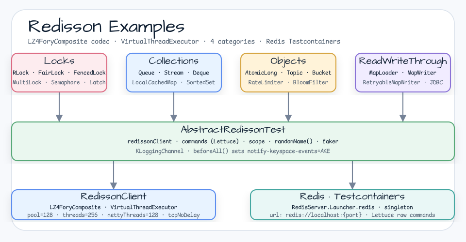

# Redisson Examples

[한국어](README.ko.md) | English

## Example Scenario

This example exercises **Redisson Examples** as a runnable Redis-backed coordination workshop slice. It focuses on the path a developer would inspect first: configure the module, run the sample or tests, and observe the library or framework APIs that remove repetitive infrastructure code.

## Architecture Diagram



The module is organized around the sample entry point or test fixture, the bluetape4k extension layer, and the runtime dependency used by the example. Keep the package under `io.bluetape4k.workshop.redis` as the source of truth when comparing this README with the code.

## Sequence Diagram

This collection of examples uses distributed synchronization objects from the Redis client library [Redisson](https://redisson.org/).
It uses bluetape4k's `RedissonCodecs.LZ4ForyComposite`, `localCachedMap()`, `streamAddArgsOf()`, `VirtualThreadExecutor`, `RedisServer.Launcher`, and test concurrency helpers.
It automatically starts a Redis container with Testcontainers and runs integration tests against it.

## Example Categories

### Distributed Locks (`locks/`)

| Class | Description |
|---|---|
| `LockExamples` | Basic distributed lock (`RLock`) |
| `FairLockExamples` | Fair lock that preserves request order |
| `ReadWriteLockExamples` | Separate read/write lock (`RReadWriteLock`) |
| `FencedLockExamples` | Fencing-token-based lock (prevents split brain) |
| `SpinLockExamples` | Spin lock for short critical sections |
| `MultiLockExamples` | Distributed lock across multiple Redis nodes |

### Distributed Semaphores (`locks/`)

| Class | Description |
|---|---|
| `SemaphoreExamples` | Distributed semaphore (`RSemaphore`) |
| `PermitExpirableSemaphoreExamples` | TTL-based auto-expiring semaphore |
| `CountDownLatchExamples` | Distributed `CountDownLatch` |

### Distributed Objects (`objects/`)

| Class | Description |
|---|---|
| `BucketExamples` | `RBucket` — object holder similar to `AtomicReference` |
| `AtomicLongExamples` | `RAtomicLong` — distributed atomic integer |
| `BloomFilterExamples` | `RBloomFilter` — probabilistic membership filter |
| `HyperLogLogExamples` | `RHyperLogLog` — large-scale cardinality estimation |
| `GeoExamples` | `RGeo` — geospatial data |
| `RateLimiterExamples` | `RRateLimiter` — distributed rate limiting |
| `IdGeneratorExamples` | `RIdGenerator` — distributed ID generation |
| `BatchExamples` | Executes commands in batches |

### Pub/Sub (`objects/`)

| Class | Description |
|---|---|
| `TopicExamples` | Publishes and subscribes to messages through `RTopic` channels |
| `ReliableTopicExamples` | `RReliableTopic` — reliable Pub/Sub without message loss |

### Distributed Collections (`collections/`)

| Class | Description |
|---|---|
| `LocalCachedMapExamples` | `RLocalCachedMap` — local cache + Redis synchronization |
| `StreamExamples` | `RStream` — Redis Streams |
| `ScoredSortedSetExamples` | `RScoredSortedSet` — score-based sorted set |

### Read/Write Through

| Class | Description |
|---|---|
| `ReadWriteThroughExamples` | Cache-as-SOR — the cache proxies DB reads and writes |

## Used bluetape4k Features

| Feature | Artifact | Code Location | Benefit |
|---|---|---|---|
| `RedissonCodecs.LZ4ForyComposite` | `bluetape4k-redisson` | `AbstractRedissonTest` | LZ4 compression + Fory serialization with better space and speed characteristics than JSON |
| `localCachedMap()` | `bluetape4k-redisson` | `LocalCachedMapExamples` | Combines the `LocalCachedMapOptions` DSL and map creation call to reduce duplicate Near Cache configuration |
| `streamAddArgsOf()` | `bluetape4k-redisson` | `StreamExamples` | Creates Redis Stream append arguments with a Kotlin-friendly helper |
| `VirtualThreadExecutor` | `bluetape4k-coroutines` | `AbstractRedissonTest` | Handles Redisson I/O with Virtual Threads |
| `RedisServer.Launcher.redis` | `bluetape4k-testcontainers` | `AbstractRedissonTest` | Testcontainers Redis singleton that starts and stops automatically |
| `ShutdownQueue.register` | `bluetape4k-core` | `AbstractRedissonTest` | Automatically closes `RedissonClient` on JVM shutdown |
| `Base58.randomString` | `bluetape4k-io` | `AbstractRedissonTest` | Generates URL-safe random keys |
| `MultithreadingTester` | `bluetape4k-junit5` | `FencedLockExamples` | Verifies concurrency with a fixed thread pool |
| `StructuredTaskScopeTester` | `bluetape4k-junit5` | `FencedLockExamples` | Verifies Virtual Thread concurrency |
| `SuspendedJobTester` | `bluetape4k-junit5` | `FencedLockExamples` | Verifies coroutine race conditions |
| `getLockId()` | `bluetape4k-redis` | `FencedLockExamples` | Gets coroutine-safe `RFencedLock` IDs |

## bluetape4k Before / After

### `RedissonCodecs.LZ4ForyComposite` vs Default Codec

```kotlin
// Before — default JSON serialization (text-based, larger payloads)
val config = Config().apply {
    useSingleServer().setAddress(redisUrl)
    codec = JsonJacksonCodec()  // text-based serialization
}

// After — bluetape4k LZ4ForyComposite (binary compressed serialization)
val config = Config().apply {
    useSingleServer()
        .setAddress(redis.url)
        .setConnectionPoolSize(128)
        .setConnectionMinimumIdleSize(32)
    executor = VirtualThreadExecutor          // Virtual Thread I/O
    threads = 256
    nettyThreads = 128
    codec = RedissonCodecs.LZ4ForyComposite   // LZ4 + Fory binary compression
}
```

### Concurrency Testing — BT Test Helpers

```kotlin
// Before — manual Thread creation (non-deterministic, hard to verify race conditions)
val threads = (1..8).map { Thread { lock.tryLock() } }
threads.forEach { it.start() }
threads.forEach { it.join() }

// After — bluetape4k MultithreadingTester (reproducible concurrency verification)
MultithreadingTester()
    .workers(8)
    .rounds(2)
    .add {
        val token = lock.tryLockAndGetTokenAsync(5, 10, TimeUnit.SECONDS).get()
        if (token != null) {
            // Critical section work
            lock.unlock()
        }
    }
    .run()
```

### `SuspendedJobTester` — Coroutine FencedLock

```kotlin
// After — verifies FencedLock concurrency in a coroutine environment
SuspendedJobTester()
    .workers(8)
    .rounds(16)
    .add {
        val mlockId = redisson.getLockId("fencedLock")  // BT coroutine-safe getLockId
        val locked = lock.tryLockAsync(5, 10, TimeUnit.SECONDS, mlockId).await()
        if (locked) {
            // Critical section
            lock.unlockAsync(mlockId).await()
        }
    }
    .run()
```

## Running

```bash
# Automatically starts the Redis container, then runs tests
./gradlew :redis-redisson-examples:test

# Run only a specific example
./gradlew :redis-redisson-examples:test --tests "*.FencedLockExamples"
```

## References

- [Redisson official docs](https://redisson.org/docs/)
- [Redisson GitHub](https://github.com/redisson/redisson)
- [bluetape4k-redis](https://github.com/bluetape4k/bluetape4k-projects)
- [bluetape4k-redisson](https://github.com/bluetape4k/bluetape4k-projects)
- For Spring Data Redis-based examples, see [`spring-data/redis-examples`](../../spring-data/redis-examples)
