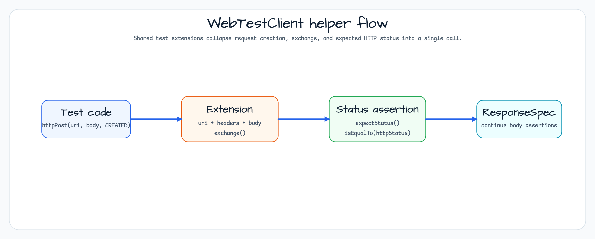

# Bluetape4k Workshop Shared

[English](README.md) | 한국어

이 모듈은 workshop 예제가 사용하는 작은 HTTP client 및 integration-test helper를 제공합니다. 실행 가능한 application이 아니라, `RestClient`, `WebClient`, `WebTestClient` 호출을 간결하게 만들기 위한 shared utility dependency입니다.

## Utility Map


## Test Helper Flow



## 핵심 기능

- **RestClientExtensions**: `RestClient` 확장 함수(GET, POST, PUT, PATCH, DELETE)
- **WebClientExtensions**: Reactive `WebClient` 확장 함수
- **WebTestClientExtensions**: `WebTestClient`용 테스트 확장 함수
- **AbstractSpringTest**: Spring 통합 테스트 base class

## 모듈 구조

## 제공 유틸리티

### RestClientExtensions(동기 HTTP Client)

Spring `RestClient` method chain을 간결한 형태로 감싸는 확장 함수입니다.

| 함수 | HTTP Method | 설명 |
|---|---|---|
| `httpGet(uri, accept?)` | GET | 간단한 조회 |
| `httpHead(uri, accept?)` | HEAD | header-only 조회 |
| `httpPost(uri, value?, ...)` | POST | 단일 객체 전송 |
| `httpPost<T>(uri, publisher, ...)` | POST | Reactor Publisher stream 전송 |
| `httpPost<T>(uri, flow, ...)` | POST | Kotlin Flow stream 전송 |
| `httpPut(uri, value?, ...)` | PUT | 단일 객체 갱신 |
| `httpPatch(uri, value?, ...)` | PATCH | 부분 갱신 |
| `httpDelete(uri, accept?)` | DELETE | 삭제 |

### WebClientExtensions(비동기/Reactive HTTP Client)

Spring `WebClient`에 동일한 signature의 확장 함수를 제공합니다. `Publisher<T>`와 `Flow<T>` overload는 reactive 및 coroutine stream 요청을 단순화합니다.

### WebTestClientExtensions(통합 테스트용)

`httpStatus` 파라미터를 통해 내장 HTTP status assertion을 제공하는 `WebTestClient` 확장 함수입니다. `exchange()` + `expectStatus()` 호출을 한 줄로 줄입니다.

```kotlin
// Usage example
webTestClient.httpGet("/tasks/1", HttpStatus.OK)
    .expectBody<Task>().returnResult()

webTestClient.httpPost("/tasks", task, HttpStatus.CREATED)
```

## 사용법

`build.gradle.kts`에 dependency를 추가합니다.

```kotlin
// For production code
implementation(project(":shared"))

// For test code
testImplementation(project(":shared"))
```

### AbstractSpringTest 확장

Spring WebFlux 통합 테스트 base class를 확장하면 `WebTestClient` 빈이 자동으로 주입됩니다.

```kotlin
@SpringBootTest(webEnvironment = SpringBootTest.WebEnvironment.RANDOM_PORT)
abstract class AbstractSpringTest {
    @Autowired
    lateinit var webTestClient: WebTestClient
}

class MyControllerTest : AbstractSpringTest() {
    @Test
    fun `find tasks`() {
        webTestClient.httpGet("/tasks", HttpStatus.OK)
            .expectBodyList<Task>().hasSize(2)
    }
}
```

## 빌드

```bash
./gradlew :shared:build
./gradlew :shared:test
```
