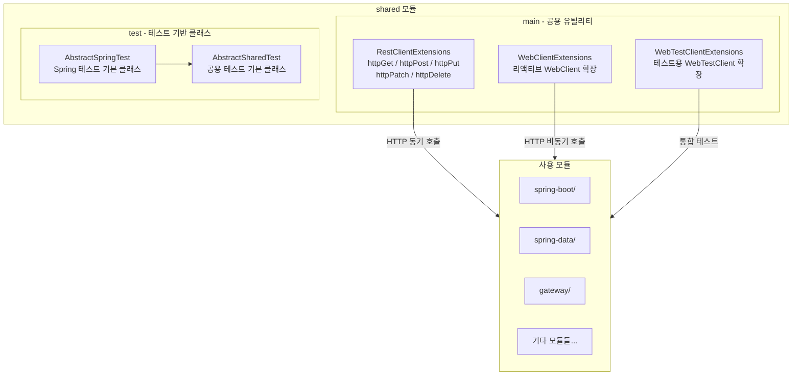

# Bluetape4k Workshop Shared

Bluetape4k Workshop 에서 공용으로 사용하고자 하는 기능을 제공하기 위해 만든 모듈입니다.

대부분 `Bluetape4k` 에서 미리 제공하는 기능을 사용할 수 있지만, 추가적인 기능이 필요한 경우 해당 모듈을 사용할 수 있습니다.

## 주요 기능

- **RestClientExtensions**: `RestClient` 확장 함수 (GET, POST, PUT, PATCH, DELETE)
- **WebClientExtensions**: `WebClient` 리액티브 확장 함수
- **WebTestClientExtensions**: `WebTestClient` 테스트 확장 함수
- **AbstractSpringTest**: Spring 통합 테스트 기본 클래스

## 모듈 구성



## 제공 유틸리티 목록

### RestClientExtensions (동기 HTTP 클라이언트)

Spring `RestClient`에 메서드 체인을 간결하게 래핑한 확장 함수입니다.

| 함수 | HTTP 메서드 | 설명 |
|---|---|---|
| `httpGet(uri, accept?)` | GET | 단순 조회 |
| `httpHead(uri, accept?)` | HEAD | 헤더만 조회 |
| `httpPost(uri, value?, ...)` | POST | 단일 객체 전송 |
| `httpPost<T>(uri, publisher, ...)` | POST | Reactor Publisher 스트림 전송 |
| `httpPost<T>(uri, flow, ...)` | POST | Kotlin Flow 스트림 전송 |
| `httpPut(uri, value?, ...)` | PUT | 단일 객체 수정 |
| `httpPatch(uri, value?, ...)` | PATCH | 부분 수정 |
| `httpDelete(uri, accept?)` | DELETE | 삭제 |

### WebClientExtensions (비동기/리액티브 HTTP 클라이언트)

Spring `WebClient`용 동일한 시그니처의 확장 함수입니다. `Publisher<T>` 및 `Flow<T>` 오버로드를 제공하여 리액티브/코루틴 스트림 요청을 단순화합니다.

### WebTestClientExtensions (통합 테스트용)

`WebTestClient`에 HTTP 상태 검증(`httpStatus` 파라미터)을 내장한 확장 함수입니다. `exchange()` + `expectStatus()` 호출을 한 줄로 줄입니다.

```kotlin
// 사용 예시
webTestClient.httpGet("/tasks/1", HttpStatus.OK)
    .expectBody<Task>().returnResult()

webTestClient.httpPost("/tasks", task, HttpStatus.CREATED)
```

## 사용 방법

`build.gradle.kts`에 의존성을 추가합니다.

```kotlin
// 프로덕션 코드에서
implementation(project(":shared"))

// 테스트 코드에서
testImplementation(project(":shared"))
```

### AbstractSpringTest 상속

Spring WebFlux 통합 테스트 기반 클래스를 상속하면 `WebTestClient` 빈이 자동 주입됩니다.

```kotlin
@SpringBootTest(webEnvironment = SpringBootTest.WebEnvironment.RANDOM_PORT)
abstract class AbstractSpringTest {
    @Autowired
    lateinit var webTestClient: WebTestClient
}

class MyControllerTest : AbstractSpringTest() {
    @Test
    fun `태스크 조회 테스트`() {
        webTestClient.httpGet("/tasks", HttpStatus.OK)
            .expectBodyList<Task>().hasSize(2)
    }
}
```

## 빌드

```bash
./gradlew :shared:build
./gradlew :shared:test
```
