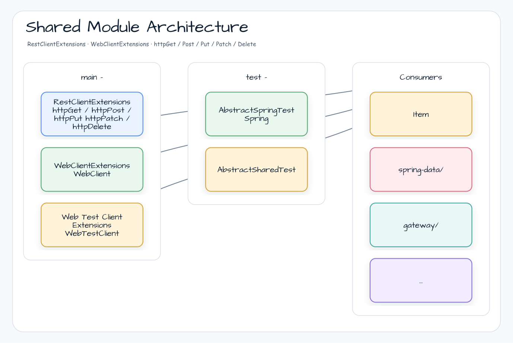

# Bluetape4k Workshop Shared

[한국어](README.ko.md) | English

## Example Scenario

This example exercises **Bluetape4k Workshop Shared** as a runnable shared workshop utilities workshop slice. It focuses on the path a developer would inspect first: configure the module, run the sample or tests, and observe the library or framework APIs that remove repetitive infrastructure code.

## Architecture Diagram



The module is organized around the sample entry point or test fixture, the bluetape4k extension layer, and the runtime dependency used by the example. Keep the package under `io.bluetape4k.workshop.shared` as the source of truth when comparing this README with the code.


## Flow Diagram

1. Prepare the local runtime required by `shared`.
2. Execute the application, controller, service, or test fixture that owns the example scenario.
3. Delegate repetitive infrastructure work to bluetape4k utilities or Spring/Kotlin integrations.
4. Assert the visible result through the sample output, HTTP response, repository state, metric, trace, or test expectation.

## Sequence Diagram

The core sequence is: caller or test fixture -> workshop adapter -> bluetape4k helper/API -> external runtime or in-memory backend -> assertion/response. When this module has a dedicated sequence asset, the image below shows that interaction order; otherwise the source tests are the authoritative executable sequence.

This module provides shared utilities used across Bluetape4k Workshop examples.

Most features are already provided by `Bluetape4k`, but this module fills the gaps when workshop examples need additional utilities.

## Key Features

- **RestClientExtensions**: `RestClient` extension functions (GET, POST, PUT, PATCH, DELETE)
- **WebClientExtensions**: Reactive `WebClient` extension functions
- **WebTestClientExtensions**: Test extension functions for `WebTestClient`
- **AbstractSpringTest**: Base class for Spring integration tests

## Module Structure


## Provided Utilities

### RestClientExtensions (Synchronous HTTP Client)

Extension functions that wrap Spring `RestClient` method chains in a concise form.

| Function | HTTP Method | Description |
|---|---|---|
| `httpGet(uri, accept?)` | GET | Simple retrieval |
| `httpHead(uri, accept?)` | HEAD | Header-only retrieval |
| `httpPost(uri, value?, ...)` | POST | Send a single object |
| `httpPost<T>(uri, publisher, ...)` | POST | Send a Reactor Publisher stream |
| `httpPost<T>(uri, flow, ...)` | POST | Send a Kotlin Flow stream |
| `httpPut(uri, value?, ...)` | PUT | Update a single object |
| `httpPatch(uri, value?, ...)` | PATCH | Partial update |
| `httpDelete(uri, accept?)` | DELETE | Delete |

### WebClientExtensions (Asynchronous/Reactive HTTP Client)

Extension functions with the same signatures for Spring `WebClient`. `Publisher<T>` and `Flow<T>` overloads simplify reactive and coroutine stream requests.

### WebTestClientExtensions (For Integration Tests)

Extension functions for `WebTestClient` with built-in HTTP status assertions through the `httpStatus` parameter. They reduce `exchange()` + `expectStatus()` calls to one line.

```kotlin
// Usage example
webTestClient.httpGet("/tasks/1", HttpStatus.OK)
    .expectBody<Task>().returnResult()

webTestClient.httpPost("/tasks", task, HttpStatus.CREATED)
```

## Usage

Add the dependency to `build.gradle.kts`.

```kotlin
// For production code
implementation(project(":shared"))

// For test code
testImplementation(project(":shared"))
```

### Extending AbstractSpringTest

Extending the Spring WebFlux integration test base class automatically injects the `WebTestClient` bean.

```kotlin
@SpringBootTest(webEnvironment = SpringBootTest.WebEnvironment.RANDOM_PORT)
abstract class AbstractSpringTest {
    @Autowired
    lateinit var webTestClient: WebTestClient
}

class MyControllerTest : AbstractSpringTest() {
    @Test
    fun `find tasks`() {
        webTestClient.httpGet("/tasks", HttpStatus.OK)
            .expectBodyList<Task>().hasSize(2)
    }
}
```

## Build

```bash
./gradlew :shared:build
./gradlew :shared:test
```
