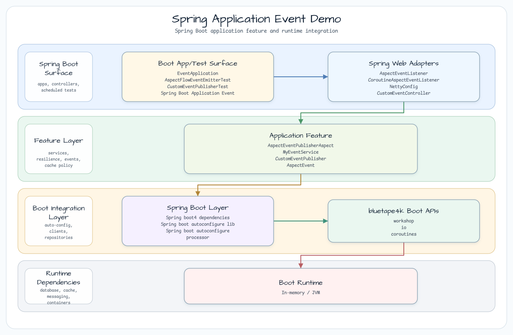
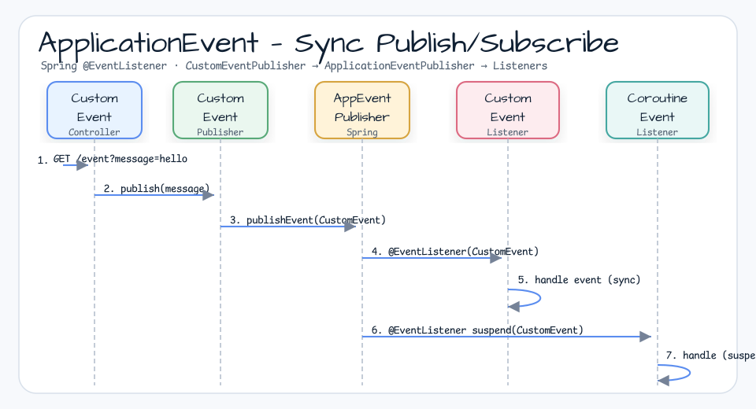
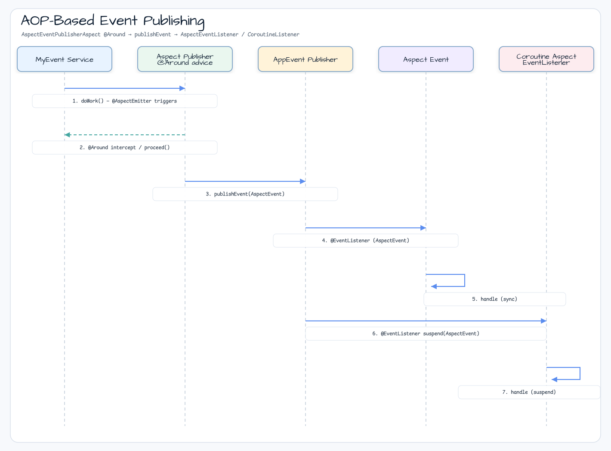

# Spring Application Event Demo

[English](README.md) | 한국어

## 예제 시나리오

이 예제는 **Spring Application Event Demo**를 실행 가능한 Spring Boot 애플리케이션 기능 워크숍 조각으로 다룹니다. 개발자가 먼저 확인할 경로인 모듈 설정, 샘플 또는 테스트 실행, 반복적인 인프라 코드를 줄여 주는 라이브러리와 프레임워크 API 관찰에 초점을 둡니다.

## 아키텍처 다이어그램



이 모듈은 샘플 진입점 또는 테스트 픽스처, bluetape4k 확장 계층, 예제가 사용하는 런타임 의존성을 중심으로 구성됩니다. README와 코드를 비교할 때는 `io.bluetape4k.workshop.springboot` 패키지를 기준으로 삼습니다.

## 흐름 다이어그램

1. `spring-boot-application-event-demo`에 필요한 로컬 런타임을 준비합니다.
2. 예제 시나리오를 담당하는 애플리케이션, 컨트롤러, 서비스 또는 테스트 픽스처를 실행합니다.
3. 반복적인 인프라 작업을 bluetape4k 유틸리티 또는 Spring/Kotlin 통합에 위임합니다.
4. 샘플 출력, HTTP 응답, 저장소 상태, metric, trace 또는 테스트 기대값으로 보이는 결과를 검증합니다.

## 시퀀스 다이어그램

핵심 시퀀스는 호출자 또는 테스트 픽스처 -> 워크숍 어댑터 -> bluetape4k 헬퍼/API -> 외부 런타임 또는 인메모리 백엔드 -> 검증/응답 순서입니다. 이 모듈에 전용 시퀀스 자산이 있으면 아래 이미지가 상호작용 순서를 보여 줍니다. 없으면 소스 테스트가 실행 가능한 시퀀스의 기준입니다.



Reactor와 코루틴으로 Spring Application Event를 비동기 발행하고 수신하는 패턴을 보여 줍니다.

## 이벤트 발행/수신 흐름


## AOP 기반 이벤트 흐름



## 두 가지 이벤트 발행 방식

### 1. 직접 발행(`custom/`)

`ApplicationEventPublisher`를 직접 주입하고 컴포넌트에서 이벤트를 발행합니다.

```kotlin
@Component
class CustomEventPublisher(private val publisher: ApplicationEventPublisher) {
    fun publish(message: String) = publisher.publishEvent(CustomEvent(this, message))
}
```

리스너는 일반 동기 방식과 코루틴 기반 비동기 방식으로 모두 제공됩니다.
- `CustomEventListener` — `@EventListener`로 이벤트를 동기 수신합니다.
- `AnnotatedCoroutineCustomEventListener` — `@EventListener`와 suspend 함수로 이벤트를 비동기 수신합니다.

### 2. AOP 기반 발행(`aspect/`)

메서드가 실행될 때 AOP를 통해 이벤트를 자동 발행합니다.

```kotlin
@AspectEventEmitter  // Automatically publishes an event when a method with this annotation executes
fun doSomething(): Result { ... }
```

- `AspectEventPublisherAspect` — Around Advice로 이벤트를 캡처하고 발행합니다.
- `AspectEventListener` — 동기 이벤트 수신자입니다.
- `CoroutineAspectEventListener` — 코루틴 기반 비동기 이벤트 수신자입니다.

## 참고

- [Spring Application Events](https://docs.spring.io/spring-framework/reference/core/beans/context-introduction.html#context-functionality-events)
- [Spring + Coroutines event handling](https://docs.spring.io/spring-framework/reference/languages/kotlin/coroutines.html)
