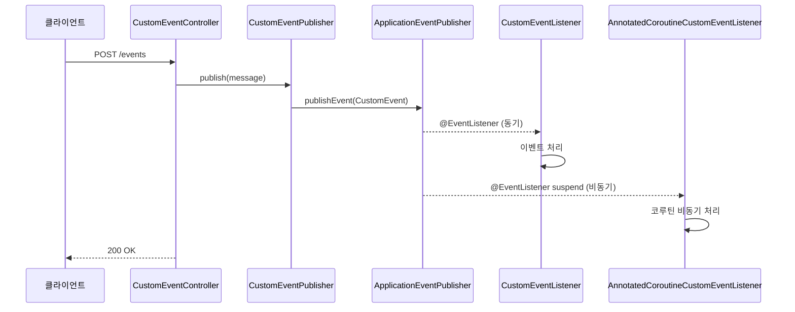
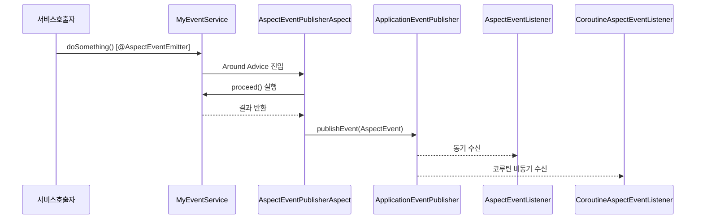

# Spring Application Event Demo

Spring Application Event를 비동기 방식(Reactor, Coroutines)으로 발행하고 수신하는 패턴을 보여줍니다.

## 이벤트 발행/수신 흐름



## AOP 기반 이벤트 흐름



## 두 가지 이벤트 발행 방식

### 1. 직접 발행 (`custom/`)

`ApplicationEventPublisher`를 직접 주입받아 이벤트를 발행합니다.

```kotlin
@Component
class CustomEventPublisher(private val publisher: ApplicationEventPublisher) {
    fun publish(message: String) = publisher.publishEvent(CustomEvent(this, message))
}
```

리스너는 일반 방식과 Coroutine 비동기 방식 모두 제공합니다:
- `CustomEventListener` — `@EventListener`로 동기 수신
- `AnnotatedCoroutineCustomEventListener` — `@EventListener` + suspend 함수로 비동기 수신

### 2. AOP 기반 발행 (`aspect/`)

메서드 실행 시 AOP로 자동으로 이벤트를 발행합니다.

```kotlin
@AspectEventEmitter  // 이 어노테이션이 붙은 메서드 실행 시 자동으로 이벤트 발행
fun doSomething(): Result { ... }
```

- `AspectEventPublisherAspect` — Around Advice로 이벤트 캡처 후 발행
- `AspectEventListener` — 동기 수신
- `CoroutineAspectEventListener` — Coroutine 비동기 수신

## 참고

- [Spring Application Events](https://docs.spring.io/spring-framework/reference/core/beans/context-introduction.html#context-functionality-events)
- [Spring + Coroutines 이벤트 처리](https://docs.spring.io/spring-framework/reference/languages/kotlin/coroutines.html)
