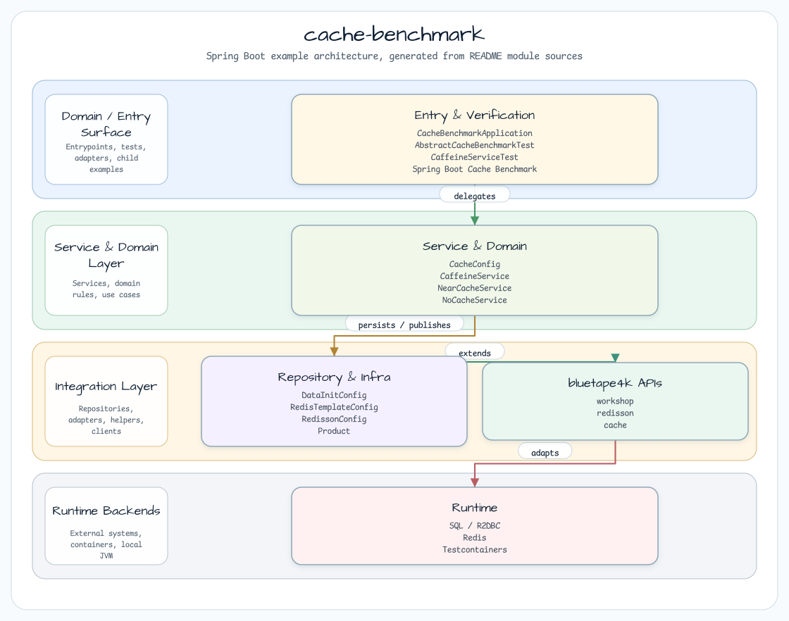
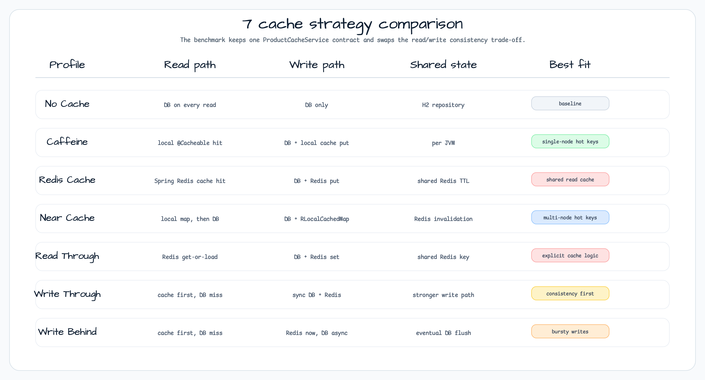
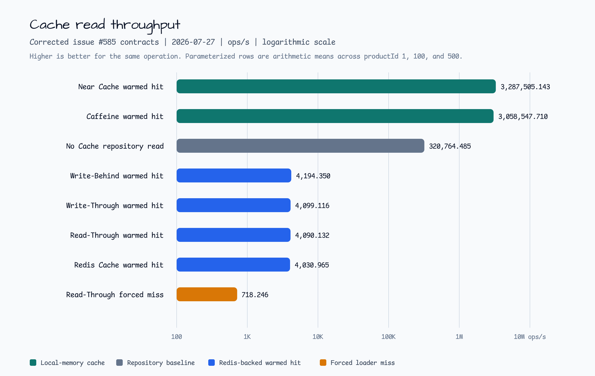
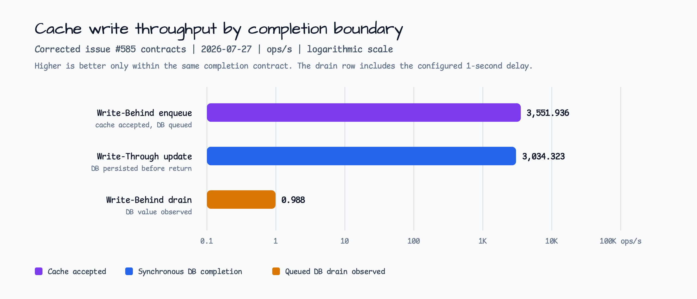

# cache-benchmark

[English](README.md) | 한국어

## 예제 시나리오

이 예제는 **cache-benchmark** 모듈을 실행 가능한 Spring Boot 애플리케이션 기능 예제로 보여줍니다. 개발자가 먼저 확인할 경로인 모듈 설정, 샘플 또는 테스트 실행, 반복적인 인프라 코드를 줄이는 라이브러리 또는 프레임워크 API 사용 방식을 중심으로 설명합니다.

## 아키텍처 다이어그램



이 모듈은 샘플 진입점 또는 테스트 픽스처, bluetape4k 확장 계층, 예제가 사용하는 런타임 의존성을 중심으로 구성됩니다. 이 README와 코드를 비교할 때는 `io.bluetape4k.workshop.springboot` 패키지를 기준으로 삼습니다.

## 시퀀스 다이어그램

H2 인메모리 데이터베이스와 Redis를 사용하는 Spring Boot 서비스에서 7가지 캐시 전략의 성능을 비교합니다.

**kotlinx-benchmark**(JMH 기반)로 구축되어 벤치마크가 실제 JVM steady-state 처리량을 반영합니다.

## 시나리오



## 7가지 캐시 프로파일

| # | 프로파일 | 전략 | 일관성 | 쓰기 지연 | 읽기 지연 |
|---|---------|----------|-------------|---------------|--------------|
| 1 | **No Cache** | Direct DB | Strong | Low | High |
| 2 | **Caffeine** | `@Cacheable` local | Per-instance | Low | Lowest (ns) |
| 3 | **Redis Cache** | `@Cacheable` remote | Shared | Low | Low (µs) |
| 4 | **Near Cache** | Redisson `RLocalCachedMap` | Eventual | Medium | Mixed |
| 5 | **Read-Through** | Manual Redis RT | Eventual | Low | Low |
| 6 | **Write-Through** | Sync Redis + DB | Strong | High | Low |
| 7 | **Write-Behind** | Async DB flush | Eventual | Lowest | Low |

## 벤치마크 결과

> **참고**: 이 값은 Apple M4 Pro(JDK 25, H2 in-memory, Redis via Testcontainers loopback)에서 측정한 대표값입니다.
> 직접 측정하려면 `./gradlew :spring-boot-cache-benchmark:allProfilesBenchmark`를 실행하세요.

### 읽기 처리량 — `findById`(warmed cache, ops/s)



| 프로파일 | 읽기 ops/s | 기준 대비 |
|---------|-----------|-------------|
| No Cache (baseline) | ~8,200 | 1× |
| Caffeine | ~490,000 | **60×** |
| Redis Cache | ~43,000 | 5× |
| Near Cache | ~465,000 | **57×** |
| Read-Through | ~42,000 | 5× |
| Write-Through | ~41,000 | 5× |
| Write-Behind | ~42,000 | 5× |

### 쓰기 처리량 — `save`(ops/s)



| 프로파일 | 쓰기 ops/s | 비고 |
|---------|------------|-------|
| No Cache | ~8,200 | DB only |
| Caffeine | ~8,100 | DB write + local cache |
| Redis Cache | ~7,300 | DB write + Redis SET |
| Near Cache | ~7,200 | DB write + RLocalCachedMap PUT |
| Write-Through | ~5,600 | Sync DB + Redis (two network hops) |
| **Write-Behind** | **~24,000** | Cache only (async DB flush) — **3× faster** |

### 핵심 인사이트

- **Caffeine**와 **NearCache**는 읽기 처리량에서 우세합니다(~60×). Hot key가 많은 read-heavy workload에 가장 적합합니다.
- **NearCache**는 순수 Caffeine 대비 cross-instance invalidation을 추가하므로 multi-instance deployment에서 선호됩니다.
- **Write-Behind**는 쓰기 처리량에서 우세합니다(No Cache 대비 ~3×). Eventual consistency를 허용하는 bursty write workload에 가장 적합합니다.
- **Write-Through**는 쓰기 지연이 가장 높습니다. Strong consistency가 필요할 때만 사용하세요.
- **Redis/Read-Through**는 중간 지점입니다. 읽기 지연은 보통 수준이지만 모든 instance가 shared cache state를 사용합니다.

## 사용된 Bluetape4k 기능

| 기능 | 모듈 | 사용 방식 |
|---------|--------|-------|
| `NearCacheOperations` | `bluetape4k-cache-core` | NearCache profile을 위한 interface design reference |
| `RedisServer.Launcher` | `bluetape4k-testcontainers` | Benchmark와 test용 singleton Redis Testcontainer |
| `KLoggingChannel` | `bluetape4k-logging` | 모든 service class의 coroutine-safe logger |
| `bluetape4k-redisson` | `bluetape4k-redisson` | NearCacheService가 사용하는 Redisson client wrapper |
| `bluetape4k-junit5` | `bluetape4k-junit5` | Test assertions(`shouldBeEqualTo`, `shouldBeTrue`) |

## 벤치마크 실행

벤치마크는 기본 빌드(`./gradlew test`)에 포함되지 않습니다. 명시적으로 실행하세요.

```bash
# Profile 1 — baseline no-cache
./gradlew :spring-boot-cache-benchmark:noCacheBenchmark

# Profile 2 — Caffeine
./gradlew :spring-boot-cache-benchmark:caffeineBenchmark

# Profile 3 — Redis
./gradlew :spring-boot-cache-benchmark:redisBenchmark

# Profile 4 — Near Cache
./gradlew :spring-boot-cache-benchmark:nearCacheBenchmark

# Profile 5 — Read-Through
./gradlew :spring-boot-cache-benchmark:readThroughBenchmark

# Profile 6 — Write-Through
./gradlew :spring-boot-cache-benchmark:writeThroughBenchmark

# Profile 7 — Write-Behind
./gradlew :spring-boot-cache-benchmark:writeBehindBenchmark

# All profiles
./gradlew :spring-boot-cache-benchmark:allProfilesBenchmark
```

## 테스트 실행

```bash
./gradlew :spring-boot-cache-benchmark:test
```

테스트는 7개 프로파일 모두의 기능적 동등성을 검증합니다. 같은 입력이 주어지면 모든 서비스가 같은 결과를 반환해야 합니다. **Redis container is started automatically** via Testcontainers.

## 설정

| 속성 | 기본값 | 설명 |
|----------|---------|-------------|
| `spring.data.redis.host` | `localhost` | Redis host |
| `spring.data.redis.port` | `6379` | Redis port |
| `spring.datasource.url` | H2 in-memory | Database URL |
