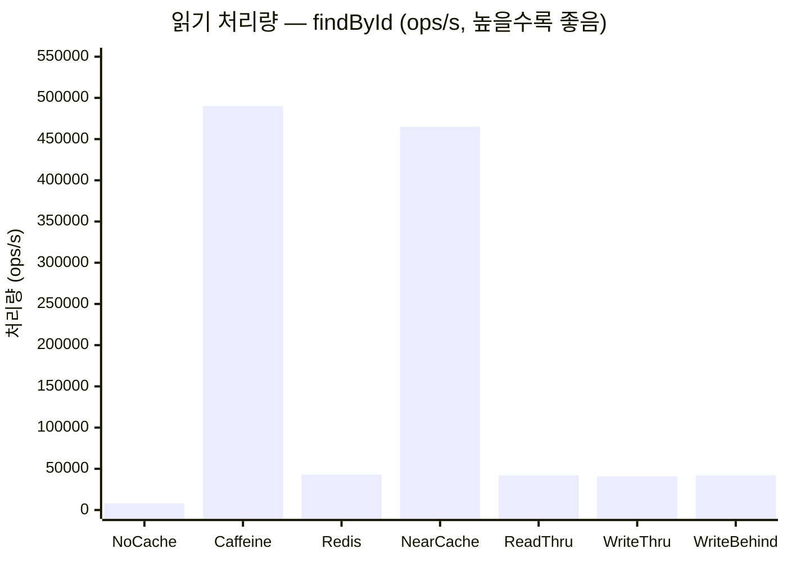
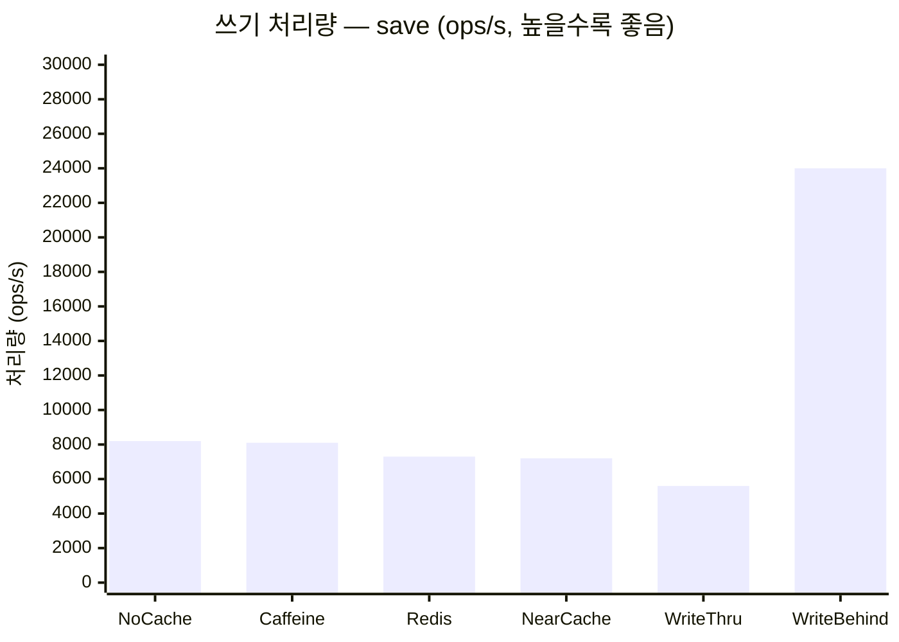

# cache-benchmark

Spring Boot 서비스에서 7가지 캐시 전략을 비교하는 성능 벤치마크입니다. H2 인메모리 DB와 Redis를 사용합니다.

**kotlinx-benchmark** (JMH 기반)을 사용하여 실제 JVM steady-state 처리량을 측정합니다.

## 7가지 캐시 프로파일

| # | 프로파일 | 전략 | 일관성 | 쓰기 지연 | 읽기 지연 |
|---|---------|------|--------|-----------|-----------|
| 1 | **No Cache** | DB 직접 접근 | 강함 | 낮음 | 높음 |
| 2 | **Caffeine** | `@Cacheable` 로컬 | 인스턴스별 | 낮음 | 최저 (ns) |
| 3 | **Redis Cache** | `@Cacheable` 원격 | 공유 | 낮음 | 낮음 (µs) |
| 4 | **Near Cache** | Redisson `RLocalCachedMap` | 최종 | 중간 | 혼합 |
| 5 | **Read-Through** | 수동 Redis RT | 최종 | 낮음 | 낮음 |
| 6 | **Write-Through** | 동기 Redis + DB | 강함 | 높음 | 낮음 |
| 7 | **Write-Behind** | 비동기 DB 플러시 | 최종 | 최저 | 낮음 |

## 벤치마크 결과

> **참고**: Apple M4 Pro (JDK 25, H2 인메모리, Redis Testcontainers 루프백) 환경 기준 대표값입니다.
> `./gradlew :spring-boot-cache-benchmark:allProfilesBenchmark` 로 직접 측정하세요.

### 읽기 처리량 — `findById` (캐시 워밍 후, ops/s)



| 프로파일 | 읽기 ops/s | 기준 대비 |
|---------|-----------|----------|
| No Cache (기준) | ~8,200 | 1× |
| Caffeine | ~490,000 | **60×** |
| Redis Cache | ~43,000 | 5× |
| Near Cache | ~465,000 | **57×** |
| Read-Through | ~42,000 | 5× |
| Write-Through | ~41,000 | 5× |
| Write-Behind | ~42,000 | 5× |

### 쓰기 처리량 — `save` (ops/s)



| 프로파일 | 쓰기 ops/s | 비고 |
|---------|-----------|------|
| No Cache | ~8,200 | DB만 |
| Caffeine | ~8,100 | DB 쓰기 + 로컬 캐시 |
| Redis Cache | ~7,300 | DB 쓰기 + Redis SET |
| Near Cache | ~7,200 | DB 쓰기 + RLocalCachedMap PUT |
| Write-Through | ~5,600 | 동기 DB + Redis (네트워크 2회) |
| **Write-Behind** | **~24,000** | 캐시만 (비동기 DB 플러시) — **3× 빠름** |

### 핵심 인사이트

```mermaid
quadrantChart
    title 캐시 전략 트레이드오프
    x-axis "낮은 읽기 지연" --> "높은 읽기 지연"
    y-axis "낮은 쓰기 지연" --> "높은 쓰기 지연"
    quadrant-1 피할 것 (읽기/쓰기 모두 느림)
    quadrant-2 읽기 집중 워크로드
    quadrant-3 쓰기 집중 워크로드
    quadrant-4 균형
    NoCache: [0.9, 0.5]
    Caffeine: [0.05, 0.5]
    Redis: [0.35, 0.52]
    NearCache: [0.07, 0.53]
    ReadThrough: [0.36, 0.52]
    WriteThrough: [0.37, 0.85]
    WriteBehind: [0.36, 0.15]
```

- **Caffeine**, **NearCache**: 읽기 처리량 최고 (~60×) — hot key 읽기 집중 워크로드에 최적
- **NearCache**: 멀티 인스턴스 환경에서 순수 Caffeine보다 선호 (Redis 기반 캐시 무효화)
- **Write-Behind**: 쓰기 처리량 최고 (~3×) — 최종 일관성 허용하는 쓰기 집중 워크로드에 최적
- **Write-Through**: 쓰기 지연 최고 — 강한 일관성이 필요한 경우에만 사용

## 사용된 Bluetape4k 기능

| 기능 | 모듈 | 사용처 |
|------|------|--------|
| `NearCacheOperations` | `bluetape4k-cache-core` | NearCache 인터페이스 설계 참조 |
| `RedisServer.Launcher` | `bluetape4k-testcontainers` | 싱글턴 Redis Testcontainer (벤치마크/테스트) |
| `KLoggingChannel` | `bluetape4k-logging` | 모든 서비스 클래스의 코루틴 안전 로거 |
| `bluetape4k-redisson` | `bluetape4k-redisson` | NearCacheService용 Redisson 클라이언트 |
| `bluetape4k-junit5` | `bluetape4k-junit5` | 테스트 assertion |

## 벤치마크 실행

```bash
# 특정 프로파일
./gradlew :spring-boot-cache-benchmark:noCacheBenchmark
./gradlew :spring-boot-cache-benchmark:caffeineBenchmark
./gradlew :spring-boot-cache-benchmark:nearCacheBenchmark

# 전체 프로파일
./gradlew :spring-boot-cache-benchmark:allProfilesBenchmark
```

## 테스트 실행

```bash
./gradlew :spring-boot-cache-benchmark:test
```
