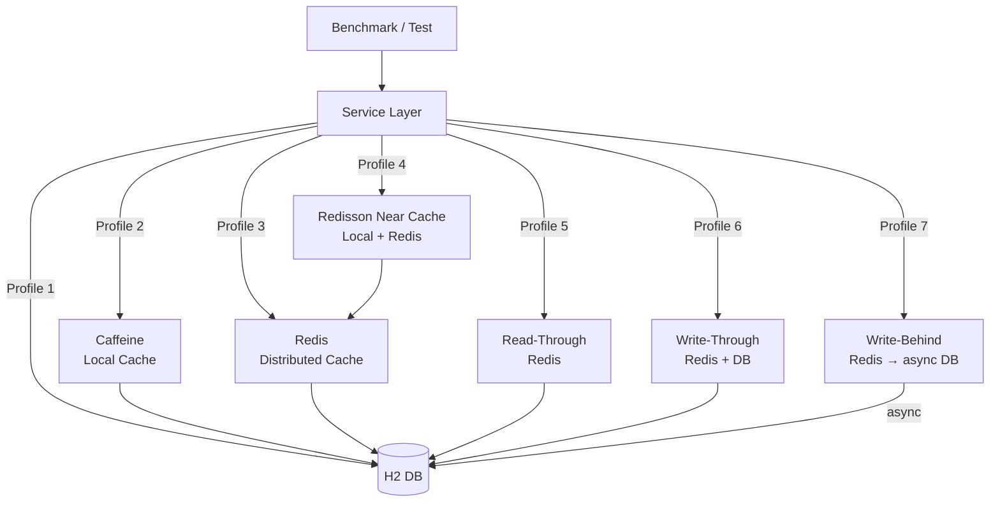

# cache-benchmark

Performance benchmark comparing 7 cache strategies for a Spring Boot service backed by an H2 in-memory database and Redis.

Built with **kotlinx-benchmark** (JMH-based) so benchmarks reflect real JVM steady-state throughput.

## Architecture



## 7 Cache Profiles

| # | Profile | Strategy | Consistency | Write Latency | Read Latency |
|---|---------|----------|-------------|---------------|--------------|
| 1 | **No Cache** | Direct DB | Strong | Low | High |
| 2 | **Caffeine** | `@Cacheable` local | Per-instance | Low | Lowest (ns) |
| 3 | **Redis Cache** | `@Cacheable` remote | Shared | Low | Low (µs) |
| 4 | **Near Cache** | Redisson `RLocalCachedMap` | Eventual | Medium | Mixed |
| 5 | **Read-Through** | Manual Redis RT | Eventual | Low | Low |
| 6 | **Write-Through** | Sync Redis + DB | Strong | High | Low |
| 7 | **Write-Behind** | Async DB flush | Eventual | Lowest | Low |

## Used Bluetape4k Features

| Feature | Module | Usage |
|---------|--------|-------|
| `NearCacheOperations` | `bluetape4k-cache-core` | Interface design reference for NearCache profile |
| `RedisServer.Launcher` | `bluetape4k-testcontainers` | Singleton Redis Testcontainer for benchmarks & tests |
| `KLoggingChannel` | `bluetape4k-logging` | Coroutine-safe logger in all service classes |
| `bluetape4k-redisson` | `bluetape4k-redisson` | Redisson client wrapper used by NearCacheService |
| `bluetape4k-junit5` | `bluetape4k-junit5` | Test assertions (`shouldBeEqualTo`, `shouldBeTrue`) |

## Running Benchmarks

Benchmarks are **not** part of the default build (`./gradlew test`). Run them explicitly:

```bash
# Profile 1 — baseline no-cache
./gradlew :spring-boot-cache-benchmark:noCacheBenchmark

# Profile 2 — Caffeine
./gradlew :spring-boot-cache-benchmark:caffeineBenchmark

# Profile 3 — Redis
./gradlew :spring-boot-cache-benchmark:redisBenchmark

# Profile 4 — Near Cache
./gradlew :spring-boot-cache-benchmark:nearCacheBenchmark

# Profile 5 — Read-Through
./gradlew :spring-boot-cache-benchmark:readThroughBenchmark

# Profile 6 — Write-Through
./gradlew :spring-boot-cache-benchmark:writeThroughBenchmark

# Profile 7 — Write-Behind
./gradlew :spring-boot-cache-benchmark:writeBehindBenchmark

# All profiles
./gradlew :spring-boot-cache-benchmark:allProfilesBenchmark
```

## Running Tests

```bash
./gradlew :spring-boot-cache-benchmark:test
```

Tests verify functional equivalence across all 7 profiles: given the same input, all services return the same result. **Redis container is started automatically** via Testcontainers.

## Configuration

| Property | Default | Description |
|----------|---------|-------------|
| `spring.data.redis.host` | `localhost` | Redis host |
| `spring.data.redis.port` | `6379` | Redis port |
| `spring.datasource.url` | H2 in-memory | Database URL |
