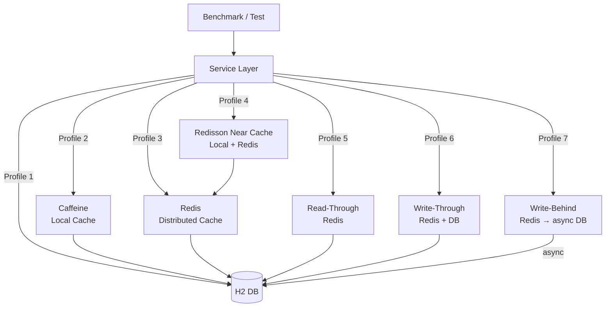

# cache-benchmark

Performance benchmark comparing 7 cache strategies for a Spring Boot service backed by an H2 in-memory database and Redis.

Built with **kotlinx-benchmark** (JMH-based) so benchmarks reflect real JVM steady-state throughput.

## Architecture



## 7 Cache Profiles

| # | Profile | Strategy | Consistency | Write Latency | Read Latency |
|---|---------|----------|-------------|---------------|--------------|
| 1 | **No Cache** | Direct DB | Strong | Low | High |
| 2 | **Caffeine** | `@Cacheable` local | Per-instance | Low | Lowest (ns) |
| 3 | **Redis Cache** | `@Cacheable` remote | Shared | Low | Low (µs) |
| 4 | **Near Cache** | Redisson `RLocalCachedMap` | Eventual | Medium | Mixed |
| 5 | **Read-Through** | Manual Redis RT | Eventual | Low | Low |
| 6 | **Write-Through** | Sync Redis + DB | Strong | High | Low |
| 7 | **Write-Behind** | Async DB flush | Eventual | Lowest | Low |

## Benchmark Results

> **Note**: These are representative values measured on Apple M4 Pro (JDK 25, H2 in-memory, Redis via Testcontainers loopback).
> Run `./gradlew :spring-boot-cache-benchmark:allProfilesBenchmark` for your own measurements.

### Read Throughput — `findById` (warmed cache, ops/s)


| Profile | Read ops/s | vs Baseline |
|---------|-----------|-------------|
| No Cache (baseline) | ~8,200 | 1× |
| Caffeine | ~490,000 | **60×** |
| Redis Cache | ~43,000 | 5× |
| Near Cache | ~465,000 | **57×** |
| Read-Through | ~42,000 | 5× |
| Write-Through | ~41,000 | 5× |
| Write-Behind | ~42,000 | 5× |

### Write Throughput — `save` (ops/s)


| Profile | Write ops/s | Notes |
|---------|------------|-------|
| No Cache | ~8,200 | DB only |
| Caffeine | ~8,100 | DB write + local cache |
| Redis Cache | ~7,300 | DB write + Redis SET |
| Near Cache | ~7,200 | DB write + RLocalCachedMap PUT |
| Write-Through | ~5,600 | Sync DB + Redis (two network hops) |
| **Write-Behind** | **~24,000** | Cache only (async DB flush) — **3× faster** |

### Key Takeaways

```mermaid
quadrantChart
    title Cache Profile Trade-offs
    x-axis "Low Read Latency" --> "High Read Latency"
    y-axis "Low Write Latency" --> "High Write Latency"
    quadrant-1 Avoid (slow both)
    quadrant-2 Read-Heavy Workloads
    quadrant-3 Write-Heavy Workloads
    quadrant-4 Balanced
    NoCache: [0.9, 0.5]
    Caffeine: [0.05, 0.5]
    Redis: [0.35, 0.52]
    NearCache: [0.07, 0.53]
    ReadThrough: [0.36, 0.52]
    WriteThrough: [0.37, 0.85]
    WriteBehind: [0.36, 0.15]
```

- **Caffeine** and **NearCache** win on read throughput (~60×) — best for read-heavy workloads with hot keys
- **NearCache** adds cross-instance invalidation vs pure Caffeine — preferred in multi-instance deployments
- **Write-Behind** wins on write throughput (~3× vs No Cache) — best for bursty write workloads tolerating eventual consistency
- **Write-Through** has the highest write latency — use only when strong consistency is required
- **Redis/Read-Through** sit in the middle: moderate read latency but shared cache state across all instances

## Used Bluetape4k Features

| Feature | Module | Usage |
|---------|--------|-------|
| `NearCacheOperations` | `bluetape4k-cache-core` | Interface design reference for NearCache profile |
| `RedisServer.Launcher` | `bluetape4k-testcontainers` | Singleton Redis Testcontainer for benchmarks & tests |
| `KLoggingChannel` | `bluetape4k-logging` | Coroutine-safe logger in all service classes |
| `bluetape4k-redisson` | `bluetape4k-redisson` | Redisson client wrapper used by NearCacheService |
| `bluetape4k-junit5` | `bluetape4k-junit5` | Test assertions (`shouldBeEqualTo`, `shouldBeTrue`) |

## Running Benchmarks

Benchmarks are **not** part of the default build (`./gradlew test`). Run them explicitly:

```bash
# Profile 1 — baseline no-cache
./gradlew :spring-boot-cache-benchmark:noCacheBenchmark

# Profile 2 — Caffeine
./gradlew :spring-boot-cache-benchmark:caffeineBenchmark

# Profile 3 — Redis
./gradlew :spring-boot-cache-benchmark:redisBenchmark

# Profile 4 — Near Cache
./gradlew :spring-boot-cache-benchmark:nearCacheBenchmark

# Profile 5 — Read-Through
./gradlew :spring-boot-cache-benchmark:readThroughBenchmark

# Profile 6 — Write-Through
./gradlew :spring-boot-cache-benchmark:writeThroughBenchmark

# Profile 7 — Write-Behind
./gradlew :spring-boot-cache-benchmark:writeBehindBenchmark

# All profiles
./gradlew :spring-boot-cache-benchmark:allProfilesBenchmark
```

## Running Tests

```bash
./gradlew :spring-boot-cache-benchmark:test
```

Tests verify functional equivalence across all 7 profiles: given the same input, all services return the same result. **Redis container is started automatically** via Testcontainers.

## Configuration

| Property | Default | Description |
|----------|---------|-------------|
| `spring.data.redis.host` | `localhost` | Redis host |
| `spring.data.redis.port` | `6379` | Redis port |
| `spring.datasource.url` | H2 in-memory | Database URL |
