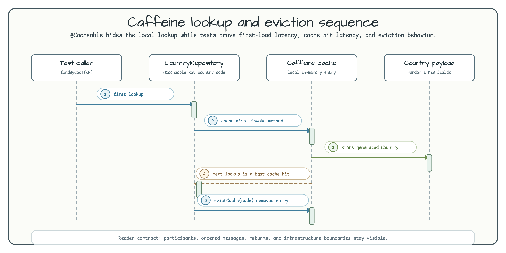

# Cache Caffeine Demo

[한국어](README.ko.md) | English

This module shows a local in-memory cache using Spring Cache and Caffeine. It is intentionally small: `CountryRepository` simulates a slow 500 ms load, then Spring Cache stores the generated `Country` payload in Caffeine.

## Architecture


`CaffeineConfig` enables Spring Cache and builds a Caffeine instance through the bluetape4k `caffeine { }` DSL. The cache uses a maximum size of 1,000 entries, expires entries after 5 minutes of inactivity, records stats, and uses `VirtualThreadExecutor` for cache work.

## Cache Flow



`CountryRepository.findByCode(code)` is annotated with `@Cacheable`. The first call waits for the simulated slow load; the second call returns from the local cache. `evictCache(code)` removes the entry and forces the next call to load again.

## Main Components

| Class | Role |
|---|---|
| `CaffeineConfig` | Registers `CaffeineCacheManager` and the bluetape4k `caffeine { }` builder |
| `CountryRepository` | Applies `@Cacheable` and `@CacheEvict` to country lookup methods |
| `CountryPrefetcher` | Periodically warms a random country code through the cached repository |
| `SchedulingConfig` | Enables scheduling with a virtual-thread scheduled executor |

## bluetape4k Features Used

| Feature | Artifact | Code Location | Benefit |
|---|---|---|---|
| `caffeine { }` DSL | `bluetape4k-cache-core` | `CaffeineConfig.caffeineBean()` | Kotlin-friendly Caffeine builder |
| `VirtualThreadExecutor` | `bluetape4k-core` | `CaffeineConfig.caffeineBean()` | Runs Caffeine executor work on virtual threads |
| `KLoggingChannel` | `bluetape4k-logging` | Companion objects | Lazy structured logging |
| `randomString()` | `bluetape4k-core` | `Country.kt` | Creates non-trivial cache payloads |

## Cache Configuration Example

```kotlin
@Configuration(proxyBeanMethods = false)
@EnableCaching
class CaffeineConfig {
    @Bean
    fun cacheManager(caffeine: Caffeine<Any, Any>): CacheManager =
        CaffeineCacheManager("cache:contries", "cache:cities").apply {
            setCaffeine(caffeine)
        }

    @Bean
    fun caffeineBean(): Caffeine<Any, Any> = caffeine {
        initialCapacity(100)
        maximumSize(1000)
        expireAfterAccess(5.minutes.toJavaDuration())
        recordStats()
        executor(VirtualThreadExecutor)
    }
}
```

## Run

```bash
./gradlew :spring-boot:cache-caffeine:bootRun
./gradlew :spring-boot:cache-caffeine:test
```

## References

- [Caffeine GitHub](https://github.com/ben-manes/caffeine)
- [Spring Cache Abstraction](https://docs.spring.io/spring-framework/reference/integration/cache.html)
- [bluetape4k-cache-core](https://github.com/bluetape4k/bluetape4k-projects)
