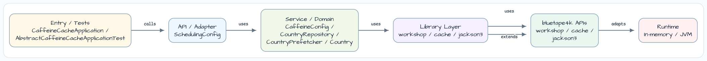
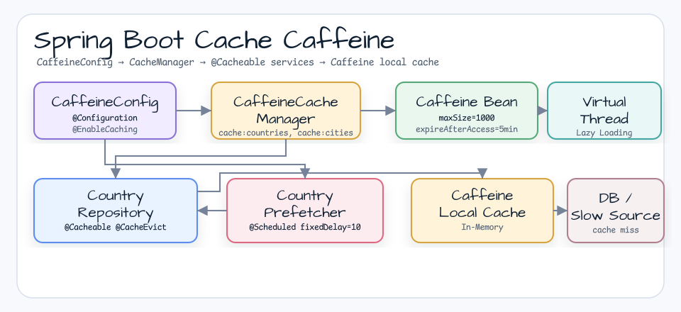
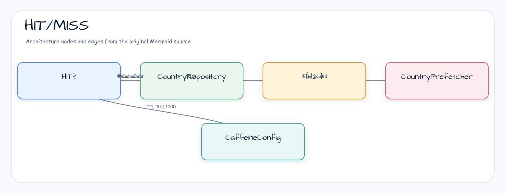

# Cache Caffeine Demo

[한국어](README.ko.md) | English

## Example Scenario

This example exercises **Cache Caffeine Demo** as a runnable Spring Boot application feature workshop slice. It focuses on the path a developer would inspect first: configure the module, run the sample or tests, and observe the library or framework APIs that remove repetitive infrastructure code.

## Architecture Diagram



The module is organized around the sample entry point or test fixture, the bluetape4k extension layer, and the runtime dependency used by the example. Keep the package under `io.bluetape4k.workshop.springboot` as the source of truth when comparing this README with the code.



## Flow Diagram

1. Prepare the local runtime required by `spring-boot-cache-caffeine`.
2. Execute the application, controller, service, or test fixture that owns the example scenario.
3. Delegate repetitive infrastructure work to bluetape4k utilities or Spring/Kotlin integrations.
4. Assert the visible result through the sample output, HTTP response, repository state, metric, trace, or test expectation.



## Sequence Diagram

The core sequence is: caller or test fixture -> workshop adapter -> bluetape4k helper/API -> external runtime or in-memory backend -> assertion/response. When this module has a dedicated sequence asset, the image below shows that interaction order; otherwise the source tests are the authoritative executable sequence.

Local in-memory cache example using [Caffeine](https://github.com/ben-manes/caffeine) with Spring Cache abstraction.
Demonstrates the bluetape4k `caffeine { }` DSL and `VirtualThreadExecutor` for lazy-loading cache entries.

## Overview

This module shows how to wire Caffeine as a Spring `CacheManager` using the bluetape4k Kotlin DSL.
Key features: type-safe builder with `kotlin.time.Duration`, Virtual Thread executor for lazy loading,
and structured logging with `KLoggingChannel`.

---

## Detailed Description

This example integrates [Caffeine](https://github.com/ben-manes/caffeine) with the Spring Cache abstraction.
It configures a local in-memory cache with the bluetape4k `caffeine { }` DSL and `VirtualThreadExecutor`.

## Architecture


## Main Components

| Class | Role |
|---|---|
| `CaffeineConfig` | Configures the `CacheManager` bean with the bluetape4k `caffeine { }` DSL + `VirtualThreadExecutor` |
| `CountryRepository` | Applies the `@Cacheable` and `@CacheEvict` annotations |
| `CountryPrefetcher` | Periodically warms up the cache through a scheduler |
| `SchedulingConfig` | Configures `@EnableScheduling` |

## bluetape4k Features Used

| Feature | Artifact | Code Location | Benefit |
|---|---|---|---|
| `caffeine { }` DSL | `bluetape4k-cache-core` | `CaffeineConfig.caffeineBean()` | Type-safe builder with direct Kotlin Duration support |
| `VirtualThreadExecutor` | `bluetape4k-coroutines` | `CaffeineConfig.caffeineBean()` | Runs lazy loading on Virtual Threads |
| `KLoggingChannel` | `bluetape4k-logging` | All companion objects | Structured logging with coroutine context |
| `randomString()` | `bluetape4k-core` | `Country.kt` | Generates test data for cache payloads |

## bluetape4k Before / After

### `caffeine { }` DSL vs Traditional Builder

```kotlin
// Before — Java Caffeine.newBuilder() style
@Bean
fun cacheManager(): CacheManager = CaffeineCacheManager().apply {
    setCaffeine(
        Caffeine.newBuilder()
            .initialCapacity(100)
            .maximumSize(1_000)
            .expireAfterAccess(5, TimeUnit.MINUTES)
            .recordStats()
    )
}

// After — bluetape4k caffeine { } DSL (Kotlin Duration, improved readability)
@Bean
fun caffeineBean(): Caffeine<Any, Any> = caffeine {
    initialCapacity(100)
    maximumSize(1000)
    expireAfterAccess(5.minutes.toJavaDuration())  // Uses kotlin.time.Duration directly
    recordStats()
    executor(VirtualThreadExecutor)                // Lazy loading on Virtual Threads
}
```

### `KLoggingChannel` vs Traditional Logger

```kotlin
// Before — Direct LoggerFactory usage
private val logger = LoggerFactory.getLogger(CaffeineConfig::class.java)

// After — KLoggingChannel (includes coroutine MDC context propagation)
companion object: KLoggingChannel()

log.debug { "Loading country with code[$code]..." }  // lazy lambda
```

## Cache Configuration Example

```kotlin
@Configuration
@EnableCaching
class CaffeineConfig {

    companion object: KLoggingChannel()

    @Bean
    fun cacheManager(caffeine: Caffeine<Any, Any>): CacheManager {
        return CaffeineCacheManager("cache:countries", "cache:cities").apply {
            setCaffeine(caffeine)
        }
    }

    @Bean
    fun caffeineBean(): Caffeine<Any, Any> = caffeine {
        initialCapacity(100)
        maximumSize(1000)
        expireAfterAccess(5.minutes.toJavaDuration())
        recordStats()
        executor(VirtualThreadExecutor)
    }
}
```

## Run

```bash
./gradlew :cache-caffeine:bootRun
```

## References

- [Caffeine GitHub](https://github.com/ben-manes/caffeine)
- [Spring Cache Abstraction](https://docs.spring.io/spring-framework/reference/integration/cache.html)
- [bluetape4k-cache-core](https://github.com/bluetape4k/bluetape4k-projects)
