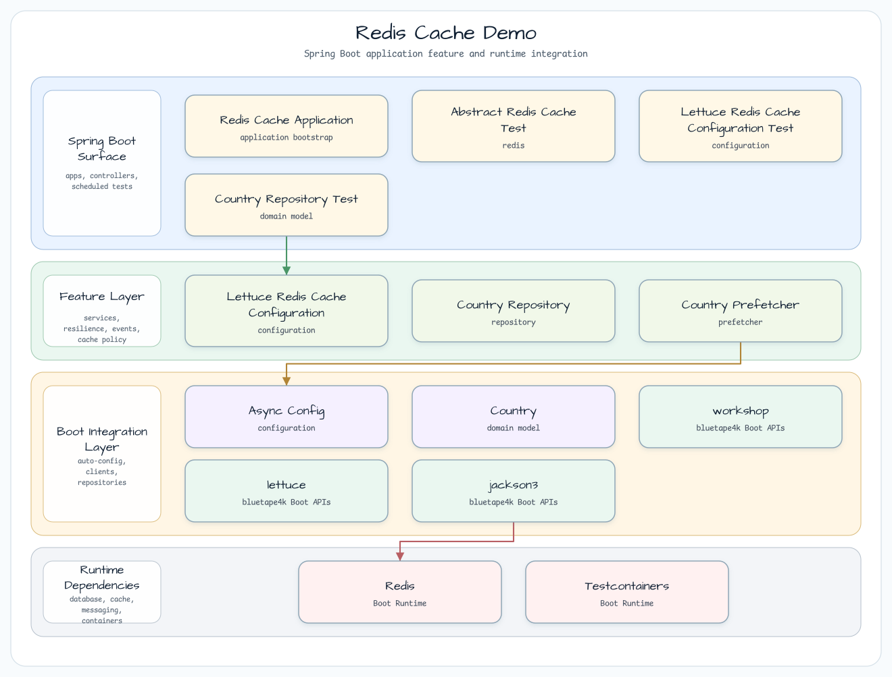
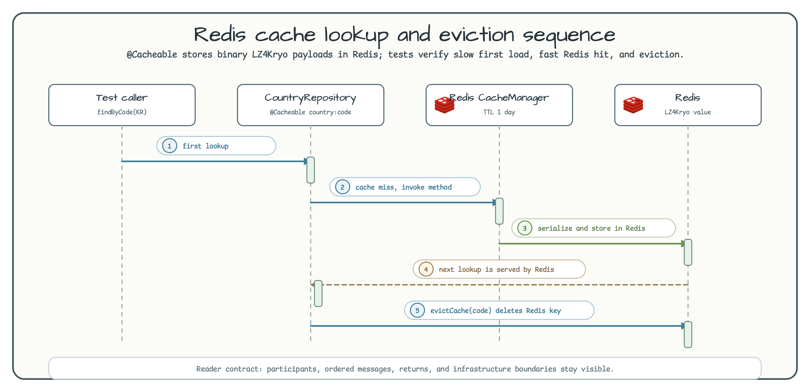

# Redis Cache Demo

[English](README.md) | 한국어

이 모듈은 Redis와 Lettuce 기반 Spring Cache 예제입니다. Caffeine cache sample과 같은 `Country` 조회 구조를 사용하지만, payload를 Redis에 저장하고 bluetape4k binary serialization과 virtual-thread executor를 적용합니다.

## 아키텍처



`RedisCacheApplication`은 `RedisServer.Launcher.redis`를 시작하므로 테스트와 로컬 실행이 같은 Testcontainers Redis endpoint를 사용할 수 있습니다. `LettuceRedisCacheConfiguration`은 `LettuceConnectionFactory`, `RedisCacheManager`, `RedisTemplate`을 `RedisBinarySerializers.LZ4Kryo`와 함께 구성합니다.

## 캐시 흐름



`CountryRepository.findByCode(code)`에는 `@Cacheable`이 적용되어 있습니다. 첫 호출은 느린 메서드를 실행하고 Redis entry를 저장하며, 다음 호출은 Redis에서 반환됩니다. `evictCache(code)`는 Redis key를 제거합니다.

## 주요 구성 요소

| 클래스 | 역할 |
|---|---|
| `LettuceRedisCacheConfiguration` | `RedisCacheManager`, `RedisTemplate`, binary serialization, Lettuce connection factory를 구성합니다. |
| `AsyncConfig` | 공통 `VirtualThreads` executor를 소유하고 Spring adapter와 작업별 MDC 복원을 제공합니다. |
| `CountryRepository` | bluetape4k 검증과 `@Cacheable`, `@CacheEvict`를 Redis-backed country lookup에 적용합니다. |

## 사용한 bluetape4k 기능

| 기능 | 아티팩트 | 코드 위치 | 이점 |
|---|---|---|---|
| `RedisServer.Launcher.redis` | `bluetape4k-testcontainers` | `RedisCacheApplication` | 테스트와 로컬 실행을 위한 shared Redis Testcontainers 인스턴스 시작 |
| `RedisBinarySerializers.LZ4Kryo` | `bluetape4k-spring-boot4-redis` | `LettuceRedisCacheConfiguration.redisTemplate()` | Redis 값을 compact binary 형태로 저장 |
| `requireNotBlank()` | `bluetape4k-core` | `CountryRepository.findByCode()`, `evictCache()` | 잘못된 cache key를 loading/eviction 전에 거부 |
| `VirtualThreads.executorService()` | `bluetape4k-virtualthread-api` + `bluetape4k-virtualthread-jdk25` | `AsyncConfig` | 지원 provider 또는 platform fallback을 선택하고 Spring이 shutdown을 소유 |
| `CountryPrefetcher` | `app` profile에서 무작위 국가 코드를 예열합니다. |

## Executor 소유권

```kotlin
@Bean(name = ["cacheRedisVirtualThreadExecutor"], destroyMethod = "shutdown")
fun cacheRedisVirtualThreadExecutor(): ExecutorService = VirtualThreads.executorService()

@Bean(TaskExecutionAutoConfiguration.APPLICATION_TASK_EXECUTOR_BEAN_NAME)
fun asyncTaskExecutor(executorService: ExecutorService): AsyncTaskExecutor =
    TaskExecutorAdapter(executorService).apply {
        setTaskDecorator(LoggingTaskDecorator())
    }
```

Spring이 `@Async`와 Lettuce가 함께 사용하는 delegate 하나를 소유합니다. Context shutdown은 신규 작업을
거부하지만 이미 제출된 작업을 interrupt하거나 무한히 기다리지 않습니다. Provider가 정한 thread name을
그대로 사용하며 운영 관측에는 `cacheRedisVirtualThreadExecutor` bean name과 `VirtualThreads.runtimeName()`을
사용합니다. MDC decorator는 오류와 빈 caller context를 포함해 `finally`에서 worker의 이전 context를 복원합니다.
두 virtual-thread artifact는 module에서 version 없이 선언하고 `bluetape4k-dependencies:2.0.0`으로 resolve합니다.

## Redis 설정 예제

```kotlin
@Bean
fun lettuceConnectionFactory(applicationTaskExecutor: AsyncTaskExecutor): LettuceConnectionFactory =
    LettuceConnectionFactory(RedisStandaloneConfiguration(redisHost, redisPort)).apply {
        setExecutor(applicationTaskExecutor)
    }

@Bean
fun redisTemplate(connectionFactory: RedisConnectionFactory): RedisTemplate<Any, Any> =
    RedisTemplate<Any, Any>().apply {
        setConnectionFactory(connectionFactory)
        setDefaultSerializer(RedisBinarySerializers.LZ4Kryo)
        keySerializer = StringRedisSerializer.UTF_8
        valueSerializer = RedisBinarySerializers.LZ4Kryo
    }
```

## 실행

```bash
./gradlew :spring-boot-cache-redis:test
./gradlew :spring-boot-cache-redis:bootRun
```

## 참고

- [Spring Data Redis](https://docs.spring.io/spring-data/redis/reference/)
- [Lettuce](https://lettuce.io/)
- [bluetape4k-spring-boot4-redis](https://github.com/bluetape4k/bluetape4k-projects)
- [bluetape4k virtual-thread API](https://github.com/bluetape4k/bluetape4k-projects/tree/develop/virtualthread)
