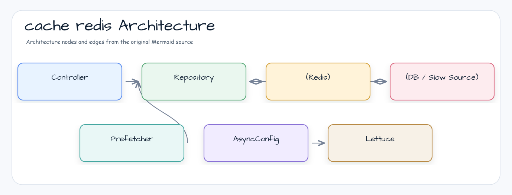

# Redis Cache Demo

Spring Data Redis와 Lettuce를 이용해 Spring Cache 추상화를 Redis로 구현하는 예제입니다.
bluetape4k의 `RedisBinarySerializers`(LZ4 + Kryo)와 Virtual Thread 기반 Async Executor를 활용합니다.
Testcontainers로 Redis 컨테이너를 자동으로 구동하여 통합 테스트를 수행합니다.

## 아키텍처



## 주요 구성

| 클래스 | 역할 |
|---|---|
| `LettuceRedisCacheConfiguration` | `RedisCacheManager` 빈 구성 + `RedisBinarySerializers` 직렬화 |
| `AsyncConfig` | Virtual Thread 기반 `AsyncTaskExecutor` + MDC 전파 |
| `CountryRepository` | `@Cacheable`, `@CacheEvict` 어노테이션 적용 |
| `CountryPrefetcher` | 스케줄러로 캐시를 주기적으로 워밍업(pre-fetch) |

## 사용된 bluetape4k 기능

| 기능 | 아티팩트 | 코드 위치 | 이점 |
|---|---|---|---|
| `RedisBinarySerializers.LZ4Kryo` | `bluetape4k-spring-boot4-redis` | `LettuceRedisCacheConfiguration.redisTemplate()` | LZ4 압축 + Kryo 직렬화로 Redis 저장 공간 절감 |
| `KLoggingChannel` | `bluetape4k-logging` | 모든 companion object | 코루틴 컨텍스트 포함 구조적 로깅 |
| Virtual Thread Executor | `bluetape4k-coroutines` | `AsyncConfig` | Lettuce I/O를 Virtual Thread로 처리 |
| `randomString()` | `bluetape4k-core` | `Country.kt` | 캐시 페이로드 테스트 데이터 생성 |

## bluetape4k Before / After

### `RedisBinarySerializers` vs 기존 JSON 직렬화

```kotlin
// Before — GenericJackson2JsonRedisSerializer (텍스트 기반, 용량 큼)
@Bean
fun redisCacheManager(connectionFactory: RedisConnectionFactory): RedisCacheManager =
    RedisCacheManager.builder(connectionFactory)
        .cacheDefaults(
            RedisCacheConfiguration.defaultCacheConfig()
                .entryTtl(Duration.ofMinutes(10))
                .serializeValuesWith(
                    RedisSerializationContext.SerializationPair
                        .fromSerializer(GenericJackson2JsonRedisSerializer())
                )
        )
        .build()

// After — RedisBinarySerializers.LZ4Kryo (이진 압축, 용량 50~70% 절감)
@Bean
fun redisTemplate(connectionFactory: RedisConnectionFactory): RedisTemplate<Any, Any> {
    return RedisTemplate<Any, Any>().apply {
        setConnectionFactory(connectionFactory)
        setDefaultSerializer(RedisBinarySerializers.LZ4Kryo)
        keySerializer = StringRedisSerializer.UTF_8
        valueSerializer = RedisBinarySerializers.LZ4Kryo
    }
}
```

### Virtual Thread Executor vs 일반 스레드풀

```kotlin
// Before — ThreadPoolTaskExecutor (OS 스레드 기반)
@Bean
fun asyncTaskExecutor(): AsyncTaskExecutor =
    ThreadPoolTaskExecutor().apply {
        corePoolSize = 10
        maxPoolSize = 50
        setThreadNamePrefix("async-")
    }

// After — Virtual Thread per task (JVM에서 경량 스레드 자동 관리)
@Bean(TaskExecutionAutoConfiguration.APPLICATION_TASK_EXECUTOR_BEAN_NAME)
@Primary
fun asyncTaskExecutor(): AsyncTaskExecutor {
    val factory = Thread.ofVirtual().name("async-vt-exec-", 0).factory()
    return TaskExecutorAdapter(Executors.newThreadPerTaskExecutor(factory)).apply {
        setTaskDecorator(LoggingTaskDecorator())  // MDC 컨텍스트 전파
    }
}
```

## Redis 캐시 설정 예시

```kotlin
@Bean
fun lettuceConnectionFactory(applicationTaskExecutor: AsyncTaskExecutor): LettuceConnectionFactory {
    val configuration = RedisStandaloneConfiguration(redisHost, redisPort)
    // Lettuce 작업을 Virtual Threads로 실행
    return LettuceConnectionFactory(configuration).apply {
        setExecutor(applicationTaskExecutor)
    }
}

@Bean
fun redisCacheManager(connectionFactory: RedisConnectionFactory): CacheManager =
    RedisCacheManager.builder(connectionFactory)
        .transactionAware()
        .cacheDefaults(RedisCacheConfiguration.defaultCacheConfig().entryTtl(Duration.ofDays(1)))
        .build()
```

## 실행

```bash
# Testcontainers가 Redis 컨테이너를 자동으로 구동합니다
./gradlew :cache-redis:test

./gradlew :cache-redis:bootRun
```

## 참고

- [Spring Data Redis](https://docs.spring.io/spring-data/redis/reference/)
- [Lettuce](https://lettuce.io/)
- [bluetape4k-spring-boot4-redis](https://github.com/bluetape4k/bluetape4k-projects)
