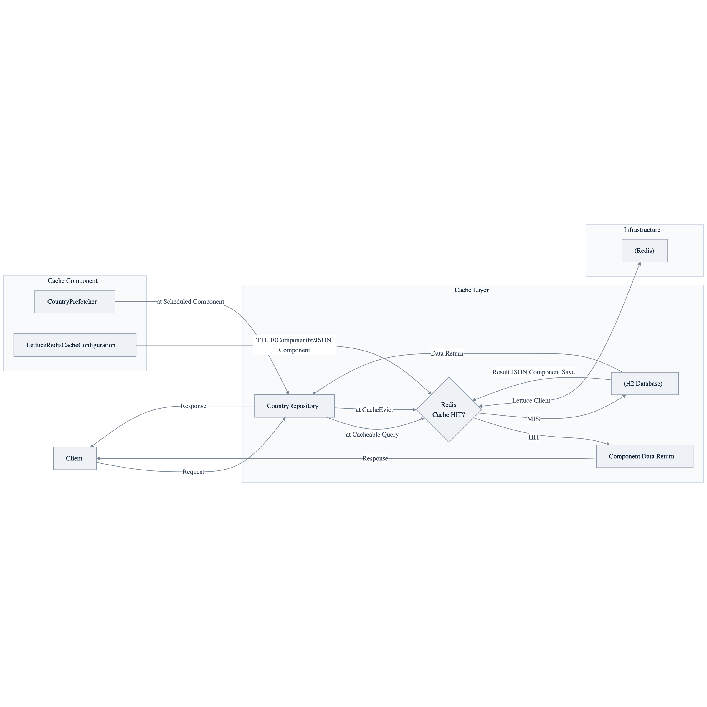

# Redis Cache Demo

[한국어](README.ko.md) | English

## Example Scenario

This example exercises **Redis Cache Demo** as a runnable Spring Boot application feature workshop slice. It focuses on the path a developer would inspect first: configure the module, run the sample or tests, and observe the library or framework APIs that remove repetitive infrastructure code.

## Architecture Diagram


The module is organized around the sample entry point or test fixture, the bluetape4k extension layer, and the runtime dependency used by the example. Keep the package under `io.bluetape4k.workshop.springboot` as the source of truth when comparing this README with the code.


## Flow Diagram

1. Prepare the local runtime required by `spring-boot-cache-redis`.
2. Execute the application, controller, service, or test fixture that owns the example scenario.
3. Delegate repetitive infrastructure work to bluetape4k utilities or Spring/Kotlin integrations.
4. Assert the visible result through the sample output, HTTP response, repository state, metric, trace, or test expectation.



## Sequence Diagram

The core sequence is: caller or test fixture -> workshop adapter -> bluetape4k helper/API -> external runtime or in-memory backend -> assertion/response. When this module has a dedicated sequence asset, the image below shows that interaction order; otherwise the source tests are the authoritative executable sequence.

Distributed cache example using Spring Data Redis + Lettuce backed by bluetape4k's
`RedisBinarySerializers` (LZ4 + Kryo) and a Virtual Thread async executor.
Testcontainers launches a Redis container automatically for integration tests.

## Overview

This module demonstrates replacing JSON serialization with the bluetape4k binary serializer
(`RedisBinarySerializers.LZ4Kryo`) to reduce Redis storage by 50–70%, and using Virtual Threads
for Lettuce I/O instead of a fixed thread pool.

---

## Detailed Description

This example implements the Spring Cache abstraction on Redis with Spring Data Redis and Lettuce.
It uses bluetape4k `RedisBinarySerializers` (LZ4 + Kryo) and a Virtual Thread based async executor.
Testcontainers automatically starts a Redis container for integration tests.

## Architecture


## Main Components

| Class | Role |
|---|---|
| `LettuceRedisCacheConfiguration` | Configures the `RedisCacheManager` bean + `RedisBinarySerializers` serialization |
| `AsyncConfig` | Virtual Thread based `AsyncTaskExecutor` + MDC propagation |
| `CountryRepository` | Applies the `@Cacheable` and `@CacheEvict` annotations |
| `CountryPrefetcher` | Periodically warms up the cache through a scheduler |

## bluetape4k Features Used

| Feature | Artifact | Code Location | Benefit |
|---|---|---|---|
| `RedisBinarySerializers.LZ4Kryo` | `bluetape4k-spring-boot4-redis` | `LettuceRedisCacheConfiguration.redisTemplate()` | Reduces Redis storage through LZ4 compression + Kryo serialization |
| `KLoggingChannel` | `bluetape4k-logging` | All companion objects | Structured logging with coroutine context |
| Virtual Thread Executor | `bluetape4k-coroutines` | `AsyncConfig` | Handles Lettuce I/O on Virtual Threads |
| `randomString()` | `bluetape4k-core` | `Country.kt` | Generates test data for cache payloads |

## bluetape4k Before / After

### `RedisBinarySerializers` vs Traditional JSON Serialization

```kotlin
// Before — GenericJackson2JsonRedisSerializer (text-based, larger payloads)
@Bean
fun redisCacheManager(connectionFactory: RedisConnectionFactory): RedisCacheManager =
    RedisCacheManager.builder(connectionFactory)
        .cacheDefaults(
            RedisCacheConfiguration.defaultCacheConfig()
                .entryTtl(Duration.ofMinutes(10))
                .serializeValuesWith(
                    RedisSerializationContext.SerializationPair
                        .fromSerializer(GenericJackson2JsonRedisSerializer())
                )
        )
        .build()

// After — RedisBinarySerializers.LZ4Kryo (binary compression, 50-70% less storage)
@Bean
fun redisTemplate(connectionFactory: RedisConnectionFactory): RedisTemplate<Any, Any> {
    return RedisTemplate<Any, Any>().apply {
        setConnectionFactory(connectionFactory)
        setDefaultSerializer(RedisBinarySerializers.LZ4Kryo)
        keySerializer = StringRedisSerializer.UTF_8
        valueSerializer = RedisBinarySerializers.LZ4Kryo
    }
}
```

### Virtual Thread Executor vs Regular Thread Pool

```kotlin
// Before — ThreadPoolTaskExecutor (OS thread based)
@Bean
fun asyncTaskExecutor(): AsyncTaskExecutor =
    ThreadPoolTaskExecutor().apply {
        corePoolSize = 10
        maxPoolSize = 50
        setThreadNamePrefix("async-")
    }

// After — Virtual Thread per task (lightweight threads managed by the JVM)
@Bean(TaskExecutionAutoConfiguration.APPLICATION_TASK_EXECUTOR_BEAN_NAME)
@Primary
fun asyncTaskExecutor(): AsyncTaskExecutor {
    val factory = Thread.ofVirtual().name("async-vt-exec-", 0).factory()
    return TaskExecutorAdapter(Executors.newThreadPerTaskExecutor(factory)).apply {
        setTaskDecorator(LoggingTaskDecorator())  // MDC context propagation
    }
}
```

## Redis Cache Configuration Example

```kotlin
@Bean
fun lettuceConnectionFactory(applicationTaskExecutor: AsyncTaskExecutor): LettuceConnectionFactory {
    val configuration = RedisStandaloneConfiguration(redisHost, redisPort)
    // Runs Lettuce work on Virtual Threads
    return LettuceConnectionFactory(configuration).apply {
        setExecutor(applicationTaskExecutor)
    }
}

@Bean
fun redisCacheManager(connectionFactory: RedisConnectionFactory): CacheManager =
    RedisCacheManager.builder(connectionFactory)
        .transactionAware()
        .cacheDefaults(RedisCacheConfiguration.defaultCacheConfig().entryTtl(Duration.ofDays(1)))
        .build()
```

## Run

```bash
# Testcontainers starts the Redis container automatically
./gradlew :cache-redis:test

./gradlew :cache-redis:bootRun
```

## References

- [Spring Data Redis](https://docs.spring.io/spring-data/redis/reference/)
- [Lettuce](https://lettuce.io/)
- [bluetape4k-spring-boot4-redis](https://github.com/bluetape4k/bluetape4k-projects)
